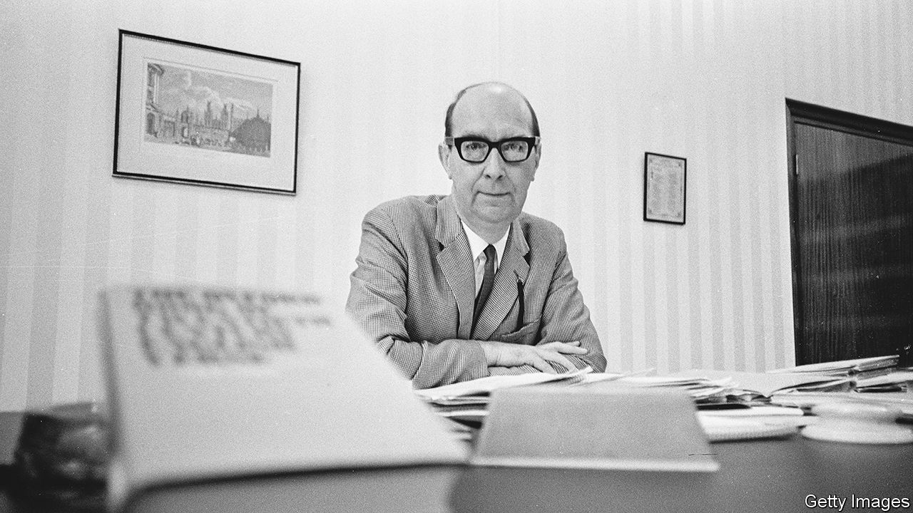

###### Home Entertainment

# Philip Larkin’s verse is tender. His prejudices are controversial 

##### Born 100 years ago, the English poet balanced pathos with wit 

 

> Jul 28th 2022 

The world of Philip Larkin’s verse is far from glamorous. His natural habitat was English suburbia, a realm of grey dawns, hollow afternoons and low horizons. He spent most of his adult life working as a librarian—the last 30 years at the university in Hull, a city he disparaged as being “on the way to nowhere”. His poems record mundane activities: visiting churches, deciding whether to attend a party, perusing old photos. 

But Larkin is more than just the unofficial laureate of humdrum Englishness. His poems, rather than practising the British habits of evasion and whimsy, speak directly. Many begin with bracing immediacy: “I work all day, and get half-drunk at night”; “I deal with farmers, things like dips and feed”; “The mower stalled, twice; kneeling, I found/A hedgehog jammed up against the blades.” 

Larkin writes frankly and sometimes devastatingly about sadness and mortality. He describes “the instantaneous grief of being alone”, death as an “anaesthetic from which none come round” and the way misery, passed from parents to their children, “deepens like a coastal shelf”. 

Yet often his manner is less jaundiced than tender. He notes the “miniature gaiety of seasides”, pictures the sun’s “petalled head of flames” and addresses a newborn child as “Tightly-folded bud”. Expressing himself sparely, he zeroes in on physical details that are tellingly ugly or bluntly unpoetic. One of his best poems, “The Whitsun Weddings”, itemises what he sees while travelling by train on a hot Saturday afternoon (“acres of dismantled cars”, “canals with floatings of industrial froth”), and in so doing builds to an unexpected, transcendent climax. 

The centenary of Larkin’s birth on August 9th should be an opportunity for appreciation. But controversy dogs his name. When his letters were published in 1992, less than a decade after his death, they exposed a seam of racism and misogyny, as well as a puerility at odds with the grave craftsmanship of his finest verse. His reputation weathered the outrage, but now, at a time of heightened sensitivity about prejudice and artists’ personal failings, it is under threat again, as is his place in the British curriculum. 

On one side are academics eager to modernise and diversify the canon. On the other are traditionalists who think removing Larkin from poetry anthologies is cultural vandalism. His defenders rightly cite his technical virtuosity, though they can exaggerate the breadth of his vision. David Blunkett, a British politician, has spoken up for the “glory” of Larkin’s language while fancifully claiming that he captured “geographic diversity”.

There is no escaping Larkin’s faults. Rarely a charitable soul outside his verse, he could be crudely vitriolic—whether about a fellow poet, Ted Hughes, a “boring old monolith”, or about the Bible, which was “absolute balls”. But few writers have so skilfully melded wit and pathos, the lyrical and the conversational. Few have been so free of illusions. And few can so often make their readers smile and, at the same time, shudder. ■

