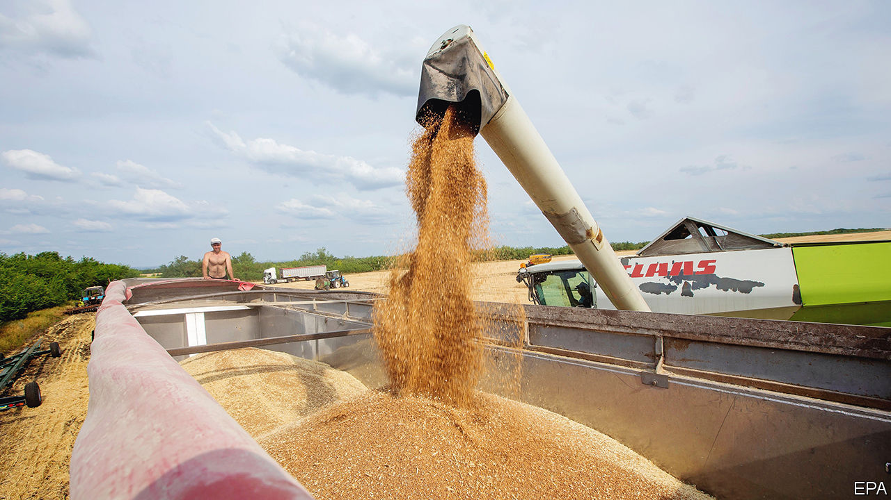

###### A deal on the Black Sea

# After agreeing to let Ukraine export grain, Russia rockets its port 

##### A strike on Odessa undermines a deal to ease the global food crisis 

 

> Jul 22nd 2022 


For months António Guterres, the un’s secretary-general, has warned that Russia’s war on Ukraine could cause a global food crisis by blocking Ukraine’s grain exports. On July 22nd in Istanbul, Mr Guterres and Turkey’s president, Recep Tayyip Erdogan, brokered a deal to let those exports resume. The next morning Russian missiles hit Odessa, Ukraine’s biggest port. Vladimir Putin had “[spat] in the face” of Messrs Guterres and Erdogan, said Oleg Nikolenko, a Ukrainian spokesman.

Yet the deal seems to have survived. As  went to press on July 28th, a ship packed with Ukrainian grain readied to leave the port of Chornomorsk. Odessa and Pivdennyi plan to resume exports next. Dozens of ships trapped in Ukrainian ports since the start of the war hope to set sail soon, though uncertainty remains. “If [the Russians] start shooting at vessels and ports and terminals,” says Oleksandr Kubrakov, the Ukrainian infrastructure minister, “then this initiative will not work.” 

The deal came not a moment too soon for the world’s poorest. The un says 828m people are  every night, and that 50m are on the brink of famine. Ukraine is among the world’s biggest exporters of wheat, barley, maize and sunflower oil. It has been unable to ship most of its crops since the war started. Russia has captured Ukraine’s ports in the Sea of Azov and blockaded those on the Black Sea; Ukraine has mined its own waters to prevent an amphibious invasion. Only some mines will be cleared, to create corridors for cargo ships. Ukraine still fears a Russian naval attack on Odessa. 

In Istanbul the two sides did not sign an agreement with each other, but separate accords with Turkey, witnessed by the un. The deal creates a “joint co-ordination centre” in Istanbul, staffed by the belligerents as well as by Turkey and the un, to inspect ships traveling to and from Ukrainian ports to ensure they do not carry weapons. It is valid for renewable periods of 120 days. But it has large gaps. The route of the “maritime humanitarian corridor” is yet to be set. It is not clear who will do the de-mining. The un has no means of enforcement.

Ukraine has been expanding alternative routes, via rail, road and Danube river barge. But these cannot make up for the Black Sea ports. To replace an 80,000-tonne cargo ship takes 3,600 trucks, says Dmytro Barinov, deputy head of the Ukrainian seaport authority. About 60m tonnes of grain are starting to be harvested. Ukraine lacks storage for about 15m-18m tonnes. If it cannot be shipped soon, much will be left to rot.

Besides the Istanbul deal, two other factors are lowering food prices. First, the harvest in the northern hemisphere is going well; Russia is expecting a record 90m-tonne wheat crop. Second, the strong dollar makes dollar-denominated commodities more expensive and encourages farmers to bring more of their crop to market. 

Still, the food crisis is not over. Grain prices, though down one-third from their peak this year, are 40% higher than in January 2020. Fuel, fertiliser and other inputs remain expensive. And a  looms. Michael Magdovitz of Rabobank, a Dutch lender, reckons Ukraine could double exports to 4m tonnes a month. But if vessels cannot leave Odessa by October, some of the crop may be lost. “There is tremendous upside risk to prices,” says Mr Magdovitz. 

Many find the deal too good to be true. “I struggle to see what’s in it for the Russians,” says an executive from an agricultural trading firm. Mr Putin has broken previous ceasefires; the attacks on Odessa suggest he may want to torpedo the deal. But Alexander Gabuev of the Carnegie Endowment, an American think-tank, thinks Mr Putin is under pressure from countries in and around the Middle East—not least Turkey. “Moscow still has plenty of sharp objects in its toolbox beyond grain exports,” he tweeted, especially gas. 

Meanwhile Lloyd’s, an insurance market, has not announced how ships might be insured. “We have been waiting for five months,” said Sefa Seker of Polarnet Shipping Operations in Istanbul, which owns a ship stuck in Odessa. “Nothing is clear.” ■


