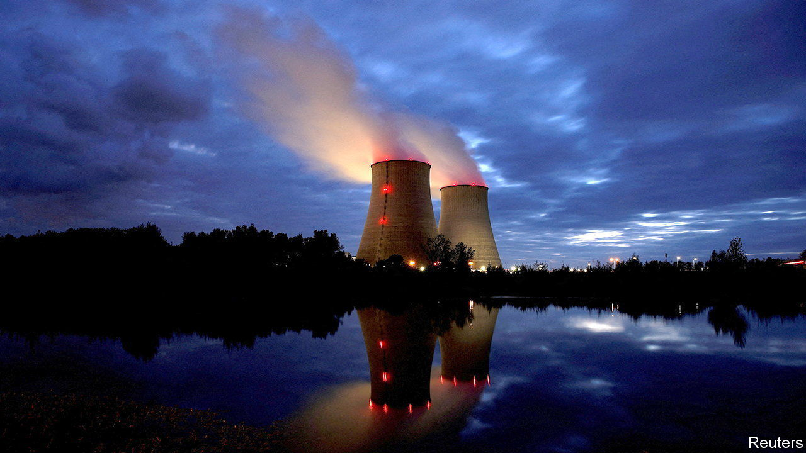

###### Delayed reaction

# France’s nuclear plants are going down for repairs 

##### The crunch in electricity supply comes at the worst possible time 

 

> Jul 28th 2022 

As europe struggles with the energy crunch caused by Russia’s war on Ukraine, France has until now been in denial. Thanks to its nuclear-energy industry, the country is usually a net exporter of electricity to the rest of Europe, including Britain. Unlike Germany, which had to cut energy use fast due to its heavy reliance on Russian gas, France uses relatively little gas in its energy mix. Indeed, as energy prices have soared the French government has focused more on subsidising fuel prices than on encouraging energy savings. 

So it came as a shock when President Emmanuel Macron chose the national holiday on July 14th to tell the French that they too had to cut back. He has urged a regime of energy “sobriety”, to reduce consumption and waste. The government wants to shrink overall French energy use by 10% by 2024. It will fine shops if they leave their street doors open while the air-conditioning is on, or their commercial signs lit up all night. The big French retailers have promised to dim in-store lighting and turn off bright signs after hours. 

For a country that prizes the semi-independence offered by its nuclear-power industry, this squeeze is awkward. French Greens and left-wing parties may dislike nuclear power. But the country’s nuclear power stations, the first of which opened in 1963, have historically been a source of pride. Today they provide 42% of all energy, compared with just 6% in Germany. While Germany has been phasing out nuclear, Mr Macron plans to build at least six new next-generation reactors in France.

Yet, at the worst possible time, France’s fleet of nuclear stations are under pressure. Over half of the country’s 56 reactors are shut for maintenance, due to routine inspections as well as corrosion issues. Output this winter is expected to be 25% below that in a normal year. To compensate, France has had to buy electricity on wholesale markets. It plans to reopen a coal-fired power station in Saint-Avold, mothballed only in March. On July 6th the government announced that it would fully nationalise edf, the country’s energy giant, in which it already holds an 84% stake. “At a crucial moment for Europe’s energy supply, French nuclear is just not able to step up,” says Cécile Maisonneuve, energy adviser at the French Institute of International Relations, a think-tank.

Two political difficulties loom as a result. One is domestic. Mr Macron learned during the  crisis in 2018-19 how an increase in fuel prices can crystallise anger. In contrast to other European countries, consumers in France have been shielded from the worst fuel-price inflation. This week parliament approved fresh subsidies at the pump. But such untargeted measures cannot last forever, and they undermine the parallel effort to curb energy use. Gas may supply only 16% of French energy, but it is used to heat two-fifths of households. When prices do rise, things could turn nasty. 

The other is a test of eu solidarity. After contesting the European Commission’s call for a 15% cut in gas use, the countries that do not rely on Russian gas won carve-outs. The tougher it gets for consumers and firms, the harder it will be to maintain united support for sanctions. Mr Macron has warned the French to prepare for a “very tough scenario”. “Russia,” he says, “is using energy as a weapon of war.” ■

