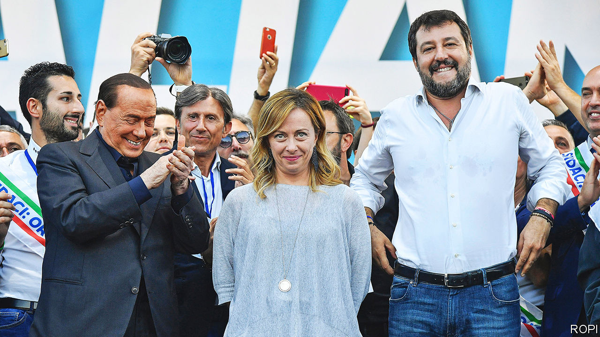

###### Right ahead

# Italy’s next government may be more nationalist than Europe likes 

##### The hard-right Fratelli d’Italia are riding high in the polls 

 

> Jul 28th 2022 

Asurge of migrants rescued from rickety boats in the Mediterranean on July 23rd and 24th seemed to echo the chaos in Italian politics. Over 2,000 arrived, overwhelming the reception centre on the island of Lampedusa. Two days earlier Sergio Mattarella, the president, announced an election would be held on September 25th, following the resignation of Mario Draghi as prime minister. As during the much bigger crisis of 2014-16, rising numbers of migrants are a boon for Italy’s far right.

At the last general election in 2018, fears of uncontrolled migration helped the hard-right Northern League win enough votes to enter government as the junior partner in a coalition with the left-leaning Five Star Movement (m5s). Though the m5s acted as a brake on the League, the two populist parties sent a wave of apprehension through Europe and clashed repeatedly with the European Commission. Back then, the combined vote share of the League and Italy’s other hard-right party, the Brothers of Italy (fdi), was below 22%. 

Five years on the situation is different. The League has lost considerable support. But the Brothers—led paradoxically by a woman, Giorgia Meloni (pictured, with Silvio Berlusconi and the League’s Matteo Salvini)—have soared in popularity. Polls give the two parties around 37% of the vote. Add 8-9% for Mr Berlusconi’s Forza Italia party and some smaller groups, and the right looks set for a convincing victory, perhaps a parliamentary majority that could let it govern for a full five-year term. It would be an ideologically cohesive right, dominated by the fdi and stripped of its most liberal elements. This month several Forza Italia lawmakers, including all three of its ministers in the outgoing government, quit the party in protest at Mr Berlusconi’s role in Mr Draghi’s removal.

By contrast, the right’s adversaries are in comic disarray. Enrico Letta, leader of the centre-left Democratic Party (pd), has precluded an electoral alliance with the m5s because it too helped bring down Mr Draghi. Carlo Calenda, the leader of Action, a centrist group that has absorbed some Forza Italia refugees, seems open to a deal with the pd, but wants Mr Draghi to be the prime ministerial candidate rather than Mr Letta. And two small leftist parties are refusing to join if Mr Calenda does. Matteo Renzi, a former prime minister who left the pd in 2019 to form a new party, Italia Viva, has vowed it will run alone.

Much could change before the vote. Support for the pd seems to have jumped since Mr Draghi was ousted. Celebrities such as the mixed-race singer Elodie Di Patrizi have expressed alarm at the prospect of a government led by Ms Meloni. As the campaign progresses, a central issue will be the extent of the Brothers’ radicalism.

There are two parts to this. The first is whether a hard-right government would secure Italy’s full share of grants and low-cost loans from the eu’s pandemic-recovery programme, worth more than €200bn ($203bn). “What has so far been achieved is the easy part,” says Francesco Grillo, director of Vision, a think-tank that monitors the programme’s implementation. It found that, of the 96 objectives set by Brussels which Mr Draghi’s government had met, all but three involved creating an administrative framework for investment. Only €2-3m, less than 0.0015%, had actually been spent. By 2026, a government used to making capital investments of €15bn a year will need to raise that to almost €50bn. Even “Super Mario”, as Mr Draghi was known, would have found that hard.

The danger is that his successor would further complicate the challenge by insisting on changes. Since Mr Draghi’s resignation, Ms Meloni has expressed dissatisfaction with aspects of the plan agreed with Brussels. Her party’s own ideas are set out in an online pamphlet that features prominently on the fdi‘s website. They differ substantially from the existing scheme. For example, the fdi wants to use a large part of the money to build a bridge linking Sicily to the mainland.

The other issue set to colour the campaign is ideology. The fdi traces its origins to the neo-fascist movement that took up Benito Mussolini’s legacy after the second world war. Valerio Alfonso Bruno of the Centre for the Analysis of the Radical Right, a British watchdog, said he did not expect the FdI to differ much from other conservative parties in foreign policy. But its thinking on economic policy is highly protectionist and corporatist. It favours nationalising a wide swath of industry, including airports and railways. It also focusses on protecting small firms rather than fostering bigger ones.

But it is in domestic and social policy that the Brothers’ ideology could be most strongly felt. Ms Meloni’s biographer, Francesco Giubilei, says the fdi’s entry into the hard- but not far-right European Conservatives and Reformists (ecr) group in the European Parliament marked a shift. In his view, the party turned towards “conservatism with a Latin blueprint, involving a greater attachment to the welfare state than in English-speaking societies.” Such a statist approach is now common among populist-nationalist parties such as Hungary’s Fidesz. While the ecr includes some Christian Democrats, it also has hard-right members such as Spain’s Vox party. The fdi’s online pamphlet, featuring a photo of young white people wrapped in the Italian flag, reflects its intensely nativist stance. It opposes granting citizenship to children born in Italy to immigrant parents. It wants a big increase in child support to improve Italy’s ultra-low birthrate and a naval blockade to stop unauthorised migration.

Mr Bruno thinks Ms Meloni’s drive to give her movement wider appeal masks the persistence of “a more closed element that remains faithful to its roots in the [defunct, neo-fascist] Italian Social Movement (msi)”. The fdi still uses the msi’s symbol of a three-coloured flame. “Why,” Mr Bruno asks, “would a moderate party want to keep that in its logo?” Europe may soon find out. ■

