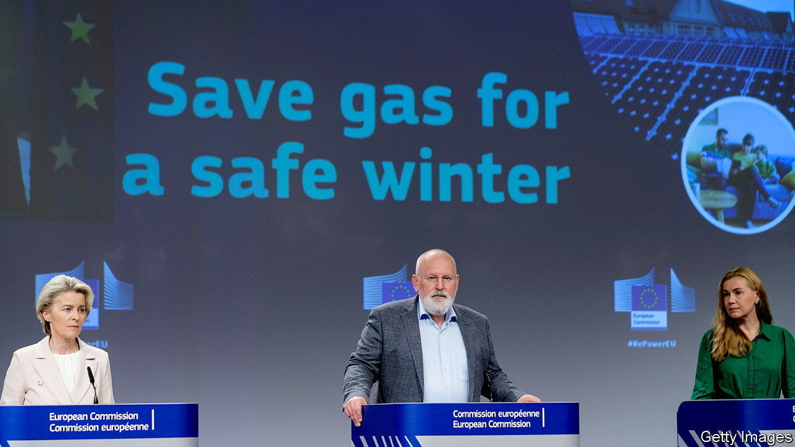

###### Cutting calories

# The EU agrees on an energy diet to fight Russian gas cuts 

##### Vladimir Putin wants to blackmail Europe into dropping sanctions 

 

> Jul 28th 2022 

The news from the  was grim. “The situation is tense and a further worsening...cannot be ruled out,” Germany’s energy regulator announced on July 26th. Gazprom, Russia’s state-run gas provider, had just said it would further cut deliveries of natural gas through Nord Stream 1 (ns1), a pipeline from Russia to Germany. ns1 was already at 40% of capacity, and has now dropped to 20%. Gazprom blamed turbine trouble: the first of the cuts was attributed to a part sent to Canada for maintenance. That was a pretext. Canada has returned the turbine to Germany, and it could be shipped to Russia any day.

Rather, the cuts are blackmail, aimed at forcing Europe to drop sanctions over Russia’s invasion of Ukraine. Pundits had expected the Kremlin to tighten the screws, but not so quickly. If ns1 remains at 20% of capacity Germany will not be able to reach the government’s goal of filling 95% of its gas-storage tanks by November. They are now two-thirds full.

The eu reacted with unusual speed. On July 26th, 26 of its 27 member states agreed to cut gas consumption by 15% compared with the average of the last five years. (Hungary opposed the deal.) How they achieve this goal is up to them. The agreement comes into force on August 1st and runs until the end of March. But it is a watered-down version of the European Commission’s initial proposal. Countries that use little Russian gas, including Poland, Portugal and Spain, resisted the mandatory cuts pressed by countries like Germany and Austria, which use lots of it. 

The ensuing horse-trading led to many carve-outs. Hopefully Europeans will reduce consumption voluntarily, says Simone Tagliapietra of Bruegel, a think-tank in Brussels, since the eu deal contains too many exemptions from obligatory targets. It does have a “union alert” that can be triggered if there are severe supply shortages, in which case the targets become mandatory. But even then, the list of derogations is so long and detailed that cuts will remain voluntary in practice.

Russia’s pressure tactics may yet work. Annalena Baerbock, Germany’s foreign minister, said she had to overcome objections from Canada to allowing the turbine to be returned to Russia. But if Germany’s gas were to be cut off, she continued, “we won’t be able to provide any support for Ukraine at all, because we’ll be busy with popular uprisings.” German voters feel powerless in the face of high inflation and fears about energy shortages and a looming recession.

The Kremlin could cut off gas exports to Europe at any time. If it wants to maximise Europeans’ suffering and anxiety, it might close the taps on a cold day in winter. The eu estimates that a complete shut-off could shave as much as 1.5% from the bloc’s gdp, if the winter is cold and no preventive measures are taken. 

Yet calculations by four economic think-tanks published on July 26th by , a business daily, gave worried Germans some reassurance. Even if Russia continues to pipe gas through ns1 at just 20% of its capacity, Germany would very probably have sufficient gas this winter and next, said analysts at iwh Halle, rwi Essen, ifw Kiel and Ifo München. A few years ago the prospect of ns1’s flow being cut back to 20% would have been a horror scenario. Now it is the optimistic one. ■


