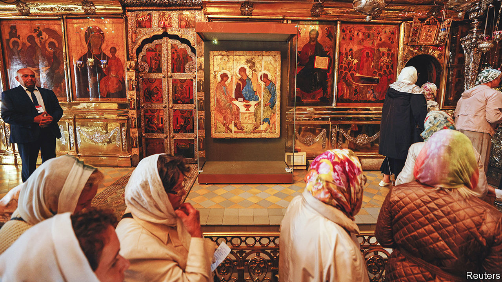

###### Putin’s false piety

# The Kremlin drafts a much-loved icon for war propaganda 

##### Andrei Rublev’s “Holy Trinity” is dragged from museum to monastery 

 

> Jul 28th 2022 

Three winged figures, their heads inclined and their robes shading from azure to gold, sit at a table with a chalice in the middle. God is absent, but the painting is divine. Andrei Rublev’s “Holy Trinity” is Russia’s most precious icon. Painted in the 15th century when Russia was overrun by the Mongols, it reaffirmed the country’s ties to Christian Europe and pointed towards a Russian Renaissance that never came, according to Dmitry Likhachev, a Russian historian. 

This most numinous of Russian icons is now serving the darkest cause: Vladimir Putin’s war in Ukraine. On July 16th the icon, which had been in the State Tretyakov Gallery since 1929, was moved on Kremlin orders (and against the will of restorers) to the Trinity Lavra of St Sergius, the spiritual centre of Russia’s Orthodox church. There it was venerated during the feast of St Sergius, a Russian saint who influenced Rublev. Patriarch Kirill, the head of the Russian church and a supporter of the war, said the icon “connects us to the time when our Russia, in great danger from foreign and domestic enemies, was concentrating on becoming a great power”. 

Curators warned that dragging the icon to the church from the museum, where it was kept at a precise temperature and humidity, could damage it. Dragging Russia into obscurantism is just as damaging. The move had little to do with Christianity, and everything to do with Mr Putin’s cult of war.

Sergei Parkhomenko, a liberal journalist, compared Mr Putin to a pharoah trying to “bribe” a deity: “Either he is very afraid of losing the war, and is asking for help. Or he is deciding to do something very scary—scary even to himself—and seeks forgiveness in advance.” Russia’s president recently warned that his invasion “has not even started in earnest”. He might want to heed the words of Voltaire, who was more sceptical of religion: “God is on the side not of the heavy battalions, but of the best shots.” 

