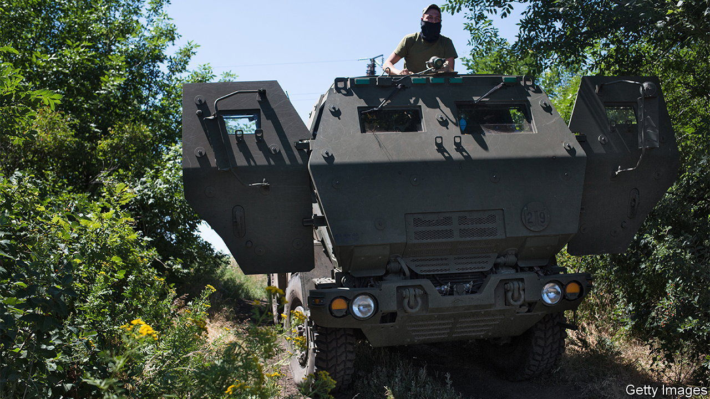
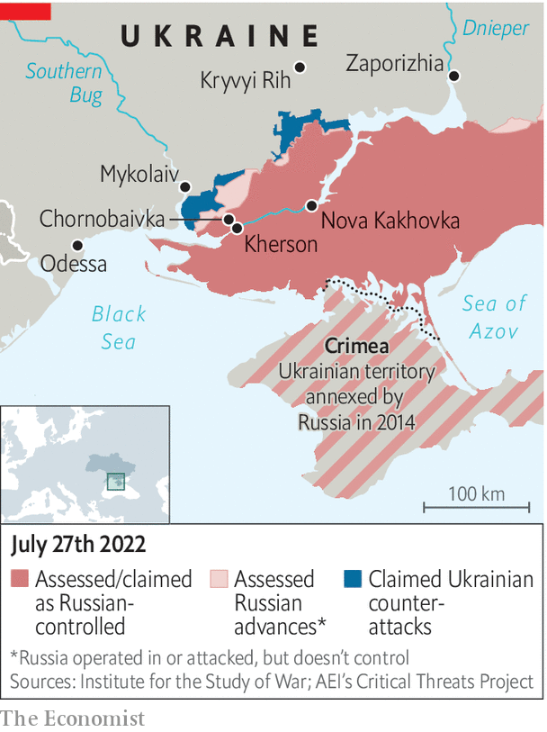

###### Taking it back

# Ukraine is gathering strength for an assault on Kherson 

##### Russia might destroy the city rather than lose it 

 

> Jul 28th 2022 

The shelling in Mykolaiv, in southern Ukraine, has been relentless. In the five months since the start of the war, only 21 days have gone by without any Russian bombs, says the mayor, Oleksandr Senkevych. More than half of the city’s residents (who numbered 480,000 before the war) have fled. With the main pipelines destroyed, the city gets its water from a nearby estuary of the Southern Bug river. The stuff is not safe for bathing, much less drinking, locals say. At least 7,800 buildings have been damaged, claims the governor, Vitaliy Kim, standing in front of his former headquarters. The building was torn in half by a Russian airstrike in March that killed 37 people.

But there is some optimism in the air. South of Mykolaiv a Ukrainian offensive to retake Kherson, the biggest city captured by Russian forces since the start of the invasion, is picking up steam. Ukrainian troops are less than 30 km from the city. On July 27th their American-supplied multiple-launch rocket systems, known as himars, pummelled the main bridge Russia uses to send troops and supplies into Kherson from Crimea, the second such attack in as many weeks. 

 


Similar strikes have wiped out Russian munitions dumps near Kherson, as well as a number of s-300 missile batteries Russia has been using to attack Mykolaiv. Drone and artillery fire has also turned scores of Russian attack helicopters into scrap metal at an airport at Chornobaivka, just north of Kherson. “We have the will and the weapons to take Kherson back,” says Mr Kim.

In the meantime, the authorities in Mykolaiv are having to contend with Russian informants, including spotters who share data on Ukrainian deployments in and around the city. The Russians pay them as little as 1,500 hryvnia ($40) when they send information, says Mr Kim. The governor says he may impose a round-the-clock curfew to try to weed out collaborators. 

To retake Kherson, says Oleg Zhdanov, a military analyst, the Ukrainians will need to keep pounding enemy bases, cut off their supply lines and push Russian troops back against the banks of the Dnieper. That no longer seems far-fetched. Thanks to the himars, not one of the Russian supply lines to Kherson is safe from Ukrainian rockets. Mr Zhdanov reckons the Ukrainians may be able to retake Kherson in a few weeks. Much also depends on the situation in the Donbas in the east. If a Russian offensive there stalls, Ukraine may be able to send reinforcements to the south. 

Ukrainian troops back from the Kherson front are less sanguine. They say morale is improving, but complain about the lack of air-defence systems, artillery and munitions. “We have plenty of targets, but we can only choose one out of ten,” says a reservist, recovering at a hospital in Mykolaiv. “So we choose the biggest.” 

Retaking Kherson would be a major boost for Ukraine, especially given setbacks in the Donbas. It would also place the Ukrainians in a position to retake areas bridging the country’s mainland and Crimea, occupied by Russia since 2014. Another prize is the dam at Nova Kakhovka, about 60 km east of Kherson, on which Crimea depends for its water supply. 

Russia will not give up Kherson easily. According to Britain’s defence ministry, its army has been reinforcing defensive positions throughout the south. Russia also seems to be paving the way to annex the region through sham referendums, to be organised in September. Sergei Lavrov, the country’s foreign minister, said on July 20th that Kherson, Zaporizhia, “and a number of other territories” would soon be able to “determine their destiny independently”. Ukrainians fear Vladimir Putin would rather reduce Kherson to rubble than abandon the city.

In Mykolaiv, Ludmila, a pensioner in her 60s, is preparing soup to the sound of air-raid sirens. She and her husband spend up to two hours every day queueing to draw water from a local well, she says. No one budges any more when Russian missiles start flying overhead: it is more important to avoid losing one’s place in the queue. But people are growing somewhat more hopeful of late. “Everyone is waiting for us to take Kherson,” she says, “so the bombing will stop.” ■


