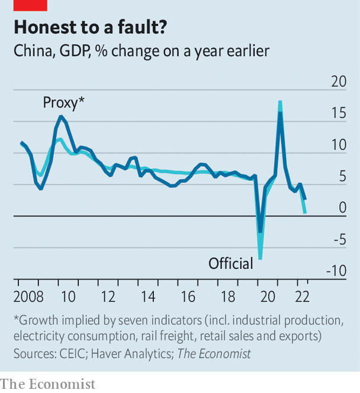

###### Less growth, more credibility

# China’s official growth figures are bad enough to be believed 

##### We cross-check the latest numbers 

 

> Jul 28th 2022 

When china’s Politburo, the 25-member committee that oversees the Communist Party, met this time last year to ponder the economy, China’s rulers seemed quite confident. Their annual growth target was in easy reach and they were keen to crack down further on the country’s overstretched property developers. As  went to press, the Politburo was preparing to meet again. But the economy looks quite different. China’s attempts to stamp out any outbreak of covid-19 have crippled manufacturing intermittently, and consumption more persistently. Distressed developers have stopped working on pre-sold flats—and aggrieved homebuyers have refused to pay their mortgages until construction resumes.

This has put China’s rulers in a pickle. They seem determined to stick to their zero-covid policy. And they would no doubt love to cling to their official gdp growth target of “around 5.5%”. But it has become clear they cannot do both. Unless, of course, they fiddle the growth figures.

That is not beyond them. But there is so far little sign of it. The most recent data showed that the economy grew by only 0.4% in the second quarter, compared with a year earlier. This was not only bad, but worse than expected by private forecasters. In a large teleconference in May, Li Keqiang, China’s prime minister, urged local officials to do more for the economy. But he also cautioned them to seek truth from facts, abiding by statistical regulations.

 


When he was himself a local official in the north-eastern province of Liaoning, Mr Li sought the truth about the provincial economy from three facts in particular: the electricity it consumed, the cargo travelling on its railways and the amount of loans disbursed by its banks. These indicators, he felt, were more reliable than the official gdp figures. In a similar spirit, John Fernald, Eric Hsu and Mark Spiegel of the Federal Reserve Bank of San Francisco have shown that a judicious combination of eight alternative indicators (including electricity consumption, rail cargo, retail sales and consumer expectations) does a reasonably good job of tracking China’s economic ups and downs. Seven of these indicators (all except consumer confidence) have already been updated for the three months from April to June. They can therefore be used to cross-check the latest official growth figure.

The chart shows our attempt to do that, using much the same method as Mr Fernald and his co-authors. Our calculation is not designed to show if China has systematically overstated gdp growth over the past two decades. But it can detect if reported growth is nearer its underlying trend than it should be, given how far the other seven indicators have strayed from their own usual trajectories. The awful data on retail sales and construction in the second quarter were, for example, far outside the norm. But these shocking figures were partly offset by respectable numbers for rail freight and exports.

In all, these indicators suggest the official growth measure was honest. (They would be consistent with gdp growth that is, if anything, a little higher than the 0.4% reported.) Our approach cannot reveal every kind of statistical skulduggery, but it does suggest China made no extra effort to fudge the figures in the second quarter, despite the unusual ugliness of the time. China’s rulers want to fight the downturn, the virus and doubts about their country’s data. They are doing a better job on the last two counts than on the first. ■


