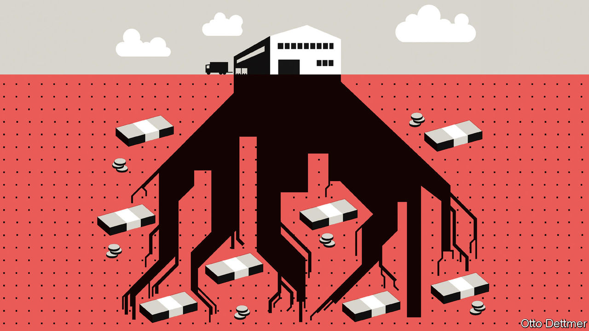

###### Free exchange

# How high property prices can damage the economy 

##### A fresh strand of research studies the consequences, both in China and the rich world 

 

> Jul 28th 2022 

Economists’ interest in land has waxed and waned over time. For the political economists of the 18th and 19th centuries, it was central to understanding the world. They believed that the distribution of rents from land ownership could explain the yawning gaps between the rich and poor, and all sorts of other economic ills. Economists cared less about land in the 20th century. Since the turn of the millennium, however, they have increasingly debated the impact that restrictive zoning laws have on the economic output of cities. The global financial crisis sparked an increase in research on the consequences of property slumps. Banks’ balance-sheets tend to weaken, and worried homeowners spend less, potentially triggering a recession. America’s housing crash during 2007-09 in particular was much studied. 

In recent years another strand of research has emerged, which, rather like the political economists of yore, attributes many long-standing economic ills to land. It explores how high and rising land prices affect lending, investment and ultimately productivity, and much of it looks closely at China’s long property boom. The worrying conclusion is that high and rising property prices can also have damaging economic effects, by crowding out productive investment and leading to a misallocation of capital. In the most extreme cases, inflated land prices may already be the cause of a protracted slowdown in productivity growth. 

Real estate is the largest asset class in the world. In 2020 it made up around 68% of the world’s non-financial assets (which includes plant and machinery as well as intangibles, such as intellectual property). Land, rather than the structures built on top of it, accounts for slightly over half of that 68%. As values have ballooned, the share of land in non-financial assets has increased sharply in some countries (though few report the data). In Britain, for instance, it went from 39% in 1995 to 56% in 2020. 

Because land can easily be valued and cannot be hidden or broken, it is good collateral to borrow against. So when prices are rising, as they have in most places for much of the past few decades, the initial effect is to boost lending and economic activity. Households can use their increasingly valuable property to borrow at lower interest rates than they otherwise would. Land-owning firms, too, can access finance more easily. Fatter asset holdings also make people feel more comfortable spending money. 

But the use of land as collateral has harmful effects, too, especially in places where banks play a big role in financing companies. Firms’ ability to borrow tends to be determined by their existing assets, rather than their productive potential. And those that own land find it much easier to borrow from banks than those, say, with lots of intangible assets. A paper published in 2018 by Sebastian Doerr of the Bank for International Settlements found that listed American firms with more property collateral were able to borrow and invest more than their competitors, even though they were less productive. These effects were also evident in Spain just before the global financial crisis. In research published last year, Sergi Basco of Universitat Barcelona and David Lopez-Rodriguez and Enrique Moral-Benito of the Bank of Spain noted that property-owning manufacturers in the country tended to receive more bank credit than other firms. 

Rising property prices can also discourage productive lending, and lead to capital being misallocated. When housing markets boom, banks tend to engage in more mortgage lending. But because lenders face capital constraints, this is often accompanied by reduced lending to businesses. One paper, published in 2018 and looking at data from America between 1988 and 2006, found that a one-standard-deviation increase in house prices in areas where a bank has branches reduced lending growth to firms that borrow from the same bank by 42%. The total investment undertaken by the affected firms fell by 21%. Such crowding-out effects may have been sizeable in other places too, considering that banks around the rich world have sharply increased their mortgage lending. Across 17 advanced economies, mortgages’ share of total bank loans climbed from 32% in 1952 to 58% in 2016 (the latest year for which data are available). 

Whatever the effects of high land prices in the West, the scale of the problem in China appears even bigger, given that the country’s investors have a huge appetite for real estate. A range of recent research suggests that China’s high land prices shift bank lending away from land-light manufacturers and reduce spending on research and development by listed firms; they also appear to lead to a reallocation of managerial talent towards the property sector. One especially striking result comes from a paper published in 2019 by Harald Hau of the University of Geneva and Difei Ouyang of the University of International Business and Economics in Beijing, based on data from manufacturers in 172 Chinese cities. It concludes that a 50% increase in property prices would raise borrowing costs, reduce investment and productivity, and result in a 35.5% decline in the firms’ value-added output. 

Hitting home 

The conclusion that high and rising property prices can throttle economic activity carries important implications for how policymakers should treat investment in land and housing. Encouraging much more housebuilding, for instance, would help deflate collateral values. Restricting the ownership of multiple properties would alter the distribution of that collateral. And limiting the amount of mortgage lending banks can do might lead more credit to flow to productive purposes. 

A more ambitious idea would be to tax land values, which, by lowering the market value of land, might reduce its attractiveness as collateral. Such a tax was, funnily enough, the goal of many 18th- and 19th-century reformers as they sought a more equal society. A new obsession with land could well revive an old idea. ■


