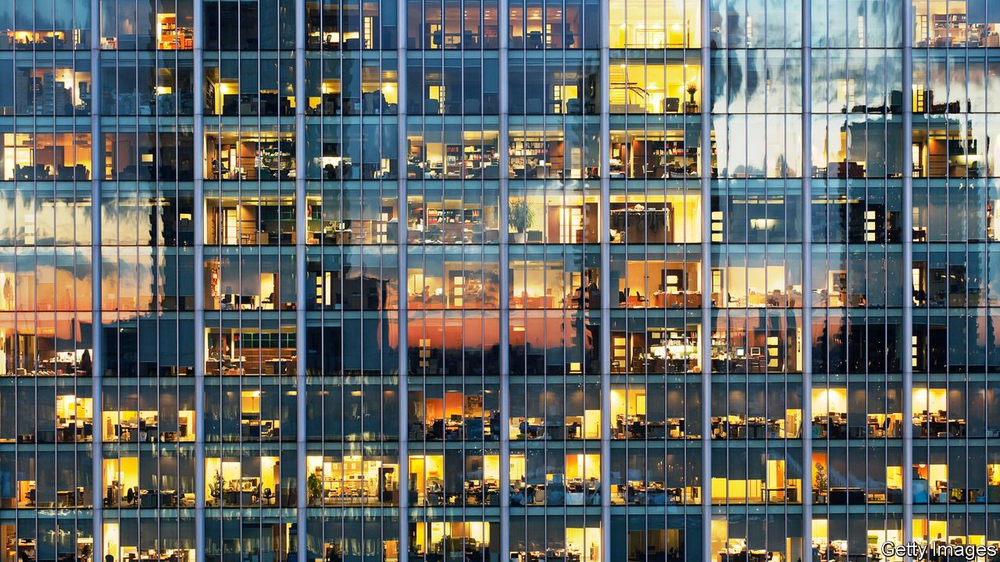

###### Through the floor

# Recession fears weigh on commercial property 

##### Prices are set to subside as investors rethink their portfolios 

 

> Jul 26th 2022 

Property is usually regarded as a good hedge against inflation. Landlords’ ability to increase rents can cushion the blow from rising costs. If  is driven by strong economic growth, rents go up, buildings stay full and landlords are assured of rising income. 

Worries about the economy, however, have turned this strategy on its head. Strained household budgets and stretched corporate balance-sheets could limit tenants’ ability to pay more rent, jeopardising investors’ returns. Moreover, with the  rising, owners of office towers, hotels, shopping malls and other types of property risk being stuck with lower returns on assets that may now be overpriced. Many fear a correction is coming. 

The darkening mood is in contrast to the optimism of 2021, when returns soared, rents rocketed and fundraising, fuelled by low interest rates, raced to record highs. Even as offices remained eerily empty, fund managers rushed to park their capital in new blocks of flats, labs and warehouses, pushing up the global value of professionally managed property by nearly $1trn. That stellar performance has since fizzled out. The share prices of listed real-estate investment trusts are tanking and expectations for rental growth and returns are being scaled back. In America delinquency rates crept up in June for the first time since late 2021. 

The strain comes on top of other challenges. ubs, a bank, expects the shift to remote work to hit leasing demand for offices by as much as 20%. Decarbonisation will require hefty investment in older buildings. Meanwhile, the decline in bricks-and-mortar stores is bad news for shopping-mall owners, and rising air fares threaten the demand for hotels.

No wonder investors are tightening their belts. After a record start to 2022, deal activity in America is cooling, says Kevin Fagan of Moody’s Analytics, a research firm. Transactions that are already under way are taking longer to negotiate; some are being put on hold. In America and Britain, commercial-property investment between April and June plunged to its lowest level since the pandemic began, to $86bn and £10bn ($12bn), respectively. Dealmaking also fell in Germany. 

Not all properties will struggle. The highest-quality, most energy-efficient buildings, with modern amenities and on prime sites, typically owned by big institutional investors, are expected to fare relatively well. By contrast, lower-quality assets across Europe lost around a tenth of their value in the second quarter of this year, compared with the previous three months, reckons Green Street, a research firm. That decline follows a poor 2021 for many such buildings: rents for lower-quality offices in London fell by 9% last year, compared with 2020, even as those for prime office space rose by 8%. 

Some cities will do better than others. In America, sunbelt markets such as Atlanta, Dallas and San Diego are expected to be among the top performers this year, providing better returns than places like New York and San Francisco, where workers have been slower to return to the office. Landlords who can guarantee future rent growth or those in markets with constrained supply are also relatively well-positioned. This includes owners of labs, warehouses and other logistics property. 

The upshot is that, although commercial-property prices might fall, the decline is not forecast to be precipitous. Analysts at Capital Economics, a consultancy, reckon that values in America could face a peak-to-trough fall of 6-8%. That is a bigger decline than the one at the start of the pandemic, but is far from the plunge of 34% during the global financial crisis. 

Another comfort is that banks have become less exposed to commercial property. In Britain, for instance, it makes up almost 7% of lenders’ loan books, compared with 12% before the financial crisis. Offices, malls and warehouses may not provide as much shelter from inflation as investors might like, but they have, at least, become less likely to amplify financial trouble. ■


