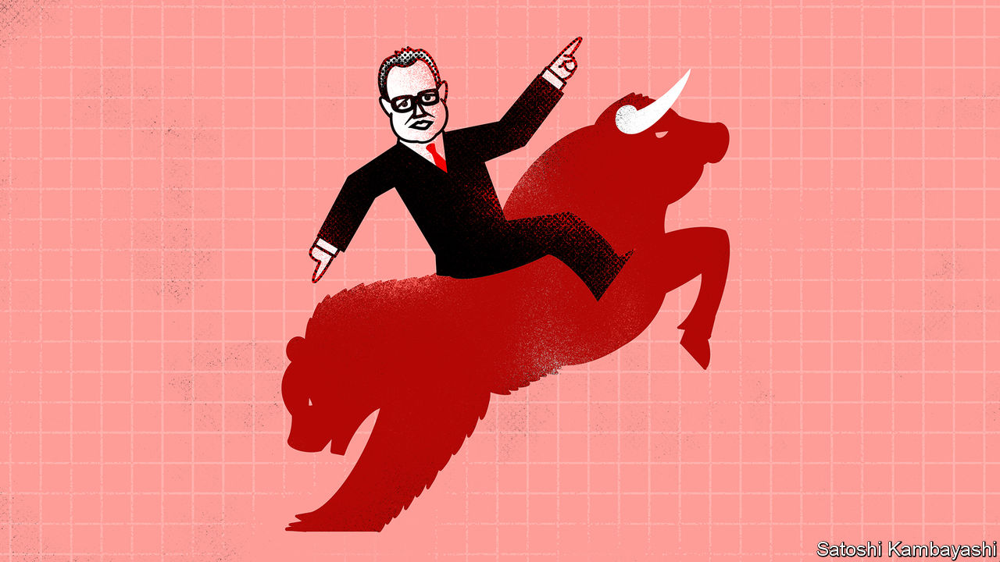

###### Buttonwood

# Reminiscences of a financial columnist 

##### There is nothing new on Wall Street 

 

> Jul 28th 2022 

It is telling that one of the best books about financial markets was published almost a century ago. “Reminiscences of a Stock Operator”, by Edwin Lefevre, is a fictionalised account of the exploits of Jesse Livermore, a speculator. Livermore made a fortune selling the market short during the financial panic of 1907. He would repeat the trick in 1929. The book captures a particular time—of bucket shops, insider pools and dandy tips on Western Union or American Steel. But it is also timeless.

As this writer finishes a four-year stint as Buttonwood, the one tentative conclusion he draws from the experience is something that Livermore realised a century ago: there is nothing new on Wall Street. What happens today in the markets has happened before and will happen again. Every extreme of greed or fear has a precedent. Technology changes, but people do not.

The beginning for this Buttonwood was May 2018. At the time there was a good deal of optimism among American and European asset managers about business prospects in China. There was much talk about its “Wild West” stockmarket—with lots of retail trading on tips and a rapid turnover of shares. Rich-world entrants fancied they would add a dash of professionalism. But instead of China’s market becoming more American, the reverse happened. In 2020 there was a surge in new accounts at no-fee brokers, notably Robinhood, catering to small investors in America. A gaggle of social-media pundits emerged to mobilise this new army of speculators. They piled into tech darlings, such as Tesla, but also bombed-out stocks, such as GameStop, a video-games retailer. 

This “meme-stock” craze seemed new, but it wasn’t. What it most resembled was the bucket shops of early-20th-century America, where Livermore first learned to read the markets. Here ordinary punters exchanged tips and could bet on the direction of favoured stocks for a tiny initial outlay. The Robinhood crowd, though they had better technology, had similar preferences. They were keen on call options on stocks that had the characteristics of long-odds bets. As with bucket-shop punts, these options mostly expire worthless, but can reap a spectacular profit if the share price surges.

Manias, scams and iffy schemes are recurring evils. “I used to think that people were more gullible in the 1860s and 1870s than the 1900s,” says the narrator of “Reminiscences”. But Livermore only had to pick up his newspaper to read about the latest Ponzi scheme or crooked broker. More recently, there has been the Wirecard fraud, the Archegos blow-up, the shell-company boom and any number of dodgy digital currencies. 

This year has so far been a rejoinder to such excesses. As Livermore knew well, tighter money and a giddy stockmarket are a dangerous mix. His big short in 1907 was in response to signals from the money markets, which were “megaphoning warnings to the entire world”. But they were not the only warnings he ever heard. In the world of “Reminiscences”, bull markets are marked by the “calamity howling” of “old-stagers [who] said everybody—except themselves—had gone crazy”. Doom-mongers are forever with us. Indeed, there is a kind of punditry that echoes the millenarian sects of medieval Europe, the adherents of which believed they were living in the “last days”. It anticipates an endgame in which all excesses will be washed from the markets. 

Perhaps such a reckoning is already in train. But it cannot be the endgame, because the game never ends. If history is anything to go by, a big bust would merely set the stage for another phase of play. Injuries heal with time. Memories of the last brutal bear market eventually fade. The unceasing contest between fear and greed resumes. The thoughtful investor has a lot to reckon with, and that won’t change either. There are constant judgments to be made about company managers, business strategy, economic policy, politics and geopolitics—as well as the opinions and likely reactions of other investors, who may or may not be as thoughtful.

And as Livermore knew well, any investor has also to fight the “expensive enemies within himself”. This endless wrestling with powerful emotions, such as hope, doubt and fear, is a big part of what makes Wall Street so fascinating. It has been a great privilege to watch the unfolding drama from this perch and to try to make sense of it all. The honour now passes to others. Thank you so much for reading. 


