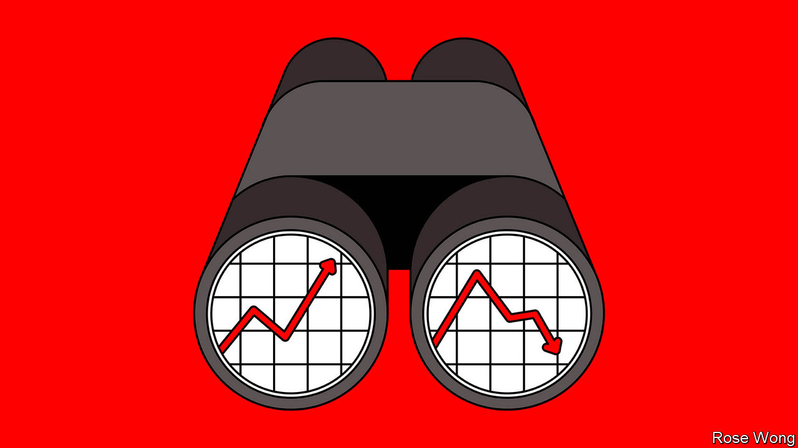
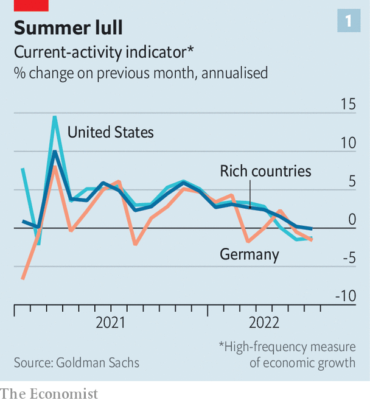
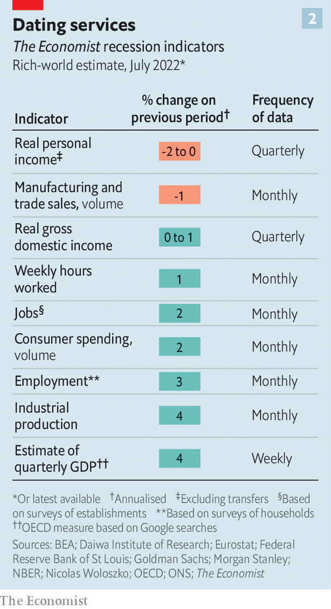
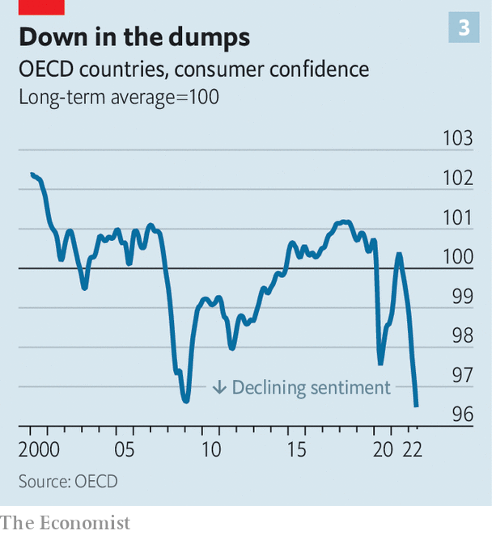
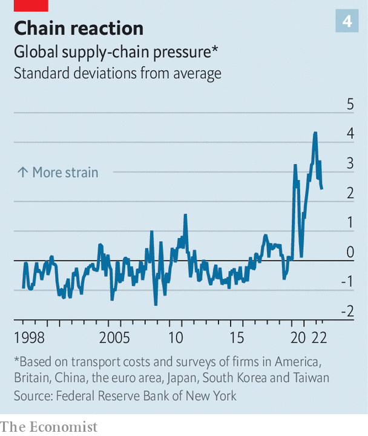

###### Coming in to land

# Why it is too early to say the world economy is in recession 

##### Growth in the rich world is slowing, but has not crashed to a halt 

 

> Jul 24th 2022 

Everyone is a pessimist these days. On July 14th Steven Blitz of ts Lombard, an investment-research firm, said that he was now expecting a recession this year in the world’s largest economy, a day after Bank of America made the same call. Goldman Sachs, another bank, expects gdp in the euro zone to fall in both the third and fourth quarters of the year. Americans’ Google searches for “recession” have never been so high. Traders are selling copper (a proxy for industrial health), buying the dollar (a sign that they are nervous) and pricing in interest-rate cuts in 2023.

A number of factors have combined to create a toxic mixture. In response to the covid-19 pandemic America overstimulated its economy,  not just within its borders but beyond them, as consumers’ voracious demand for goods bunged up the world’s supply chains. China’s attempts to stamp out covid compounded these problems. Then Russia’s invasion of Ukraine caused . In response to the ensuing inflation, roughly four-fifths of central banks worldwide have raised interest rates, by an average of 1.5 percentage points. After a meeting that ended on July 27th, the Federal Reserve raised rates for the fourth time this cycle, by three-quarters of a point. 

At the root of recession worries is a fear of the consequences of monetary tightening. It is clear that central banks have to take the proverbial punchbowl away from the party. Wage growth in the rich world is far too strong given weak productivity growth. Inflation is too high. But the risk is that higher rates will end the party altogether, rather than making it less raucous. History is not encouraging in this regard. Since 1955 there have been three periods when rates in America rose as much as they are expected to this year: in 1973, 1979 and 1981. In each case a recession followed within six months. 

 


Has recession struck again? Rich-world economies, which account for 60% of global gdp, have certainly slowed since the heady days of mid-2021, when covid restrictions were being lifted. Goldman Sachs produces a “current activity indicator”, a high-frequency measure of economic health based on a range of indicators. The gauge has slowed in recent weeks (see chart 1). Surveys of factory bosses in America and the euro zone by s&amp;p Global, a data provider, suggest that manufacturers are gloomier than at any time since the early days of the pandemic.

It looks too soon, though, to declare a recession—even if, as some expect, statisticians reveal after we go to press on July 28th that between April and June American gdp contracted for the second quarter running. This would count as a recession by one rule of thumb, but not necessarily by others. A series of oddities led gdp to shrink in the first quarter, even though the underlying performance of the economy was strong. It would also be too soon for Fed tightening to have had an effect.

 


Most economists look to America’s National Bureau of Economic Research (nber) to find out if the economy is truly in recession. Its business-cycle-dating committee considers indicators beyond gdp in making that judgment, including jobs numbers and industrial production. has used a similar approach, with a little guesswork, for the rich world as a whole. Many indicators still point to expansion (see chart 2). It is hard to argue that a recession has arrived.

 


Yet with growth clearly slowing, the big question is how bad things will get. The few remaining optimists point to the strength of households and firms. The public is even gloomier about the economy than it was during the depths of both the global financial crisis and the pandemic (see chart 3). But households in the rich world probably still have some $3trn or so in “excess” savings accumulated during the pandemic. In America the cash balances of poor households were 70% higher in March than they were in 2019, according to the JPMorgan Chase Institute, a bank-affiliated think-tank. 

Moreover, people seem more confident about their personal finances than about the state of the economy. Across the eu households are about one-third more likely to be positive about their own finances than they have been, on average, since the data began in the mid-1980s. In America an unusually low share of people believe they will be unable to meet debt commitments over the next three months. Consumer-spending trackers, including from the Bank of England (for Britain) and JPMorgan Chase (for America), still look fairly strong. 

Governments are also handing out money to help poorer people cope with roaring energy prices. In the euro zone, governments are stimulating the economy by the equivalent of about 1% of gdp. Britain has offered handouts to poor households. In May the Institute for Fiscal Studies, a think-tank, reckoned that such spending would largely compensate the poorest households for the rising cost of living (though retail energy prices are now likely to rise further still). 

The behaviour of businesses is also reassuring. Across rich economies the number of job vacancies is still near a record high. In Australia they are more than twice their pre-pandemic level, according to data from Indeed, a hiring website. In America there are more than two open positions for every unemployed person. 

As a result, labour markets remain tight. You can find some evidence of rising joblessness in the Czech Republic, if you squint. Overall, though, the unemployment rate across the oecd club of mostly rich countries is lower now than it was just before the pandemic. In half of oecd countries the share of working-age people who are in a job—a broader measure of labour-market health—is at an all-time high. If history is any guide, these figures are inconsistent with a looming recession.

Fear, uncertainty and doubt 

Declines in investment have in the past played a big role in downturns. In recessionary periods since the 1980s for the g7 group of large economies, around half the fall in combined gdp in negative quarters came from shrinking capital spending. This time investment data have weakened, but not catastrophically so, according to data compiled by JPMorgan for America, the euro zone and Japan. 

Until recently capital spending was booming, as firms spent big on remote-working technology and reinforced supply chains. Now some believe they have overinvested in capacity. Others want to conserve cash. An analysis of survey evidence, credit conditions and corporate liquidity by Oxford Economics, a consultancy, suggests that investment in the g7 could decline at an annualised pace of around 0.5% in the second half of this year. That is not good, but it is not enough to create a recession by itself. The investment declines in past downturns were steeper.

Unfortunately there is a limit to the confidence that can be taken from good economic data when the fundamental fear of investors is monetary tightening. News of any kind, it seems, can convey bad news about a recession. Weak figures confirm that a downturn is approaching. Strong data, including wage rises, suggest central banks are not succeeding in slowing things down, requiring further tightening, which in turn stands to provoke a recession. Only signs that inflation is falling will truly dispel fears of a downturn.

There is some relief ahead. A gauge of supply-chain snarls compiled by the New York Fed, comprising global transport costs, among other things, has eased. American petrol prices are now falling by 3% a week. Alternative Macro Signals, a consultancy, constructs a “news inflation pressure index”, which indicates whether the flow of news articles suggests price pressures are building up. The indices for America and Britain have fallen of late.

 


But hopes for a rapid fall in inflation are almost certain to be dashed. Past increases in the price of food and energy have not yet fully filtered into headline inflation rates: Morgan Stanley reckons that rich-world inflation will peak at 8% in the third quarter of 2022. Growth in wages shows little sign of easing. In earnings calls companies still talk about how best to pass on higher costs to their customers. 

The mass of data confronting economists is useful, but an old lesson may still hold: that recessions are hard to spot in real time. The nber dates the start of America’s downturn associated with the global financial crisis to December 2007. Even in August 2008 the Fed’s staff thought the economy was still growing at an annual pace of about 2%. The post-lockdown picture is particularly difficult to interpret. Barely anyone thought labour shortages would emerge last year, or that inflation would go from bad to worse in 2022. 

That is the case for pessimism. The case for optimism is that the present episode of monetary tightening has only just begun. Before it bites there is time for a volatile world economy to deliver more surprises—perhaps even positive ones. ■


