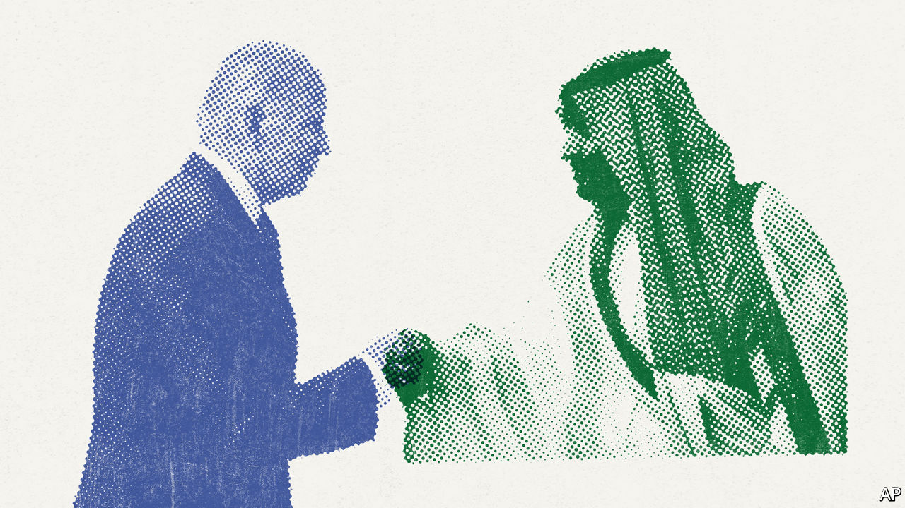

###### Foreign policy

# How to deal with despots 

##### Western foreign policy sets out to be ethical, but often ends up being ineffectual 

 

> Jul 28th 2022 

For about 15 years after the fall of the Soviet Union in 1991, Western foreign policy seemed to rest on sure foundations. Liberal values—democracy, open markets, human rights and the rule of law—had just prevailed over communism. America, the first and only global hyperpower, had the clout to impose this moral code against terrorists and tyrants. And tough love was justified, because history had shown that Western values were the uncontested formula for peace, prosperity and progress. 

Another 15 years on, Western foreign policy is in a mess. To see why, consider Muhammad bin Salman, the crown prince of Saudi Arabia. Our summer double issue, featuring profiles and long reads, leads with a , as he is known. It illustrates the erosion of each of the three pillars of Western foreign policy—values, power and that historic destiny.

The moral calculus turns out to be fraught. As our profile concludes, the crown prince has a tendency to be violent and erratic and to oppress his foes. He has been held responsible for the murder of a columnist. Yet he is also a moderniser who has liberalised Saudi society, tamed the kingdom’s clerics and given women new freedoms. Even if you doubt mbs’s reforming zeal, Saudi Arabia produces oil that could help America and its allies withstand an even more dangerous man: Vladimir Putin. Is the ethical policy to shun mbs or sup with him?

mbs also shows that American power is less imposing than it seemed 15 years ago. Saudi Arabia has been close to America since 1945, but mbs long snubbed Joe Biden by refusing to take his phone calls, instead palling up with an assertive Russia and a rising China. Saudi Arabia is key to a region that America tried to mend by invading Iraq but, although America and its allies are still formidable, the fighting has worn out voters’ willingness to see their troops act as a global police force. Their reluctance is understandable. The desert wars demonstrated that you cannot turn people into liberals by firing guns at them.

And history has bitten back. A young man in a hurry, mbs believes he can achieve Western levels of prosperity without the inconvenience of democracy or human rights. Justin Bieber and Monster-Jam motorsports sit snugly alongside his despotic rule. 

mbs is not alone. China is asserting the merits of “people-centred” human rights that put peace and economic development above voting and free speech. Mr Putin has invaded Ukraine in what can be thought of as a war on Enlightenment values by a regime in thrall to a . When Western leaders entreat the global south to stand up for the international system by condemning Mr Putin, many say that they have lost patience with preachy, hypocritical Westerners who readily invade other countries whenever it suits them.

has not lost its faith in the institutions that emerged from the Enlightenment. Liberal values are universal. Yet the West’s strategy for promoting its world-view is sputtering and America and its allies need to be clearer-eyed. They must balance what is desirable with what is possible. At the same time they must cleave to the principles that save them from the cynicism of Mr Putin’s desolate, truth-free zone. That sounds like a counsel of perfection. Can it work?

The best way for Western leaders to avoid charges of hypocrisy is to refrain from staking out moral positions they cannot sustain. While campaigning, Mr Biden pledged to treat Saudi Arabia as a “pariah”. But this month he went to Jeddah and fist-bumped mbs and was widely condemned for hypocrisy and moral cowardice. In fact, his mistake was a crowd-pleasing pledge that was always going to be a millstone in office.

Western leaders need to be honest about how much influence they really have. The assumption that the rest need the West more than the West needs the rest is less true these days. In 1991 the g7 produced 66% of global output; today, just 44%. In hindsight it was hubris to think that dictatorships could be cured of their pathologies by battalions of human-rights lawyers and market economists. Leaders ought to be clear about right and wrong, but when they weigh up whether to impose sanctions on wrongdoers they should assess the likely results rather than the appearances of virtue. 

Another principle is that talking is usually good. Some say that turning up bestows legitimacy. In reality, it generates insights, creates a chance to exert influence and helps solve otherwise insoluble problems—by means of climate deals, say; or getting grain out of Ukraine; or asking al-Shabab, an affiliate of al-Qaeda, to help  from starvation. Mr Biden was right to talk to mbs. Emmanuel Macron, France’s president, is right to talk to Mr Putin. Everyone needs to talk to China’s president, Xi Jinping.

There are ways to help keep talks honest. In meetings you can have your say on human rights. You can temper your contact, as Mr Macron did after Russian troops committed war crimes. You can insist on also speaking to the opposition and to dissidents. In this and other things, Western leaders should co-ordinate with each other so that they are less likely to be picked off by a policy of divide and rule—by China over its treatment of dissidents abroad, for example, or the abuse of the Uyghur people in Xinjiang. 

A last principle is to acknowledge that foreign policy, like all government, involves trade-offs. For most countries that is so obvious it hardly needs saying. But the West came to think that it could have it all. Such trade-offs need not be grubby. A clearer focus on outcomes after the Russian annexation of Crimea in 2014 might have led to more effective action by nato countries than the weak, conscience-salving sanctions they actually imposed. Unfortunately, Mr Biden’s simplistic attempt to divide the world into democracies and autocracies makes wise trade-offs harder.

Ideals and their consequences

The West has discovered that simply trying to impose its values on despots like mbs is ultimately self-defeating. Instead, it should marry pressure with persuasion and plain-speaking with patience. That may not be as gratifying as outraged denunciations and calls for boycotts and symbolic sanctions. But it is more likely to do some good. ■


