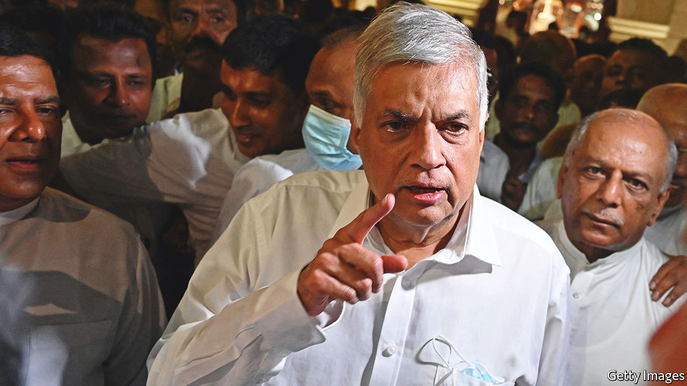

###### The tough road back

# Ranil Wickremesinghe must persuade suffering Sri Lankans to endure more pain 

##### There is no getting around difficult economic reforms 

 

> Jul 28th 2022 

For months Gotabaya Rajapaksa, the former president of Sri Lanka, was told that the economy was in free fall. The covid-19 pandemic hit tourism hard and, just as visitors began to return, Russia’s war in Ukraine pushed up fuel and food prices. But external shocks were only part of the problem. The main cause of Sri Lanka’s misery, and the reason protesters stormed the presidential palace on July 9th, was mismanagement. Errors by Mr Rajapaksa and his brothers, who treated the government like a family business, caused inflation to spiral, the currency to collapse and foreign reserves to evaporate.

Enter Ranil Wickremesinghe, who took over as president on July 21st, a week after Mr Rajapaksa fled the country. The burden of guiding Sri Lanka out of its worst-ever economic crisis now falls on him. Protesters remain in the streets. Anger over power cuts and shortages of food, fuel and medicine is unabated. Yet somehow Mr Wickremesinghe must persuade his people to endure more pain, because the reforms needed to turn  round will involve further sacrifice.

It is a shame parliament did not pick a more inspiring figure. Mr Wickremesinghe was first elected to the legislature in 1977 and has served as prime minister six times. His most recent stint came this year, under Mr Rajapaksa, whose older brother had just stepped down from the role. That does not sit well with the protesters, who, shamefully, set fire to Mr Wickremesinghe’s home on July 9th. Their demands involved his resignation, not his promotion. Few Sri Lankans think he deserves the presidency. Many see him as a puppet of the Rajapaksas, whose party vaulted him into the top job.

All that will make it difficult for Mr Wickremesinghe to unite the country. Yet he seems bent on making the task even harder. His cabinet is nearly the same as his predecessor’s. His hand-picked prime minister is a friend of the Rajapaksa family. He has also displayed an authoritarian streak, calling the protesters “fascists”, imposing a curfew and declaring a state of emergency. A day after he was sworn in, Mr Wickremesinghe ordered troops, using force if necessary, to remove protesters who had already promised to leave the president’s office.

Restoring political stability should be Mr Wickremesinghe’s priority. A lighter touch would help. To his credit, he has let protesters remain in designated areas not far from his new place of work. He could create more goodwill and boost his legitimacy by inviting members of the opposition into the government. Better still, he should set a timeline for new elections to demonstrate his commitment to democracy. Holding a vote immediately would waste precious time and resources. But by next spring the parliament will have reached its halfway mark and, as president, Mr Wickremesinghe will have the power to dissolve it. Why not then?

Negotiating a bail-out with the imf is the president’s second big task. Mr Wickremesinghe has been admirably honest about . The country is “bankrupt”, he has admitted. The Rajapaksas ran up billion-dollar debts on vanity projects, then enacted policies—such as cutting taxes and adding government jobs—that increased the budget deficit. Doing the opposite would be a start. The new government should aim to shrink the public-sector wage bill by cutting jobs, salaries or both. Taxes will have to rise. Some money could be made by selling off state-owned enterprises, such as the national airline. 

Mr Wickremesinghe is preparing Sri Lankans for the pain ahead, but he must do more. The economic crisis will probably last until at least the end of next year. Creditors will drive a hard bargain in negotiations over restructuring the country’s debt. Many people would prefer to hear these hard truths from someone else. But those who know Mr Wickremesinghe insist that he is a canny political operator with a mind of his own. Now is the time for him to prove it. ■

