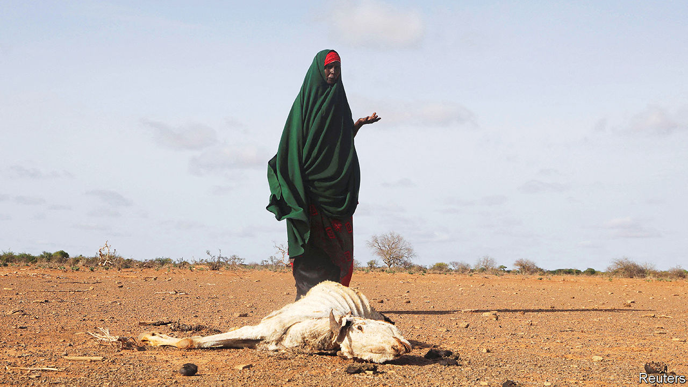

###### War and hunger

# Somalia needs urgent help to avert a catastrophic famine 

##### Saving lives will also involve talking to terrorists 

 

> Jul 28th 2022 

In the contest to win recruits and funding, Africa’s jihadists aim for notoriety. Al-Qaeda’s affiliate in Burkina Faso has booby-trapped bodies to kill doctors. Islamic State West Africa Province has beheaded captives. Boko Haram in Nigeria has strapped ticking bombs to children and sent them into mosques and markets. But al-Shabab in Somalia can claim to top this list of savagery. America’s military command for Africa calls it “al-Qaeda’s fastest-growing and most kinetically active affiliate”. It has abducted thousands of children to use as soldiers, slaves and child brides. It has targeted schools and hospitals. Despite all that, the world needs to talk to al-Shabab.

The reason is that Somalia faces a famine. The worst drought in 40 years is killing livestock and causing crops to shrivel. Russia’s invasion of Ukraine has exacerbated the crisis by raising grain prices, meaning that farmers and herders cannot afford to supplement their diets. Roughly 7m people, or 40% of Somalia’s population, are struggling to find enough food to eat. Around 1.4m children are severely malnourished. Experts say that, unless urgent action is taken, this famine may be even deadlier than the one that .

The first step towards averting calamity is for the world to send more aid, quickly. A rapid response in 2017 prevented a drought in Somalia from turning into a disaster. Cash sent early is spent more efficiently, so less money is needed. Unfortunately, the funding today is falling far behind the targets laid down five years ago. Although America pledged an additional $476m on July 24th, the total raised so far is only 46% of the $1.5bn the un says is needed in Somalia. Others should also do their part. 

The next step is where al-Shabab comes in. For the food to get to the hungry, aid groups must negotiate with the jihadists, who control large swathes of the countryside in central and southern Somalia. At the moment, little help gets through to people in these areas because aid workers are afraid of being kidnapped or killed. As a result, starving families risk long, dangerous journeys to squalid informal camps on the edge of cities. By the time they set out, their children are often too weak to survive.

Countless lives would be saved if the food made its way to people in the countryside, rather than the other way round. But negotiating access with al-Shabab takes aid workers into morally hazardous territory. In previous famines the jihadists forced humanitarian groups into handing over cash. This imposed a dire choice on aid agencies: “Pay off al-Shabab, a listed ‘terrorist’ organisation, or let people die,” said a report by the Overseas Development Institute, a British think-tank. Some groups, such as the un‘s World Food Programme, temporarily withdrew from southern Somalia. Others agreed to pay as much as $10,000 for access, putting them at risk of criminal prosecution under laws banning the financing of terrorists. 

Although the president, , elected this year, has said he would talk to al-Shabab when the time was right, there are plenty of reasons to balk at dealing with it now. The group would be largely in control of where and how food is distributed, helping it coerce Somalis. The jihadists will want to deny the government credit for supplying the aid, by controlling whose logos feature on lorries when it is delivered. Payments by aid organisations would make al-Shabab stronger. Meanwhile, charities have concluded that if they are accused of supporting jihadists donors may abandon them, hindering their work elsewhere.

None of that is good for the security of Somalia or the region. But the world faces a trade-off: to shun al-Shabab and watch a famine claim perhaps hundreds of thousands of lives; or to talk to al-Shabab in order to get food to the starving in the knowledge that the jihadists will grow stronger. Caught between evils, the world should choose the lesser of the two. ■

