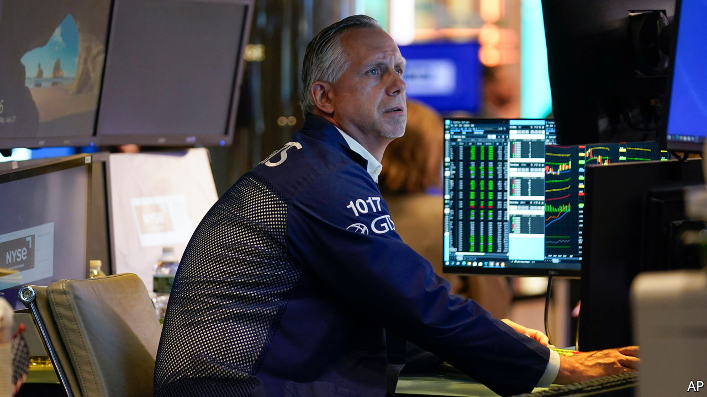
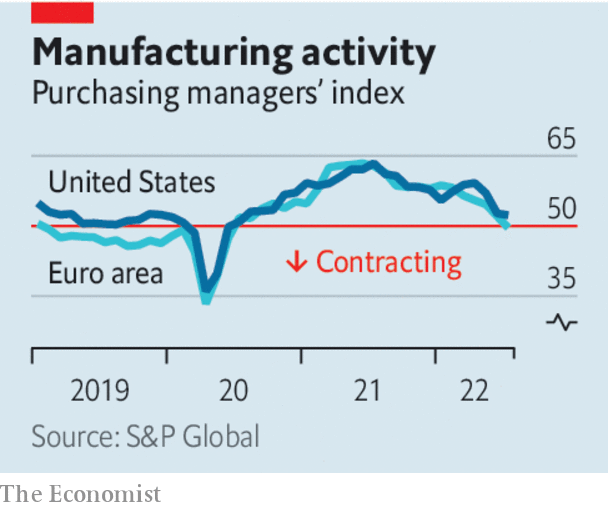

###### After the downturn

# The silver linings of a recession 

##### Lower inflation and greener energy are worth the price of a short downturn 

 

> Jul 27th 2022 

Predicting a global recession usually means standing out from the crowd. Today it is those saying the world economy will avoid a downturn who are sticking their necks out. America’s Federal Reserve  a broad charge to tighten monetary policy, and has raised interest rates by 2¼ percentage points since March. It is expected to impose another point of tightening by December. Europe is short of natural gas because of falling supplies from Russia. Chinese growth has slowed sharply as a result of the lockdowns that stem from its zero-covid policy, and worries are mounting over its fragile property markets.

So gloomy is the mood that many investors are asking whether a recession has already arrived. It is a hard question to answer. The pandemic has . Inflation has caused consumer confidence to plunge, but when asked about their personal finances rather than the whole economy, people are much cheerier. America’s disappointing gdp figures do not tally with other measures of output or employers’ growing payrolls. Manufacturing surveys register their weakest results since the early days of the pandemic, but that may be because consumers are still rebalancing their spending after the worst phase of the pandemic (there is less buying of home-gym equipment, but more queuing in airports). Even China’s slowdown could help Europe narrowly, by reducing global demand for liquefied natural gas.

 


Regardless of whether economies are already shrinking, it is hard to see how they can avoid a recession over the next year as monetary tightening bites and Europe heads into a bleak winter. The silver lining is that both higher interest rates and the energy shock will bring gains that should strengthen the world economy in the long run.

Some recessions feed on themselves as indebted households cut their spending or defaults cascade through a fragile financial system. With a few exceptions, such as Canada’s frothy housing market, today’s big economies suffer from few such vulnerabilities. In fact, households and companies look strong. 

The bank balances of the poorest American households are around 70% fatter than they were in 2019. Even the threat of an emerging-market financial crisis—the usual worry when the Fed raises rates—is not what it once was. That is in part because of a switch towards debts denominated in local currencies rather than dollars.

The main global economic fault line is inflation. Thankfully, it is still short in the tooth. The last time the Fed tightened monetary policy so dramatically, in the early 1980s, prices had more than doubled over the previous decade. Today the figure is just 29%, because inflation only took off last year. Though America’s economy has badly overheated, long-term inflation expectations remain modest. The best historical analogy is probably not the prolonged battle with stagflation of the 1970s but the burst in consumer prices that followed the mass disruption of the second world war. The downturn that brought that inflation to an end was shallow and left few scars. A mild recession should squeeze price rises out of the economy this time, too. Already, markets are betting that American prices will rise by about 3.8% over the next year, less than half the current inflation rate.

Elsewhere the main impetus for inflation is soaring global food and energy prices and disrupted supply chains, which are raising the price of imported goods. Some shortages are already easing. Wheat prices are down by nearly 40% from their recent peak in May. Oil prices have also been falling lately. Supply chains are recovering. Unfortunately, Europe’s gas shortage is getting worse. Though governments are doing their best to shield consumers from the consequences, if rationing becomes necessary, industrial production and hence gdp will fall, perhaps steeply in exposed economies like Germany. Even as output shrinks, inflation will rise further. 

Yet in the same way that a downturn should purge the American economy of its inflation problem, so Europe could emerge from recession having overcome its complacency about the supply of energy. Policymakers have belatedly realised that a carefully managed shift to clean energy also eases their dependence on autocratic regimes. 

Around the world, investment in renewable energy is surging and governments that were previously sceptical about nuclear power—an essential part of a low-carbon energy grid—are reconsidering their opposition to it. Even Japan, which suffered the Fukushima disaster in 2011, is hoping to restart more nuclear reactors. If the world emerges from the coming downturn with inflation under control and on the path to greener, more secure energy supplies, the pain will not have been for nothing. ■

