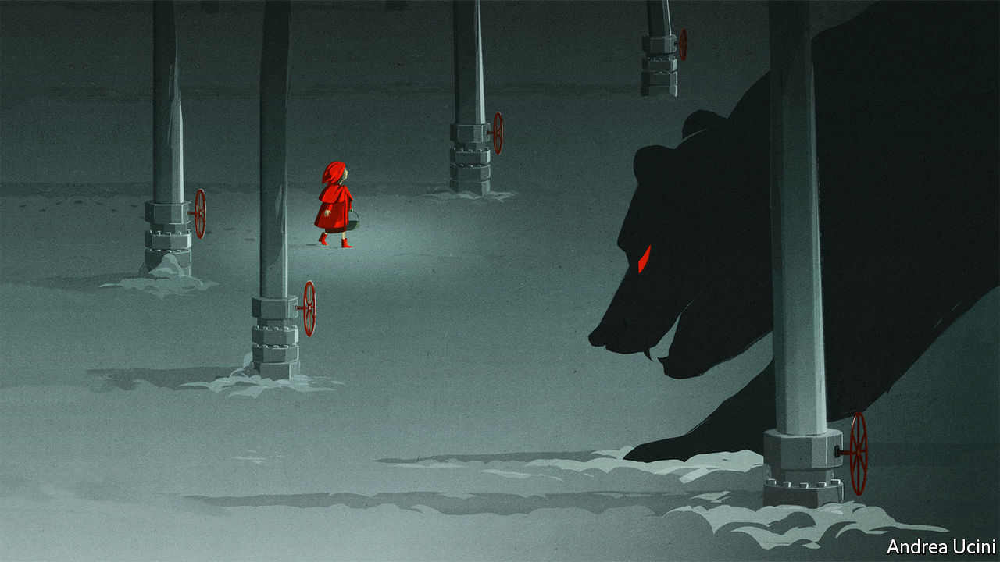
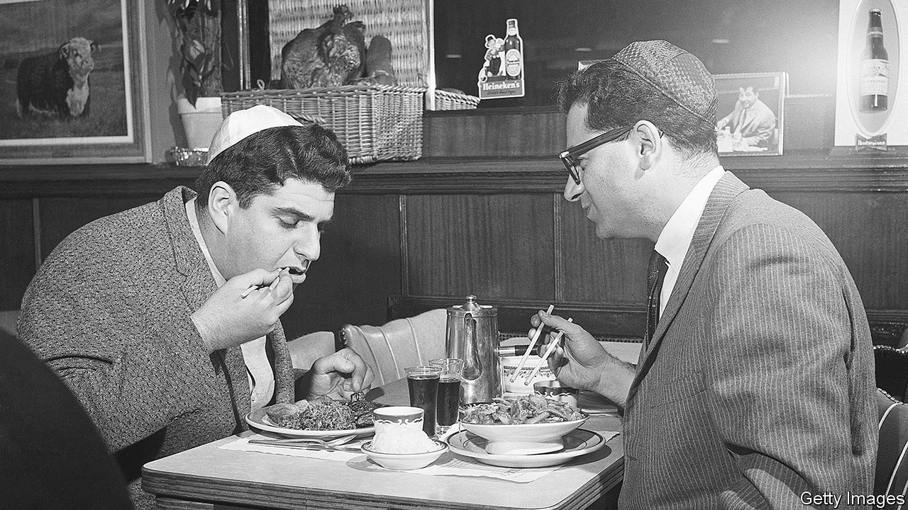

###### On gas markets, priests, Shakespeare, China, folk cuisine, turning 65, games

# Letters to the editor 

##### A selection of correspondence 

 

> Jul 28th 2022 


Europe’s gas market

Your leader on “” (July 16th) was timely. However, the current price gaps in European gas markets are more a reflection of physical congestion than a reflection of fear that the single gas market will break down. Until last year, spreads between hubs (gas-trading places) were often below €1/mwh ($1/mwh). Today, some spreads reach €50/mwh. Why? Gas flows have changed. 

Previously most gas flowed from east (Russia) to west. In the first half of this year, Russian pipeline supplies to Europe decreased by 29bn cubic metres. Liquefied natural gas replaced almost all of it. But with most lng terminals located in the western part of Europe, gas now often needs to flow in the opposite direction. So what we see is physical congestion at borders (for example, from Britain to the continent, and from Spain to France) and these are reflected in price gaps. A reallocation of existing transmission capacities and targeted investments could address the most pressing gaps. 

Market forces ensured that gas continued to flow to those who most needed it. There are reasons to worry about keeping the single European Union gas market in place, but price gaps are not one of them.

dennis hesseling

Head of gas

eu Agency for the Co-operation of Energy Regulators


 


Celibacy in the priesthood

I wish to express my appreciation for your article on sex abuse and the Catholic church (“”, July 16th). However, presenting celibacy as the root cause of abusive behaviour is scientifically untenable. In fact, all independent studies (governmental, like the Royal Commission reports in Australia, and those conducted by public universities) conclude that abolishing clerical celibacy is not the solution to the sexual abuse crisis as such, as celibacy is not the root cause of sexual abuse. Your assumption that married Protestant clergy, or, for that matter, Orthodox priests, or rabbis or priests of other religions, are less abusive than celibate Catholic clergy has not been scientifically substantiated. On the contrary, the few large-scale studies looking into abuse committed by Protestant clergy show that the allegations are not far in proportion from those concerning Catholic clergy.

“Do away with celibacy and you won’t have abuse” is a dangerous slogan, because it does not address the deeper institutional challenges, above all the question of how power is exercised. A big part of the problem is the existence of a closed-church system, or “fortress mentality”, when members seek to protect the institution before the individual. 

The new Safeguarding Institute that I head is attempting to correct these failings and conduct research into the causes of abuse. We are under no illusion about finding short-term solutions; aiming for a “culture with absolutely no abuse” is Utopian. The goal is to reduce the opportunities and make it as impossible as can be for abuse to happen, always putting the victim-survivor at the centre.

hans zollner

Director

Institute of Anthropology

Pontifical Gregorian University


 


The fair youth

Sadly, ’s knowledge (July 16th) of Shakespeare’s sonnets does not compare to that of my high-school English teacher. The subject of “Sonnet XVIII”, “Shall I compare thee to a summer’s day?”, was a young man, not a young woman. 

martin johnston


Chinese nationalism

“” (July 16th) worried that China’s Communist Party may find it hard to keep the force of nationalism under control. There are signs of it running amok already. Faced with the outpouring of hatred on Chinese social media after the shooting of Abe Shinzo, even Zhao Lijian, the pugnacious foreign-ministry spokesperson, felt compelled to distance himself from such online remarks and stress Mr Abe’s contributions towards improving China–Japan relations. 

The prominence of hardline nationalists in public discourse has arisen from a combination of the party’s unwillingness and inability to rein them in, but moments like these seem to indicate that the party is becoming more unable than unwilling. 

james jiang


 


Food parts unknown

You write, in regards to Molly Yeh’s adaptation of , a bread of Jewish origin, that it is senseless to defend “ossified” categories of food against their fusion with elements from other cuisines (“”, July 9th). As you say, today’s traditional foods are themselves the product of influences and ingredients that were once foreign.

In the past, however, the adaptation of foreign elements into folk cuisines was slow, and limited. Contacts with foreigners were minimal, and new ingredients appeared infrequently. What innovations cooks did make had to be in keeping with the overall character of the existing folk tradition, what bakers of  call , the traditional and characteristic flavour of Yiddish cooking.

The danger of adopting a freewheeling attitude towards culinary fusion is that so many changes will be made to each cuisine that their individual characters will be lost. We may come to live in a world where there is much good food, but it will be a world without . Lovers of traditional cuisines should resist this.

harry rosenberg

University of Texas at Austin

 


Will you still feed me?

In two months’ time I will turn 65 and thus join the ranks of those care-home bound, snowy-headed, mentally fossilised reactionaries depicted in your piece on Britain’s demography (“”, July 16th). Currently I am fortunate to be fit and well, have hair the same mousy colour as in my 20s, can still answer the occasional question on “University Challenge” and am politically and socially liberal, which is why I read . It seems that in a few short weeks I can expect all that to change. My one hope is that the  may work out a little cheaper.

simon hancock


Playing games

Speaking as an experienced dungeon master, I can say with some confidence that as excellent as the “Oregon Trail” and “Haj Trail” computer games may be, they do not belong to the category of “role play” (“”, July 9th). 

byron the bard


