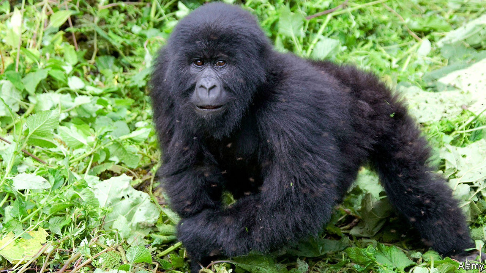
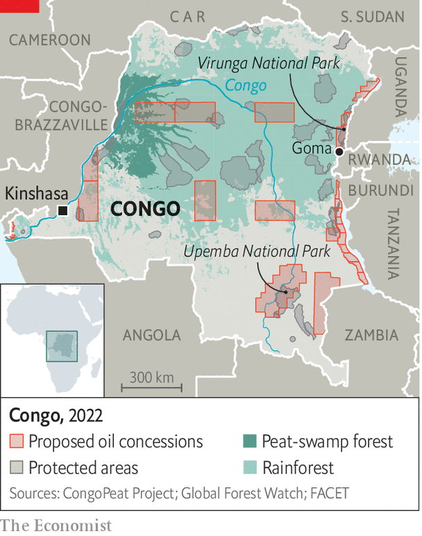

###### Drilling into the world’s lungs

# An oil auction in Congo bodes ill for the climate 

##### But the government says criticism from rich countries is hypocritical 

 

> Jul 27th 2022 

Up the congo river from Kinshasa, the capital of the Democratic Republic of the Congo, is a boggy, blooming, buzzing ecosystem that is home to elephants, gorillas and bonobo apes—as well as swarms of insects, many with a taste for human blood. Underfoot is the world’s biggest area of tropical peatlands, consisting of partially decomposed trees and plants. Undisturbed, it holds about three years’ worth of global emissions from fossil fuels, thus mitigating global warming.

It may not remain undisturbed for long. On July 28th and 29th Congo will auction 27 oil-exploration blocks that encompass 1m hectares of peatland and perhaps 11m hectares of rainforest. The government reckons that under these blocks are at least 16bn barrels of oil, worth roughly $650bn.

The auction highlights two issues facing poor African countries endowed with untapped fossil fuels. First, despite being responsible for a fraction of greenhouse-gas emissions, they are being told not to exploit their oil, gas and coal. Last year the International Energy Agency, an intergovernmental think-tank, argued against new fossil-fuel developments anywhere if the world is to balance greenhouse-gas removal with greenhouse-gas emissions by 2050. The second issue is whether poor countries should bear the costs, including lost opportunities, for protecting ecosystems that benefit the world’s climate.

Take Congo’s peatlands, which sit under swampy water for most of the year. If these swamps were to be permanently drained, much of the carbon stored in the peat would begin to escape. Simon Lewis of Leeds University warns that the swamps are already “close to the edge” of drying out. Even building roads to explore for oil could make the peatlands release carbon. 

It is not just the peatlands at risk. A dozen oil blocks overlap with protected areas, including two national parks. One of them, Virunga National Park, is home to some of the world’s last mountain gorillas. 

 


For the Congolese government, though, the priority is economic development. Congo is one the poorest countries in the world, when measured by gdp per person. “Imagine what oil can do for us,” says Didier Budimbu, the minister of hydrocarbons. He says the sale will finance schools, roads and hospitals. And he claims that criticism from rich countries which prospered from fossil fuels and still rely on them is hypocritical. “We’ve seen the American president go to the Middle East to ask them to produce more,” he says.

He is equally dismissive of a deal signed by rich countries eight months ago that is meant to provide Congo with $500m to protect forests. It built on a smaller deal in 2016. “Not even one euro has entered Congo” under the deals, he scoffs. The intergovernmental organisation charged with implementing them says that $111m has been spent in Congo since 2016.

One snag in Mr Budimbu’s case is that the vast resources of Congo, one of the world’s most corrupt countries, have benefited only a few. Proceeds from copper, cobalt and diamond exports rarely trickle down to the more than 60m people (almost three-quarters of the population) who survive on less than $1.90 a day. Many of the communities in the new oil exploration blocks have not been informed, let alone consulted, about the government’s auction plans. In Upemba National Park local chiefs heard of them only from Greenpeace, an environmental group.

Some activists fear the worst. Faustin Nyebone, who is based in the eastern city of Goma for aiced, another environmental group, doubts that the proceeds from future oil production will end up in the right place. Others think the auction will not attract many bidders because of Congo’s risky business environment and difficulties sending oil to global markets. Total, a French oil firm that the Congolese government had taken to tagging in tweets promoting the auction, tells  it will not take part. Nor will Eni and Shell, two other oil majors. Mr Budimbu still insists there is “enormous interest”. 

For now, the outlook for the peatlands remains grim. Asked about the harm to the environment if the government’s plans go ahead, Mr Budimbu reverts to the oil: “We will exploit it, we will extract it, we will sell it, we will commercialise it.” ■


