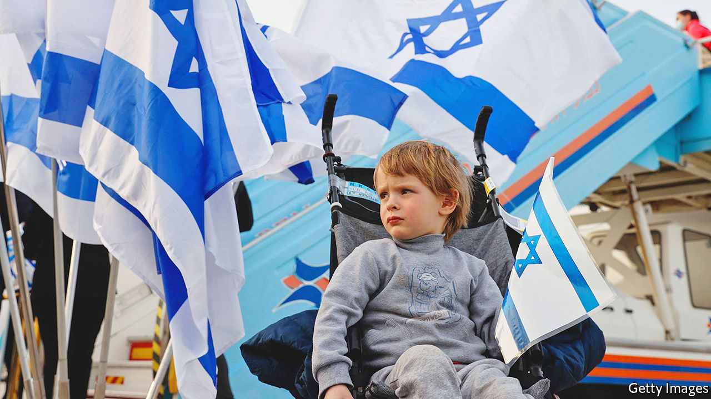
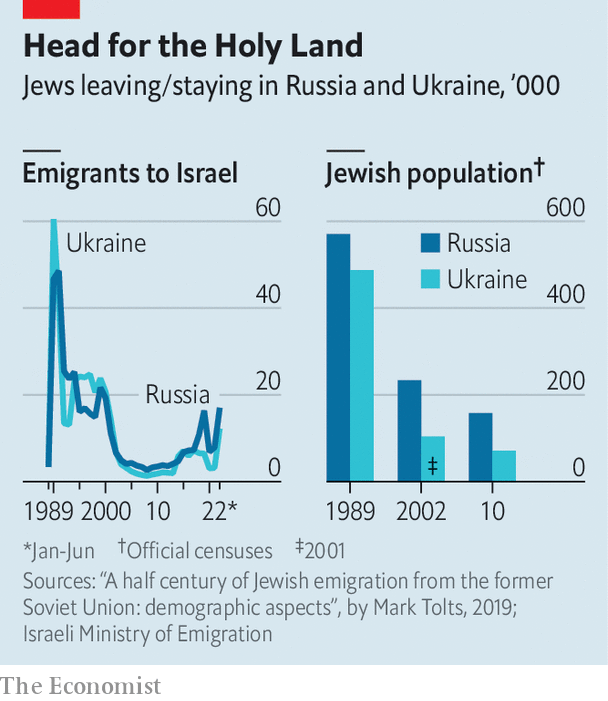

###### Head for the Holy Land

# Israel’s Russian conundrum 

##### The Jewish state’s neutrality over the war in Ukraine may be fraying 

 

> Jul 28th 2022 

For the past seven years Israel and Russia have closely co-ordinated with each other on the ground and in the skies of the Middle East. The war in Ukraine may, however, be rattling these arrangements. On July 15th a Russian court ordered the Jewish Agency to close its offices in Russia. The agency is not technically part of Israel’s government but acts on its behalf, maintaining ties between the state of Israel and the Jewish diaspora around the world. Above all, it facilitates the emigration of Jews to Israel.

Until Vladimir Putin invaded Ukraine in February, relations had been good. Even after Russia sent an expeditionary force to Syria in 2015 to prop up the then failing regime of Bashar al-Assad, a modus vivendi was soon agreed upon. Despite occupying Syrian air space, Russia let Israel continue to bomb Syria’s Iranian allies fighting for Mr Assad on the ground. In effect, Russian and Israeli warplanes divided the skies over Syria between them. 

But in May a Russian anti-aircraft battery fired at Israeli aircraft. Israel’s defence minister, Benny Gantz, played this down as a “one-off incident”. Russia, though, has since publicly told Israel to cease its operations over Syria altogether. Still, Israeli air raids over the country have continued. 

The Kremlin says that the order to close the Jewish Agency was not political but simply a legal issue. Russia’s authorities claim that the agency has broken local laws by collecting information on Russian citizens. The Israeli government is sceptical. “Legal issues like these have been cleared up quietly and without making headlines in the past,” says a senior official in Jerusalem. “It’s clear that this is pressure coming directly from the top—to make sure Israel doesn’t take Ukraine’s side in the war.” 

Since Russia’s invasion on February 24th, Israel has kept firmly on the sidelines, refusing Ukrainian requests for weapons and largely refraining from speaking out about the war. The two main reasons for Israel’s neutrality have been Russia’s military presence across Israel’s border in Syria and the large Jewish communities in Russia and Ukraine. Over a million Russian-speaking Jews have emigrated to Israel since the former Soviet Union collapsed three decades ago. They have become a powerful political constituency.

 


Israel’s past two prime ministers, Naftali Bennett and Binyamin Netanyahu, have been studiously neutral towards Russia. But in April Yair Lapid, then the foreign minister, roundly condemned Russia’s war crimes near Kyiv. Since he became prime minister on July 1st, he has shown no eagerness, unlike his predecessors, to set up a meeting or phone-calls with Mr Putin. The Jewish Agency’s troubles in Russia may have been a warning shot by Mr Putin to keep Mr Lapid in line. 

Jews have long memories of pogroms perpetrated by Russians under the tsars and of anti-Semitic discrimination during the Soviet era. Mr Putin, by contrast, has ensured friendly ties with Russia’s Jewish community during most of his rule in the past two decades. Nevertheless, Jewish emigration from both Russia and Ukraine to Israel has been soaring again—by at least 30,000 this year (see chart). 

In any event, Mr Putin has summoned the demons of history by branding Ukraine’s president, Volodymyr Zelensky, who is Jewish, as “a Nazi”. No wonder that Israel is worried that he may be falling back on bad old tsarist ways—and on using Russia’s Jews as pawns. ■

