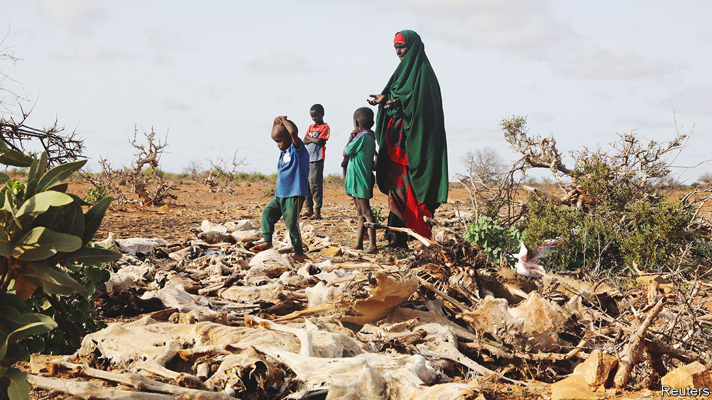
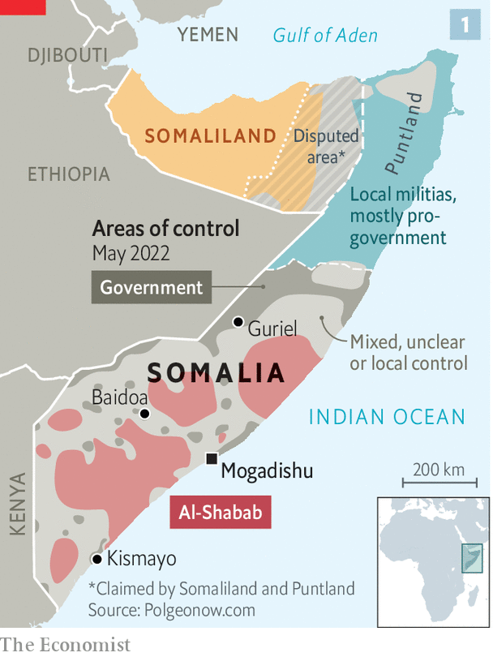
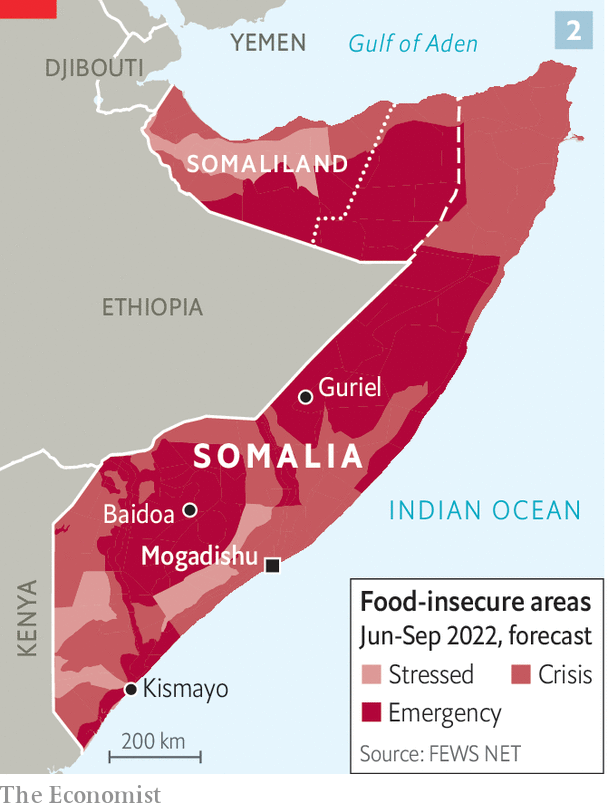
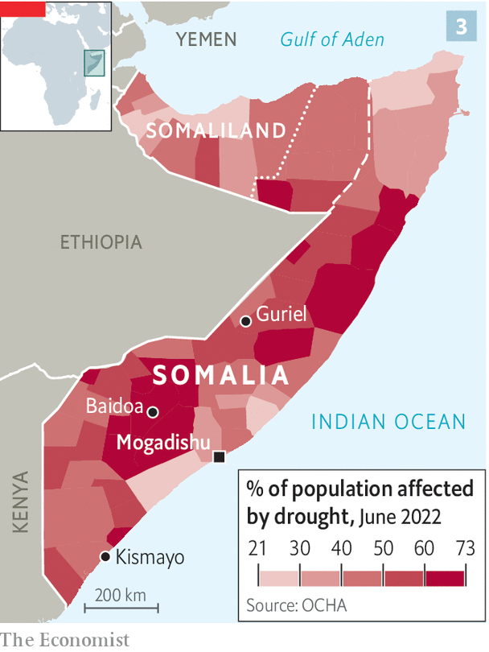

###### Hunger in the Horn

# Somalia is on the brink of starvation 

##### Drought, and the war in Ukraine, are causing the first famine of the global food crisis 

 

> Jul 25th 2022 

For three decades Somalia has lurched between disorder and anarchy. The government controls only bits of the country. The rest is in the hands of jihadists adept at blowing themselves up in crowded places. For many Somalis life is poor, brutish and short. They live in the world’s fifth poorest and eighth most violent country. Their life expectancy is the sixth lowest.

Droughts and floods add to the misery. In 2011 failed rains contributed to the worst famine of the 21st century. More than 250,000 people died, half of them children. A decade later history may repeat itself. The most extensive drought in four decades is wilting crops and killing livestock in Somalia, Ethiopia and Kenya. More than 18m people in the region are struggling to find enough to eat; children are dying in all three countries.

But it is in fragile Somalia that the drought hits hardest, landing like a blow on a bruise. “If we don’t do something right now, we’ll be talking of hundreds of thousands of deaths,” says Mohamed Abdi of the Norwegian Refugee Council, a charity. 

Somalia’s political dysfunction and poverty carry much of the blame for the crisis. But responsibility also lies beyond its borders. Given that Somalia emits only slightly more carbon dioxide than Andorra, it can hardly be faulted for the climate change that appears to be making droughts of this magnitude more common. And not even the most ardent conspiracy theorist would hold Somalia culpable for Russia’s invasion of Ukraine, which has caused a global food crisis.

Somalia imports nearly 80% of its food. By January higher shipping costs had sent local prices close to levels last seen in 2011. Russia’s invasion and higher fuel prices have also fanned food inflation. So it is now much costlier for Somalis who live off the land to buy food to supplement their diets, and for city-dwellers or residents abroad to lend a helping hand.

Higher grain prices have also increased the cost of aid. Since the start of the war in Ukraine the worldwide operational bills of the un’s World Food Programme have risen by nearly half. Donors have stumped up only 46% of the $1.5bn the un says it needs to avert a disaster in Somalia. Britain recently halted “non-essential” aid payments to avoid overrunning a budget stretched by the cost of humanitarian assistance in Ukraine. All this forces aid workers to make hard decisions about whom to help and whom to turn away.

Roughly 7m people, more than 40% of Somalia’s population, are struggling to find food. Aid workers reckon that 1.4m children are severely malnourished. Hundreds, perhaps thousands, have already died. Yet this has not triggered a formal declaration of famine, a technical term used only once a series of thresholds relating to malnutrition, food scarcity and mortality rates are crossed. Somalia is close to these levels in some areas and has breached them in others. Once all of the criteria are met, it will almost certainly be too late to ward off disaster. By the time famine was declared in 2011—an announcement that released a torrent of donor funding—half of the eventual deaths had already occurred.

True famines are mercifully rare these days. The last “calamitous” one, defined as a famine that leads to at least 1m deaths, took place in Ethiopia in the 1980s. “Great famines”, those that claim 100,000 or more lives, have also become less frequent, owing to improved early-warning mechanisms and more effective humanitarian interventions. Only three such famines have occurred this century. The most recent and deadliest was Somalia’s in 2011.

Somalia has long been prone to droughts, but they are becoming more common, says Christophe Hodder, the un’s climate adviser to the country. Although the present drought cannot be linked directly to global warming, it is the most extensive in 40 years. The rains failed thrice before the famine in 2011; during this crisis they have done so four times. Forecasts suggest that a fifth failure is likely. With Somalia’s mean temperatures projected to rise by 3-4°C by 2080, the long-term outlook is horrid.

Don’t just blame the weather

Drought alone rarely causes famines. In 1991 Somalia collapsed into civil war and a jihadist insurgency after the fall of Siad Barre, its long-lasting dictator. The decades of anarchy that followed devastated farming. A country that once did a fair job of feeding itself has seen cereal production fall by 60% since 1989. It now meets just a fifth of the country’s needs. Most staples are imported, including rice, pasta and cooking oil. Even those who eke out a living herding livestock or growing crops rely on at least some imports. 

 


The fighting has also destroyed infrastructure, stunted the economy, forced millions to flee their homes and left the state largely unable to provide basic services like health care and education. Somalia’s president, Hassan Sheikh Mohamud, took office in June. He hopes to reverse a slide in security that occurred under his predecessor, Mohamed Abdullahi Mohamed, who almost rekindled the civil war when he tried to stay in office beyond his term. The government and its allies control the capital, Mogadishu, and its main provincial cities (see map 1). But al-Shabab, al-Qaeda’s richest and most lethal affiliate, controls swathes of the countryside.

 


These rural communities are bearing the brunt of the crisis (see map 2). Guriel, in Galmudug state, is the commercial hub of central Somalia. Normally its livestock market would be heaving with 1,200 animals a day passing through its holding pens. Nowadays, says a local broker, they are lucky to get 150. Before the drought Hassan Abdullahi Ali, a regular at the market, would sell goats for $40 each, enough to feed his ten children for a month. Now the pasture he used has disappeared, the water wells have dried up and disease is spreading through his weakened herd.

 


Roughly a third of livestock in parts of central and southern Somalia may have died since the drought began in 2020 (see map 3), including 250 of Mr Ali’s 300 sheep and goats and 15 of his 20 camels. Trying to sell off the sickly survivors is tricky. “I brought two to the market today,” he says. “I have sold one, but no one wants to buy the other.” The rising cost of grain means that a goat now fetches enough to buy food to feed his family for just ten days.

Struggling families try to cope for a time by eating less and selling productive assets, says Natasha Sharma of the World Bank. This is risky. After sorghum and maize withered on the stalk, Hawa Mustaf Hassan’s husband left their farm to find work. The $5 a month he sent her was not enough. The youngest of her three children, two-year-old Adan, fell ill. Ms Hassan scraped together money to take him for medical help in time to save him. “I felt there was no hope that he would recover,” she says. “But after 14 days I saw him smile and knew he would be ok.”

Others are less fortunate. “Children are dying,” says Abdullahi Ahmed Ibrahim, a doctor at Baidoa’s general hospital. “Mothers come too late and bury their children on the way.” Isaac Nur Ibrahim brought his wife and two young sons to a squatter camp on the outskirts of Kismayo after all his livestock died eight months ago. He could only bring in $1 a day as a labourer. After cutting back to a daily plate of food, his two-year-old son Abdikaafi fell ill with malnutrition-related anaemia. The government hospital had no drugs to treat it and Mr Ibrahim did not earn enough for private care. The boy succumbed on June 8th. A month later so did Mr Ibrahim’s four-year-old nephew. In all, seven children have died in the camp since the start of June, say residents. 

The hardship falls unequally. When crops fail and animals die, those in richer or more powerful clans can get assistance from their kin. Such clans generally have more people living abroad or in Somalia’s cities; during droughts they can be counted on to send cash to the countryside or to shelter those who move to the towns in search of food. But members of poorer clans often have little choice but to move into squalid, disease-ridden camps. 

This is because aid workers rarely venture out to the countryside for fear of having their heads cut off by al-Shabab. Some 2,000 camps surround Somalia’s cities, housing most of the country’s 2.9m displaced people. Many are controlled by bigwigs of Dickensian malevolence, who skim off what little aid trickles into the camps and who evict the residents when they cease to be of use.

Helping Somalia’s people will require not just more money, but also greater efforts to get food to those most in need in parts of the countryside controlled by al-Shabab. To save lives, aid agencies will have to tolerate more risk, says Daniel Maxwell of Tufts University in Boston. These risks are not just to their workers but also their reputations. Some worry about facing criminal charges in America under counter-terrorism laws if aid falls into the hands of jihadists. 

Yet not doing more to help also carries risks for Somalia’s security. Hungry people who feel failed by their government may be more willing to support the jihadists. Climate change may exacerbate conflict as communities fight for scarce resources. It may already be too late to avert calamity in Somalia, beset as it is by insurgency and drought. But the longer the world waits to help, the greater the suffering. ■

.

