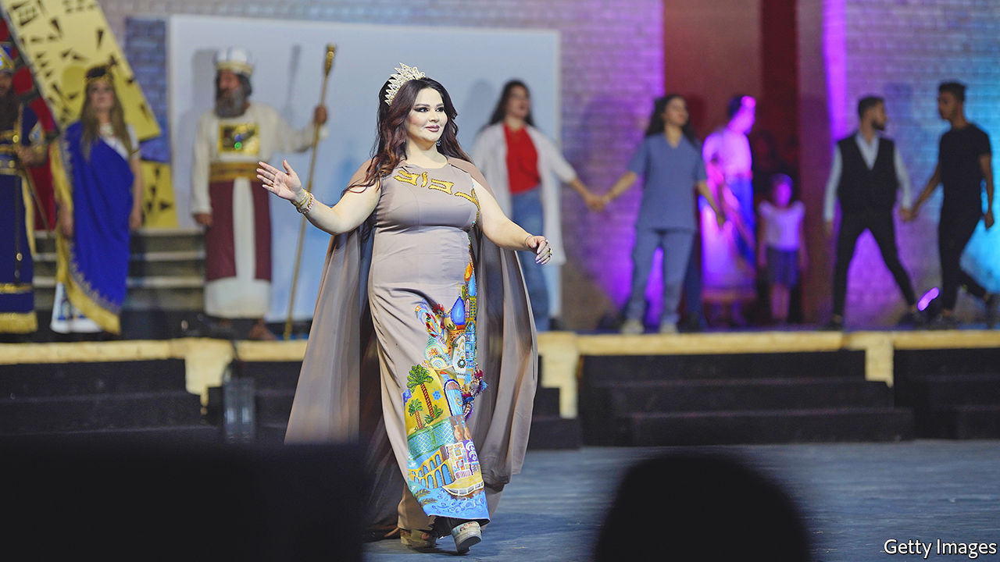

###### The obesity gap

# Why women are fatter than men in the Arab world 

##### Society does not make it easy to shed pounds 

 

> Jul 28th 2022 

Zeinab, a matronly 60-year-old in a black abaya, washes vegetables in a restaurant in Baghdad, taking home 20,000 dirhams ($13.70) a day. But she cannot afford to buy her family a decent dinner. Her daughters dropped out of school because the fees were too high. Zeinab gets by because her boss gives her leftovers—mostly oily food, she says—from the restaurant. Thursday is the only day of the week she and her daughters eat fruit, since that is when people in her neighbourhood give away food for charity. Zeinab weighs 120kg. 

Though grown up, none of her four daughters works. They are likely to become fat, too. Zeinab would rather be strapped for cash than risk men harassing them at work. So they sit at home, doing chores, occasionally visiting their extended family. Zeinab sometimes takes them out for an ice cream or to visit a holy shrine. “It’s not like they’re in prison—they’ve got phones and the internet,” she says defensively.

Across the world, more women than men are fat. Obesity is a problem for 15% of women and 11% of men, meaning that they have a body mass index (bmi) of 30 or higher. But the obesity gap varies across the world. The Middle East and north Africa has the biggest and most consistent disparity between the sexes. (Several countries in southern Africa have big gaps, too.) In the Middle East 26% of women are obese versus 16% of men. This can be dangerous. In 2019, eight Arab countries were among the 11 with the highest share of deaths attributed to obesity (mostly due to heart disease, diabetes and high blood pressure).

Only a fifth of women in Arab countries have paid jobs, says the World Bank. In Iraq the share is one in ten. This means that most Arab women spend most of the day indoors, missing out on passive exercise. Working women in other regions bustle around in hospitals, classrooms and restaurants. But in Arab countries many such jobs are done mainly by men. In Gulf countries many of the heavier menial household chores are done by foreigners.

Moreover, women in Arab countries have fewer chances to enjoy sport. Young girls and boys play football together in the street. But once a girl reaches puberty, roughhousing in public is frowned upon. Teenage girls become more sedentary, meeting friends indoors. “We don’t like girls to be outside,” says a sweaty Iraqi man who plays football outdoors four times a week but does not let his sister follow suit. She has a treadmill at home, he says. 

In any case, headscarves and clothes that cover the female body make public exercise cumbersome. Harassment in the street often makes jogging unpleasant. “When I walk my dogs, I have to put on music to block out the catcalls,” says an Iraqi woman. Strolling tends to be in air-conditioned malls. Some gyms cater just to women, but are found mainly in big cities. 

In Egypt poor women are on average fatter than rich ones. Rich families tend to be more relaxed about letting their daughters out. Still, Egypt has the highest women’s bmi of any country in the world, bar some of the Pacific islands. Diet bears much of the blame. Egyptians get 30% of their calories from bread, much of it subsidised: the price of a kilo is fixed at $0.61. Since 1975 Arab women have grown fatter at a quicker rate than Arab men, while junk food has steadily proliferated. 

Wafa al-Khatib, a housewife in Baghdad, wants to slim down, so she asked her mother to do more of the cooking to help her resist culinary temptation. “Iraqis’ problem is carbohydrates,” she says. Her family eats rice and bread at nearly every meal. 

A final cause of obesity, according to some women, is that many Arab men prefer them to be Rubens-esque. Shutting women up at home helps keep them that way. Shireen Rashid, another Iraqi housewife, wants to shed a few pounds. But not too many. When you are skinny, “you lose your femininity”, she says. Her husband does not want her to lose weight at all. He fears she will “feel like a piece of wood in bed”. Iraqis often cite Enas Taleb, an actress with ample curves (pictured), as the ideal of beauty. Some claim Iraqi women even take weight-gaining pills to be more attractive to men. Alas, in the Arab world or indeed anywhere else, that is hardly the road to good health, let alone happiness. ■

