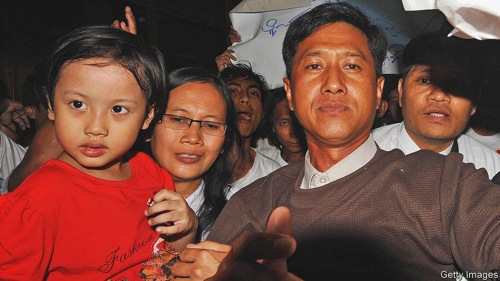

###### Darkness to light

# Ko Jimmy was determined to make Myanmar free 

##### The activist and writer was hanged by the military regime on July 23rd 

 

> Jul 27th 2022 

For years after he first saw her, he could not forget her face. She was a schoolgirl, 16 then, in her green and white uniform; just one figure in a seething crowd of thousands protesting in Yangon in 1988 against the military regime. An army officer was bearing down on her, and she was aiming to kick his head. For Kyaw Min Yu, then only 19 himself, a third-year physics student and already a giver of rallying speeches, she was an indelible image of defiance. 

He was arrested soon afterwards, and did not learn her name. But after seven years in Insein prison he heard that a new female inmate had arrived, jailed for organising protests. She was ill, with hypertension or a bad heart, and in the middle of the night he would be woken by her cries. As he later told America’s National Public Radio, stressing the words like a mantra, it seemed to happen “daily, daily, daily”. He could not bear to hear whatever was happening to her, his sister in the struggle. 

With the help of a guard, he passed her a note to ask how she was. She was in solitary, enduring the dark nights with only the song of crickets to ease the silence. He wrote more notes, which grew into letters, and they began to meet, discussing political thinkers they liked and possible campaigns. Her name was Nilar Thein. After two years he proposed, and when they were released in 2005 he quickly married her. She was, of course, the schoolgirl he had seen. 

It was then a brief time of hope in Myanmar, when the junta had announced a “road-map to democracy” and some prisoners were freed. Their romance soon became famous, but it was also, always, a political project. Kyaw Min Yu (now also known as Ko, or Brother, Jimmy), wanted to be a good husband and father, but a prisoner of conscience first. He was from Shan state, a beautiful, mountainous region with a strong tradition of rebellion; so much so that his father, though an official in the military government, made no move to stop him organising the student protests in Yangon. When he married Nilar Thein they accepted that they would be apart much of the time. When she became pregnant, he solemnly put his hands on her stomach and apologised to the baby in advance.

An apology was needed. By 2008 they were both in prison again, his “second home”, though in places far apart. They were there because as leaders of the 88 Generation, veterans of the student protests, they had helped to stir up the Saffron revolution the year before: an outcry against the ending of fuel subsidies which had also brought thousands of Buddhist monks onto the streets. Again, the couple wrote letters to each other, as much to sense each other’s bodies on the paper as to exchange their news. They were released in an amnesty in 2012. 

This was the pattern. They were either in jail, or campaigning hard outside it. Occasionally they had to go into hiding, or darkness, as he called it. But they would “never stop, never stop, never stop”. If he went to his favourite Yangon bar it was to sit at a table in the shadows, usefully drowned out by the live bands or the tv football, plotting with his 88 Generation friends. When his daughter had her fifth birthday party in 2012 the guests in the main room of their small, shabby flat, sitting cross-legged around the cake, had almost all been political prisoners. In that year he became an adviser to Aung San Suu Kyi, the pro-democracy leader, but Myanmar’s future still felt alarmingly fragile. Ms Suu Kyi’s party, the National League for Democracy, did better and better in elections but presided over turmoil, both economic and political. In 2021 the army removed her as de facto leader and took charge again. 

Evidently he was needed once more. People’s Defence Forces, a clutch of militias around 100,000 strong, had been loosely formed all over the country to resist military rule. According to the regime’s trumped-up charges against him he was a chief mover of this “terrorist group” in Yangon, planning attacks on schools, power stations and government offices. In October he was arrested at a safehouse in North Dagon township; in January he was sentenced to death, and in June an appeal was rejected.

At 19, when he had first gone to jail, he had been full of rage. His anger, vented on the guards, had made prison an even darker place. Then he found himself sharing a cell with a monk, who taught him vipassana meditation. He had not explored that area of Buddhism before. Now, for an hour in the morning and again in the evening, he would review his emotions, not judging them but calmly observing them. He saw his guards now not as evil, but as poor illiterate men who dumbly followed orders. As he looked on them more kindly his beatings ended, and the guards began to smuggle in better food. They brought paper and pens for his writing, for that too was helping him survive. He eventually produced poetry, short stories and a novel about a political love affair; and when he set about translating “The Da Vinci Code”, his guards gave him an English dictionary. 

Naturally in a Buddhist country, he had invoked Buddhist teachings before. When the 88 Generation travelled round the country in 2006, gathering signatures for a petition to release all political prisoners, everyone had worn white, the colour of purity and learning of dharma, their sacred duty. Monks were his natural allies, both during the Saffron revolution and after it. His own demeanour was courteous, smiling and soft-spoken, his usual dress an uncreased check  and crisp white shirt. He did not dwell on his time in jail, expressed no bitterness, but focused on the present moment and what he could do in it. 

His beliefs also put his efforts in perspective. At times it all seemed hopeless, as gleams of reform and democracy were continually snuffed out. But he was a born optimist. He had called his daughter “Sunshine” in the firm hope that she would one day see a free Myanmar. Darkness to light. And besides, as he told his American interviewer, he had more than one life to achieve this: “another life...another life”. And at the end of it all nirvana, true freedom, would certainly come to pass. ■

