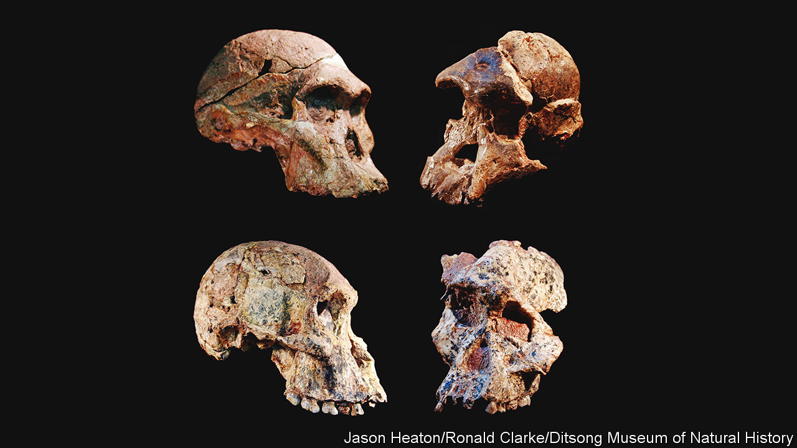

###### Palaeoanthropology

# Redating specimens of Australopithecus may rewrite human history 

##### The richest hominin fossil-bed in the world is a million years older than previously thought 

 

> Jul 27th 2022 

The high-security fossil vault at the University of the Witwatersrand (Wits), in Johannesburg, contains treasure more precious than the gold that paid for the university’s establishment. It is the resting place of five of the ten known partial skeletons of early hominins, the ancestors of human beings. In a glass case at the vault’s centre, resting on blue velvet, is Little Foot, the near-complete remains of a member of the species .

Wits is not the only repository of such treasures. Farther north, in Pretoria, the Ditsong National Museum of Natural History hosts the skull of Mrs Ples, a representative of , cousin to , and one of the most famous hominin  yet found. That these specimens are millions of years old is not in doubt. But just how many millions is disputed. A sophisticated dating technique, called cosmogenic nuclide dating, has upended previous estimates—and, with that, is rewriting an important chapter in the story of human .

The first draft of this chapter opened on April 18th 1947, the day when Mrs Ples was discovered. Robert Broom, a palaeontologist at the Transvaal Museum (as the Ditsong was then known) and his colleague John Robinson were using dynamite to blast apart a deposit of a type of rock called cave breccia, which had formed from debris that had fallen into a collection of limestone caverns at Sterkfontein, just outside Johannesburg. When the dust settled, Broom spotted several fossils in the rubble. Pieced together, these formed a perfect skull. “Broom originally placed the fossil into its own genus, named ,” says Mirriam Tawane, curator of fossils at the Ditsong. “He thought the skull looked female, so he nicknamed it Mrs Ples.” As a scientific appellation,  has fallen out of fashion. But, in everyday usage, Mrs Ples she remains. She (if “she” she be) is now classified as the first discovered adult specimen of , the direct ancestors of , the genus of modern humans.

Mrs Ples’s unearthing was the beginning of an explosion of findings at Sterkfontein and other sites dotted close by. The region is consequently known as “The Cradle of Humankind”, and was declared a unesco World Heritage Site in 1999. Based on a method called uranium-thorium dating, Mrs Ples had been reckoned to be about 2.4m years old, give or take a couple of hundred thousand. But that date has been overthrown by work employing cosmogenic nuclide dating. This suggests Mrs Ples—and a plethora of other fossils from Sterkfontein—are more than 1m years older than previously thought.

Never ask an australopith her age

Researchers have identified six distinct “geological members” of breccia at Sterkfontein. Members 1, 2 and 3 are still hidden deep in the caves, but Members 4, 5 and 6 have since been exposed above ground. Over the past 75 years excavations at members 2, 4 and 5 have yielded close to 1,000 early hominin fossils (most of them fragmentary), accounting for more than a third of those so far discovered, and making Sterkfontein by far the richest site of its kind in the world. 

Mrs Ples was originally blasted from Member 4, the source of almost every  fossil from Sterkfontein. The only exception is Little Foot, recovered from Member 2 in 1994 by Ronald Clarke, a palaeontologist at Wits. But determining the ages of Member 2 and Member 4 has been devilishly hard. Established methods of putting ages to hominin fossils rely on dating layers of volcanic ash above and below the strata in which they were found, using the uranium-lead method, one of the oldest and most refined dating techniques. That is fine in volcano-rich Kenya, Tanzania and Ethiopia, the main other sources of hominin fossils. But mainland South Africa is one of the least volcanically active places on Earth. Consequently, researchers have had to develop new dating techniques appropriate to its geology.

Until recently, the best of these was uranium-thorium dating. Water trickling through limestone caves first dissolves, then deposits, calcium carbonate. Dripping from a cave ceiling, this creates stalactites and stalagmites. Percolating into empty cracks and cavities, such as those found in breccias, it creates flowstones. The ages of these flowstones can be determined by the ratio within them of the radioactive elements uranium and thorium. The flowstones in Member 4 have been dated to between 2.1m and 2.5m years ago, with flowstones in Member 2 a similar age.

“That looks like an unimpeachable case,” says Darryl Granger, a geologist from Purdue University, in Indiana. “But geology is often more complicated than that. The trouble with relying on flowstones is that they can be younger than the surrounding rock. There is nothing to stop a flowstone from forming in a crack that developed millions of years after the rock around it, for example.” This is what Dr Granger and his colleagues—including Dr Clarke—argue happened at Members 2 and 4 at Sterkfontein. To test that idea, they directly dated the cave breccias in Members 2 and 4 using cosmogenic nuclide dating, which Dr Granger helped develop. 

Earth’s surface is constantly peppered by cosmic rays. These are particles (mostly protons) from outer space, moving at close to the speed of light. “When cosmic rays pass through objects, they trigger nuclear reactions,” observes Dr Granger. “The products of those reactions—called cosmogenic nuclides—are often radioactive, and decay over time.” When a breccia-forming object falls into a cave, it finds itself shielded from cosmic rays, and the steady decay of its existing cosmogenic nuclides can be used to determine how long ago it fell in. 

Using this method Dr Granger and colleagues determined, in 2015, that the breccia in Member 2 is 3.7m years old—1.5m years more ancient than originally thought. “That was a terrific finding, but Little Foot is only one specimen,” he says. “We consequently turned our attention to Member 4, which has produced hundreds.” After years of effort, new dates for Member 4 were published in June in the . The team now reckon the Member 4 breccia formed between 3.4m and 3.6m years ago, over a million years earlier than believed. 

Bones of contention

The conventional story of hominin evolution says that the lineage which would become modern humans split off from that leading to chimpanzees approximately 6m years ago, somewhere in equatorial Africa. “The first members of the genus  are thought to have emerged in east Africa roughly 4.5m years ago, evolving into the species  close to 3.8m years ago,” says Dr Tawane. That is the species to which “Lucy”, a famous partial skeleton discovered in Ethiopia in 1974, belonged.

Palaeontologists estimate that  emerged somewhere between 2.5m and 3m years ago. There being, until now, no evidence of  in southern Africa at this time, researchers have assumed  evolved in east Africa as well. The previous dating of the  and  fossils at Sterkfontein and other sites in South Africa led to them being regarded as tangential to the main, east African story of human evolution.

That interpretation is now threatened. “The fact that Little Foot was living at Sterkfontein 3.7m years ago complicated the picture,” says Dr Granger. “But it was only one specimen. The new dates of Member 4, however, place hundreds of  specimens in the range of 3.4m to 3.7m years old.” This is the same age as (or even older than) many of the  fossils in east Africa, including 3.2m-year-old Lucy. That brings into question whether A emerged in east Africa at all, and hints that the genus may be even older than previously thought. 

The fact that two  species were waltzing about Sterkfontein prior to 3m years ago places the origins of  and its sister genus  (a group of less brainy but more robust upright hominins) up for grabs too, with South Africa once again a compelling candidate for the original cradle of humanity. That is an encouraging prospect for scientists working in the Cradle of Humankind site, where hundreds of other caves await exploration. “These new dates from Sterkfontein complicate our understanding of early human evolution,” says Dr Granger. “But the uncertainty is exciting. The next decade is set to be a fascinating one.” ■


