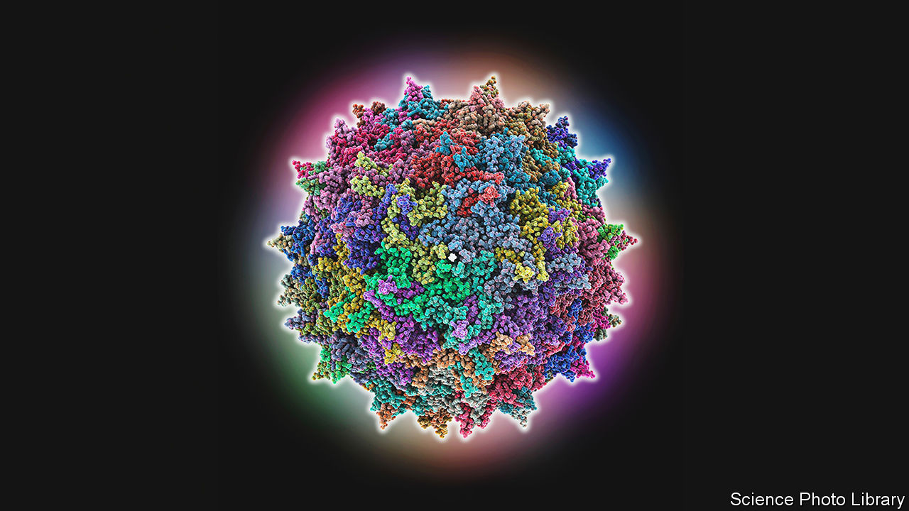

###### Virology

# The cause of a new type of hepatitis in children is found 

##### It seems to be caused by co-infection with two different viruses 

 

> Jul 27th 2022 

In april mysterious cases of hepatitis, an inflammation of the liver, began appearing in children around the world. They were not caused by the hepatitis viruses that typically cause the illness. The World Health Organisation has reported more than 1,000 probable cases in 35 countries. Some children have required liver transplants and at least 22 have died. Researchers have been scrambling to find the cause.

Two studies posted this week on medRxiv, a preprint server, propose an answer—co-infection with two common and usually innocuous viruses, probably helped by certain gene variations in the children who fell ill. sars-cov-2 was ruled out as a culprit. One of the infections seems to be from human adenovirus, a common bug in children that causes stomach upsets but does not make them very ill. A cluster of the strange hepatitis cases appeared shortly after a spike in adenovirus infections, though it was unclear what role the virus might be playing, because it is often present in healthy children too. 

In the latest research, led by teams at the University of Glasgow and University College London, researchers investigated the blood and livers of 26 children with the strange hepatitis and compared the results with those from more than 100 children of the same age, including healthy children, children with adenovirus but normal liver function, and children with hepatitis for which the cause was known. 

Collectively, the two studies found that 25 out of the 26 children with the mysterious hepatitis were also infected with adeno-associated virus 2 (aav2). This virus (pictured left) was rarely found in the children without that form of hepatitis and, when present in them, it was in much lower quantities. 

aav2 is a parvovirus that cannot replicate on its own but needs assistance from a “helper” virus such as an adenovirus or a herpesvirus. It is not known for causing illness but it is very contagious. Most children are exposed to it at a young age and it lays dormant in the cells, including those of the liver, until infection with a helper virus triggers its replication. The results from the two studies suggest that coinfection by aav2 and adenovirus—or sometimes possibly a herpesvirus called hhv6, which was found in a few children—is the cause of the mysterious hepatitis illness. 

Given how much aav2 and adenovirus circulate, lots of children probably get co-infected. Why, then, do only a small number of them develop the strange hepatitis? The researchers in Glasgow looked for an answer in the children’s genes. In eight of the nine children with the strange hepatitis they found variations in the Human Leukocyte Antigen gene that were not commonly found in the 58 comparison children. The prevalence of these specific variations is highest in northern Europe—the region where most of the strange hepatitis cases have been reported. 

It is unclear how aav2 is causing the illness. The researchers did not find viral particles in the samples taken when the children were ill, but detected large amounts of rna traces of aav2—which suggest that copious replication had happened in the past. This means that an indirect viral mechanism may be responsible, such as an immune reaction to aav2 that leads, in rare cases, to acute liver inflammation. 

Such cases of unexplained hepatitis are not new. But lowered immunity to viruses among children as a result of less mixing during the covid-19 pandemic led to many such cases at the same time. The world is acutely aware that exposure to novel viruses can cause pandemics, but a lack of exposure to bugs can cause problems too. ■


