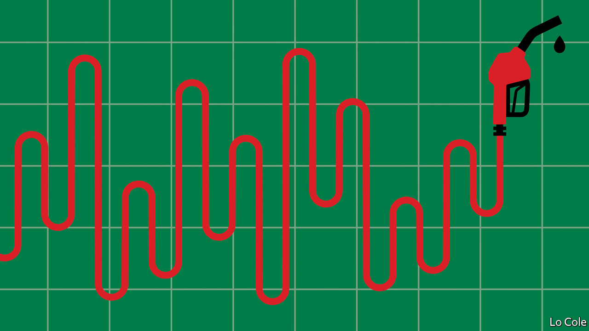

###### Bello

# Latin America’s energy subsidies are good politics but bad policy 

##### Across the region politicians are giving sops to protesters 

 

> Jul 28th 2022 

For a month now protesters in Panama have blocked highways, prompting shortages of food and medicine in a country that for the past three decades has enjoyed social and political stability and steady economic growth. Their target is the price of fuel, which rose by almost half in the first six months of this year. The shaken government of President Laurentino Cortizo buckled, agreeing to cut the price of petrol to $3.25 a gallon from $5.20. But the protests continued, with unions demanding other price controls to ease living costs.

Panama is far from alone. With the cost of oil soaring since Russia’s invasion of Ukraine in February, and with prices rising more generally, a string of governments across Latin America have introduced or increased subsidies on fuel to assuage protesters, or pre-empt them. To end almost three weeks of disorder, in which seven people died last month, Ecuador’s pro-market president, Guillermo Lasso, granted subsidies on fuel and fertilisers. These subsidies are worth around 0.8% of gdp, according to calculations by J.P. Morgan, a bank.

Brazil’s right-wing president, Jair Bolsonaro, who is seeking a second term at an election in October, has been pressing Petrobras, the state-controlled oil giant, to cut prices. On July 27th the company said it would review its pricing policy. In Mexico petrol prices are 35% lower than they would otherwise be, as the government of Andrés Manuel López Obrador has spent higher oil revenues on a subsidy equal to 1% of gdp. 

When protests broke out in Peru in April the government scrapped a fuel tax and announced other tax cuts, totalling perhaps 0.9% of gdp. In the Dominican Republic this month the government suspended a plan to wind down electricity subsidies. Both Chile and Colombia have augmented stabilisation funds which smooth the rise in fuel prices. In Argentina an agreement with the imf that involves cutting energy subsidies cost Martín Guzmán his job as economy minister on July 2nd.

It is not hard to see why governments are so sensitive to the price of fuel. Latin America is a region of long distances in which roads are paramount in the movement of both goods and people. In Venezuela in 1989 an abrupt decision by Carlos Andrés Pérez, shortly after his lavish inauguration as president, to double the petrol price triggered days of rioting that cost some 400 lives. These events discredited Venezuelan democracy and paved the way for Hugo Chávez, a populist strongman elected a decade later. When Brazil began to phase out fuel subsidies, a truckers’ strike lasting a fortnight in 2018 brought the country to a halt and helped Mr Bolsonaro, who supported it, win that year’s election. In Ecuador Mr Lasso’s predecessor, Lenín Moreno, was almost toppled by an insurrection by indigenous groups and leftists against a cut in fuel subsidies in 2019.

While across-the-board fuel subsidies may be good politics, they are bad policy. Since the better-off consume more petrol than the poor, they do nothing to reduce inequality. And they run counter to the region’s commitments to reduce fossil-fuel use to combat climate change. It would be better to blunt the impact of inflation through targeted handouts to poorer citizens, but these lack the political impact of price caps.

Many governments will find it hard to afford higher fuel subsidies for long. While they may help with inflation, they add to deficits. Latin America’s recovery from the pandemic slump was stronger than many expected, partly because of higher prices for its exports of oil, metals and foodstuffs. The imf this week raised its forecast for growth in the region this year to 3%, from 2.5%. But the going is getting rougher: the fund cut its projection for next year by a similar amount, to 2%. Inflation took off in the region last year, prompting central banks to raise interest rates. As governments offered help during the pandemic, public debt rose from an average of 58% of gdp in 2019 to 72% last year, according to the Inter-American Development Bank. Higher interest rates mean that debt is more expensive to service. 

Fiscal worries are “surfacing again and will become uglier in the second half of this year”, says William Jackson of Capital Economics, a consultancy. Apart from those in Argentina and perhaps Ecuador, governments do not face immediate financing problems, he says. “But at some point the region will have to carry out a fiscal adjustment.” The political leaders will hope that by then oil prices are falling again.


