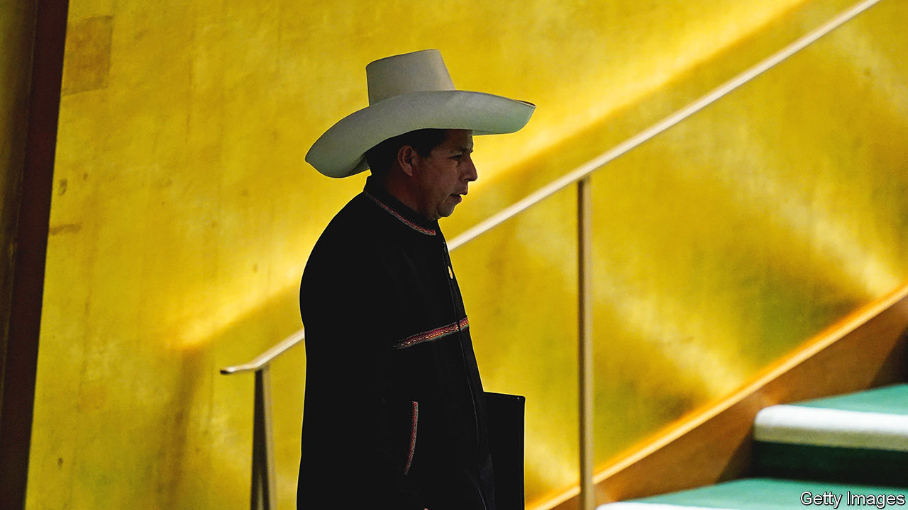

###### All hat, no cattle

# Peru is becoming ever more volatile under Pedro Castillo 

##### After a year in power, the former schoolteacher has an approval rating of just 20% 

 

> Jul 28th 2022 

On july 28th, Peru’s day of independence, the country’s president usually stands before Congress and delivers a speech in which accomplishments are highlighted and plans outlined. Pity the person tasked with preparing President Pedro Castillo’s speech this month. Mr Castillo, one of a handful of leftist leaders who recently swept to power in South America, has little to show after a year in office. 

Chaos has become the norm under Mr Castillo. His administration is marked out by constant turnover; he has appointed a new minister every week on average. He has survived two impeachment attempts, and will almost certainly face another. His approval rating is 20%. 

Mr Castillo also figures in five criminal probes, with former associates accusing him of corruption and obstruction of justice (all of which he denies). While he is not the first Peruvian president to face graft allegations, the charges against him paint a picture of a paranoid leader who has sought to carve up power for himself and his associates. Mr Castillo’s former army chief claims the president tried to strong-arm him into promoting unqualified loyalists, and fired him when he refused. Many of Mr Castillo’s appointees have had conflicts of interest; his transport minister ran an unlicensed public transport business, for example (he has since gone into hiding). Several have been investigated for domestic violence and one for murder. 

When Mr Castillo hires qualified people, they do not last long. His sixth interior minister said he had been asked to sign an undated resignation letter before he was sworn in, and was then abruptly fired for setting up an elite police squad to help find three allies of Mr Castillo who had fled arrest (including the transport minister). On July 23rd one of the three fugitives, a former aide whom prosecutors accuse of stashing $20,000 in a presidential-palace bathroom, turned himself in after three months on the run. 

The fact that Mr Castillo has managed to stay in power despite all this says a lot about one of Latin America’s most politically volatile countries. A wave of corruption scandals after an election in 2016 discredited Peru’s political elites. Mr Castillo is the fifth president to govern the country in as many years. 

Mr Castillo’s election reflected the public’s discontent. Last year just 21% of Peruvians were satisfied with their democracy, according to a poll by the Latin American Public Opinion Project at Vanderbilt University in Tennessee. Peru also had the highest tolerance for a military coup in Latin America. Mr Castillo, a former union leader, schoolteacher and farmer, was an outsider who promised to upend the status quo. He had no previous experience of national politics. He campaigned heavily in rural regions, and hit the jackpot when he faced Keiko Fujimori, a polarising politician, in the run-off last year. Mr Castillo won by less than half a percentage point.

Pedro Nadie

By his own admission, Mr Castillo was not prepared for the challenges of holding office. Nor has he improved much. At public events the president still sounds like a candidate. He describes problems without offering solutions. And those problems have worsened. The central bank recently cut its forecast for economic growth this year to 3.1%, in part because protests (in which ministers have sometimes seemed complicit) keep two large copper mines closed. Private investment is not expected to increase at all this year, as business confidence has weakened. According to Moody’s, a credit-rating agency, “all branches of government are succumbing to populist and short-term measures that are extremely irresponsible for development”. 

In February Mr Castillo replaced a leftist finance minister with Óscar Graham, an economist who spent two decades working at the central bank. But Mr Graham lacks influence. In April he was forced to accept a tax exemption on fuel and basic goods to help Mr Castillo quell protests by transport workers (see Bello). Mr Graham later described the move as a mistake. In May he failed to stop the president from signing a law which would let Peruvians withdraw more of their pension savings from the country’s private funds.

Despite his many missteps, Mr Castillo has been able to cling to power because the opposition is fractured. Congress is rife with infighting. It is even less popular than the president. At this point, Mr Castillo’s survival “rests on inertia and the lack of a better alternative”, says Julio Carrión, a political scientist at the University of Delaware. Although most Peruvians want the president to resign, only 42% definitely support impeaching him, according to a poll in July conducted by Ipsos. 

Even if he faces another impeachment attempt, Mr Castillo may survive. He has gained the support of some lawmakers by backing conservative legislation, such as a bill to give families the power to veto school curriculums. Instead of calling for new elections, many opposition lawmakers prefer to keep their jobs and make the most of Mr Castillo’s chaos. But as the economic situation worsens, and once regional elections in October are out of the way, that may change. 

Either way, Mr Castillo’s short rule has already damaged democracy. Camila Vargas, a 42-year-old waitress in Cerro de Pasco, a highland town, no longer sees the point of elections. “No one is going to rescue us,” she says. “Not with a new president, not with a new Congress.” ■

