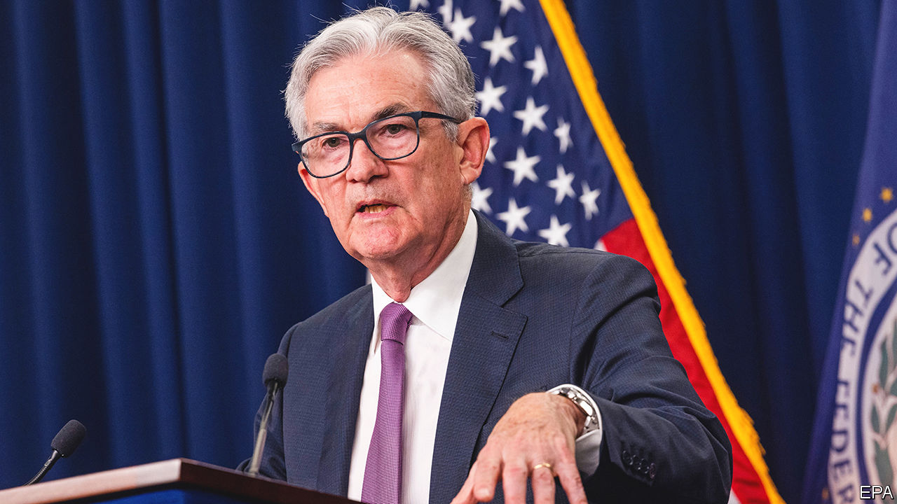

###### The world this week

# Business 

#####  

 

> Jul 28th 2022 

The  raised its benchmark interest rate by another three-quarters of a percentage point, to a range of between 2.25% and 2.5%. Central banks around the world are said to have reacted too late to the threat of sharp increases in inflation, forcing them to adopt a more aggressive approach to tightening monetary policy. The  recently lifted its deposit rate for the first time in a decade, taking it from a negative rate of -0.5% to zero. Martins Kazaks, a member of the ecb’s governing council, said that its next rate increase in September “also needs to be quite significant”. 

 shook investors when it issued its second profit warning in ten weeks. It blamed food and fuel inflation, which is affecting how its customers spend on other things. Retailers are resorting to big markdowns of their products to entice shoppers.  said it was facing “a truly unprecedented cost landscape”, though that didn’t stop the consumer-goods company from raising its sales forecast.  also blamed inflation when it lifted the price of its Prime membership in European markets, and at a much stiffer rate than its price rise for American subscribers. 

A raft of quarterly earnings pointed to a sharp slowdown in . Meta reported its first-ever decline in revenue, year on year, albeit of 1%. Revenue at Alphabet, Google’s parent company, grew at the slowest pace since mid-2020. Snap and Twitter also gave a bleak outlook for digital ads when they reported weak earnings. 

 called off its proposed merger with Frontier amid lukewarm shareholder support for the deal. That opens the way for it to be taken over by JetBlue, which has been circling Spirit with a rival offer for months. Their combination would create America’s fifth-largest airline. 

Turning a Körner

 reported a quarterly net loss of SFr1.6bn ($1.7bn). Unlike many rivals, the Swiss bank’s income from trading fell sharply, and its investment-banking business made a big loss. It announced the departure of Thomas Gottstein as chief executive, to be replaced by Ulrich Körner, who will conduct a strategic review of its operations, the second within a year. Mr Körner is known as “Uli the knife” for his approach to cost-cutting. Credit Suisse hit the headlines in recent years for a number of scandals, such as its exposure to Archegos, a collapsed family office, and for spying on employees. 

In a sign that its troubles with Chinese regulators are easing,  said it would apply for a primary listing of its shares in Hong Kong, where it currently has a secondary listing, allowing investors from the mainland to buy its stock. The tech giant also has a primary listing of shares in New York. 

 said that it would make chips for MediaTek, based in Taiwan. It is one of the biggest deals for Intel’s foundry business, which makes semiconductors for other firms without designing them. Meanwhile, the American Senate gave its approval to a bill that would provide huge subsidies to domestic , in order to reduce America’s reliance on foreign ones. 

 was booted out of his job as boss of Volkswagen by the company’s supervisory board. The indefatigable Mr Diess drove vw’s push into electric vehicles, but the carmaker’s workers, with assertive representatives on the board, were angered by his unfavourable comparison of vw with Tesla and suggestion that 30,000 jobs should go. His replacement is the more amenable Oliver Blume, who currently runs Porsche. 

According to a regulatory filing,  has set September 13th as the date for a special shareholders’ meeting to vote on Elon Musk’s takeover of the company, which he wants to pull out of. That is a month before Twitter goes to trial to try to force Mr Musk to honour their deal. 

, a French satellite operator, agreed to merge with , a British rival. Competition to provide satellite-based broadband is heating up; the combined company could pose a challenge to SpaceX’s Starlink project. OneWeb was bailed out of bankruptcy in 2020 with a package backed by the British government, after it ran out of venture capital. The British and French governments will each have a seat on the board of the new company.

Backlash against greenwash

, which was in the vanguard of the push for green investing two years ago, supported just 24% of environmental and social-issue shareholder proposals in this year’s proxy-voting season. The asset-management company warned in May that it was likely to back fewer proposals because they have become too prescriptive. It also faced reprisals from conservative investors. A group of 15 American states, led by West Virginia, has come together to “curtail” firms that cut off financing for fossil-fuel industries.

