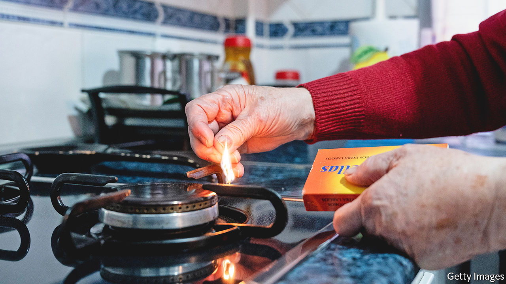
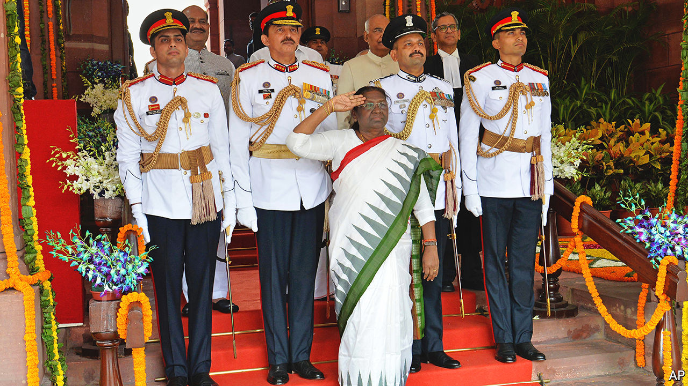

###### The world this week

# Politics 

#####  

 

> Jul 28th 2022 

Russia said it would further cut  through the Nord Stream 1 pipeline, supposedly because it requires repairs. The pipeline was already at 40% of capacity; it has now dropped to 20%. European governments took this as an effort to weaponise the supply of energy. They are trying to increase gas storage ahead of the winter. eu members agreed to reduce their gas usage by 15% between now and March. The reductions are voluntary, but could become mandatory if the situation worsens.

Russia attacked the Ukrainian port of  with cruise missiles and said it had destroyed a Ukrainian military vessel. The assault came a day after Russia and Ukraine signed a deal brokered by Turkey and the un to allow some 20m tonnes of  trapped at Black Sea ports to be exported. Ukraine said grain exports could begin only if security is guaranteed. 

The head of Russia’s space agency said it would pull out of the  in 2024. Russian cosmonauts on the iss were photographed recently brandishing the flags of Russian separatists in Ukraine’s Donetsk and Luhansk regions. 

Sergio Mattarella,  president, said , following the resignation of Mario Draghi as prime minister. Hard-right parties are expected to do well. Meanwhile, more than 2,000 migrants rescued at sea over two days were brought to the Italian island of Lampedusa, overwhelming its reception centre.

France’s president, Emmanuel Macron, went on a three-country tour of , taking in Cameroon, Benin and Guinea-Bissau. He aimed to bolster security ties and counter Russian influence. 

Around 500 members of al-Shabab, al-Qaeda’s affiliate in , crossed the border into , where they clashed with security forces. The jihadists have previously attempted to carry out terrorist attacks in Ethiopia, but this incursion appeared to be aimed at capturing territory and establishing bases.

A new  constitution giving more powers to the president passed in a referendum. About 95% of those who voted approved the charter. But only 31% of voters turned out. Groups opposed to President Kais Saied had urged Tunisians to boycott the vote.

The propagandist-in-chief

 foreign minister, Sergei Lavrov, visited , where he met ambassadors of the 22-country Arab League, among others. Mr Lavrov attempted to blame the West for shortages of grain as a result of the war in Ukraine. He also visited Ethiopia, Uganda and the Republic of Congo, conveying the same message. 

Hundreds of supporters of Muqtada al-Sadr, a Shia cleric whose party won a plurality in last year’sgeneral election, stormed the parliament building in Baghdad. They were angry about the nomination for prime minister of Muhammad al-Sudani, who is backed by a coalition close to Iran. No mps were said to be in the building. 

Ranil Wickremesinghe,  new president, ordered troops to clear protesters from the presidential complex less than a day after being sworn in. Mr Wickremesinghe must earn the goodwill of his people to push through the painful economic reforms that are necessary to put the economy back on track. Gotabaya Rajapaksa, who fled the country and resigned as president after protests earlier this month, is planning to return. 

The law of the junta

 executed four democracy activists it accused of various crimes against the state, the first time it has enforced the death penalty since the 1980s. The men were tried by army tribunals and are reported to have been denied legal counsel. The Association of South-East Asian Nations, a regional club of which Myanmar is a member, is considering punishing Myanmar. 

 


Droupadi Murmu,  first president from its 120m-strong tribal population, was sworn into office. India became a republic in 1950, three years after independence from the British. The president is the head of state, though her duties are mostly ceremonial. 

Tension mounted over plans by Nancy Pelosi, the Speaker of America’s House of Representatives, to visit  in August. The trip has not been confirmed, but Joe Biden said America’s military leaders think “it’s not a good idea right now”. China said America would “bear all the consequences” if she goes. 

To crush a small outbreak of covid-19, the  city of Shenzhen ordered factories to operate in “closed-loop” mode, with workers staying on site. A three-day lockdown was imposed in a district of Wuhan, the city where the pandemic first emerged. Four cases had been detected among the district’s 1m people. 

In  19 soldiers were charged with war crimes for murdering 303 people between 2005 and 2008. The soldiers were involved in what has become known as the “false positives” cases, in which civilians were killed and wrongly accused of being guerrilla fighters by the army. 

Nayib Bukele, the increasingly authoritarian president of , announced that his government would build a “Terrorism Confinement Centre” to lock up thousands of people. Since a state of emergency was announced in March, and extended four times, some 46,000 alleged gang members have been rounded up.

A jury in Washington found  guilty of contempt of Congress for ignoring a subpoena from the committee investigating the attack on the Capitol on January 6th 2021. Mr Bannon was one of Donald Trump’s policy advisers before they fell out. His conviction for contempt of Congress is the first since the Watergate scandal in 1974. He will be sentenced in October.

 said he was “feeling better every day” four days after testing positive for covid. His doctor said his symptoms had almost gone. 

The World Health Organisation declared  to be a “public health emergency of international concern”, giving the disease the same status as covid and Ebola. 

, a former leader of the Ulster Unionist Party, died at the age of 77. He is remembered for helping to negotiate the Good Friday Agreement in 1998, which brought peace to Northern Ireland after 30 years of sectarian violence. Mr Trimble shared the Nobel peace prize with John Hume, a nationalist politician. Though his political career waned thereafter, the peace he helped secure still endures.

