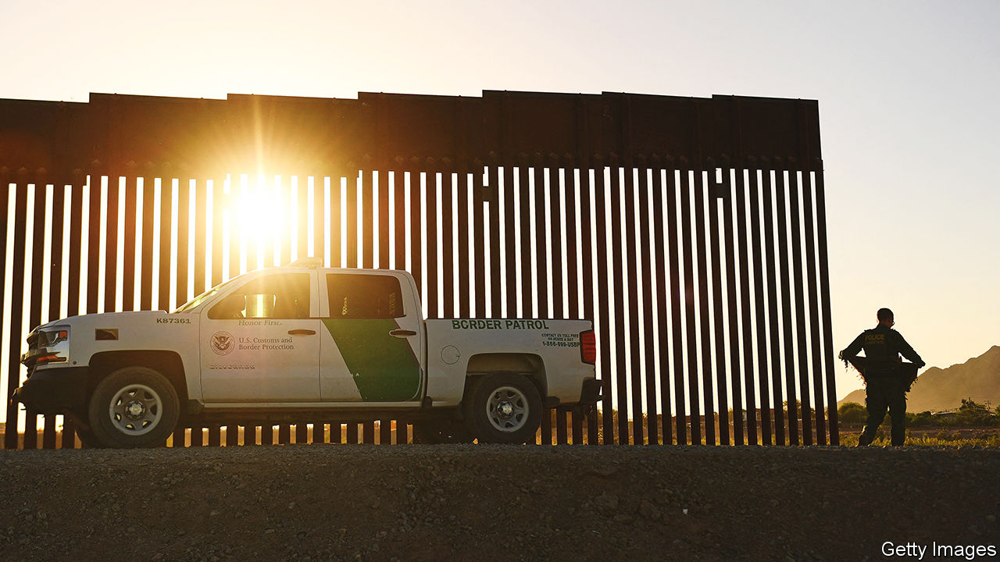
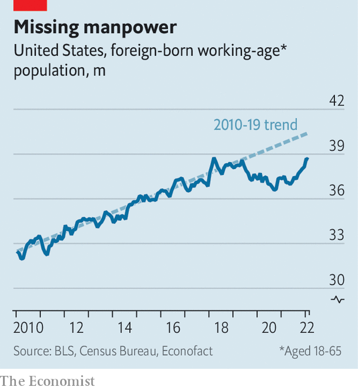

###### Immigration and the economy

# A shortfall in immigration has become an economic problem for America 

##### The real crisis is not border crossings but a shortage of new arrivals 

 

> Jul 28th 2022 

Almost every day for four months buses carrying asylum-seeking migrants have disembarked near the heart of American power, just half a mile from Capitol Hill. So far more than 6,000 people have arrived on these buses, sent by the governors of Arizona and Texas in a none-too-subtle jab at what they see as President Joe Biden’s weakness on immigration. It is the latest chapter in a decades-long fight over how to control entries from Mexico.

This border crisis has come to dominate media coverage and political debate about immigration in America. All the while, another crisis of the opposite sort is brewing: a broader decline in immigration. The resulting shortfall in the population is already making it harder for companies to find workers and threatens to do more damage to the economy. But whereas unauthorised border crossings are a perennial controversy, the drop in overall immigration has barely registered in Congress.

Net international migration—that is, accounting for both arrivals, whether authorised or not, and departures—added 247,000 to America’s population between July 2020 and July 2021. That was the smallest increase in the past three decades, and less than a third of the annual average during that time. The covid pandemic explained much of the drop, as America barred international visitors from dozens of countries, closed consulates around the world and froze many applications.

But the decline began before covid. Net immigration has trended down since 2017, Donald Trump’s first year in office. High-profile restrictions on travel from several predominately Muslim countries set the tone for his administration. Most important, it put sand in the gears of the  by, for instance, adding interviews and raising fees. Emigration has been another factor. The number of Mexicans living in America peaked 15 years ago. Many older migrants have returned home. Indeed, for all the furore about the southern border, the estimated population of unauthorised immigrants in the United States has declined during that same period, from 12.2m in 2007 to perhaps 10m in 2020.

 


The shortfall is visible in the labour market. Giovanni Peri and Reem Zaiour of the University of California, Davis, estimate that by February America was missing roughly 1.8m working-age foreign migrants relative to its post-2010 trend (see chart). Industries with higher shares of migrant workers tend to have higher vacancy rates now. Strikingly, that is true across the skills spectrum. 

Employers in the restaurant and accommodation sector, which draws a quarter of its employees from the foreign-born population, could not fill about 15% of job openings last year. In professional and business services, where the foreign-born make up a fifth of workers, doing everything from architectural sketches to tax preparation, roughly 10% of jobs went unfilled last year. That, in turn, may be contributing to higher wages, with pay rising especially quickly for low-income earners.

The fact that a decline in immigration could have such an impact is, on the one hand, unsurprising. New immigrants accounted for nearly 70% of the growth in the American labour force in the 2010s. Over the next two decades, immigrants are likely to be the only source of growth. The Pew Research Centre calculates that without new arrivals America’s labour force would decline to 163m in 2040 from 166m in 2020. If net immigration were to return to pre-pandemic levels, the labour force would instead grow to 178m by 2040. 

On the other hand, the relentless focus on America’s southern border seems to have obscured the bigger picture. Even the Federal Reserve failed to note the remarkable drop in immigration as a cause of labour-market tightness in either of its monetary-policy reports to Congress last year. In February this year it acknowledged at last that reduced immigration had probably constrained the labour supply.

Businesses are noticing the gaps. In an analysis published on July 15th, the us Chamber of Commerce outlined how widespread the problems are. Just one out of every three individuals seeking standard employment visas or seasonal work visas was successful last year, while one in four applicants for highly skilled work visas will make the cut this year. Each of these visa categories is subject to quotas created in 1990. They “have not been sufficiently updated to serve our national interest,” says Jon Baselice of the us Chamber.

Some delays are absurd. David Bier of the Cato Institute, a think-tank, estimates that Indians with degrees face a notional 90-year wait for green cards. From farm groups to theme-park associations, lobbyists have been asking the government to make it easier for American firms to hire from abroad. Silicon Valley’s tech giants have long clamoured for the same, arguing that they need foreign tech talent to stay at the global leading edge.

There is, however, little prospect of real change. The last concerted attempt at comprehensive immigration reform fizzled out in 2013, blocked by Republicans. The idea then, still seen by many advocates as the holy grail, was to combine greater openings for foreigners to work in America with some legalisation of unauthorised migrants plus tighter border security. As it turns out, the only real movement has been on bolstering border controls, symbolised by Mr Trump’s extension of the wall between America and Mexico. Lack of progress in expanding legal channels has pushed yet more migrants to view unchecked border crossings and asylum claims as their best route into America. 

Some immigration experts, noting the failure of comprehensive reform, think piecemeal efforts may offer hope. But the legislative maths is daunting, requiring votes from ten Republican senators for anything to pass. Even within the Democratic Party, some officials are wary of looking soft on border security. “We are in a very defensive position,” says a congressional aide close to immigration discussions. “It’s important to continue to remind everybody about the extreme economic impact that inaction is having,” says Bob Menendez, a Democratic senator.

There is no shortage of sensible ideas. Connecting migrants with employers before they reach America’s southern border would reduce pressure on crossings and help businesses. Marianne Wanamaker, who served as an economic adviser in Mr Trump’s White House, argues that getting rid of visa caps for specific occupations would also alleviate worker shortages. “We have tools available to us to resolve labour issues that we don’t appear willing to use,” she says. “That is the result of years and years of making immigration a third rail of American politics.” The conclusion is a dismal one: the headaches of the past year from worker shortages, far from being temporary, will be a recurrent problem in an ageing America that has forgotten how immigrants made the country what it is. ■

