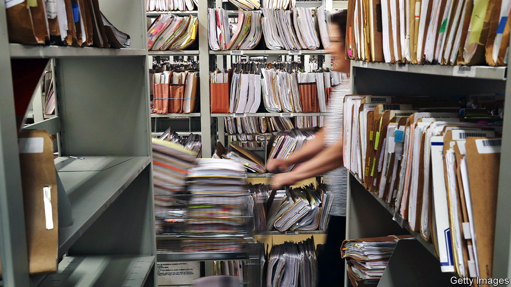

###### Green-card blues

# America’s legal-immigration system remains gummed up 

##### Donald Trump and the pandemic have done lasting damage 

 

> Jul 28th 2022 

When lisa davies, an executive assistant, flew back to Britain in February with her eight-year-old American-born son, she did not expect to stay long. She and her husband have lived in Chicago for 16 years, on an investment visa. In the past, renewing it had been relatively simple. The pandemic slowed things down, however, and with Ms Davies’s work permit about to expire, her employers sponsored her instead for an h1b, a new work visa. It was approved. But when she arrived at the American embassy in London to collect it, she was told that her application had been referred for “administrative processing”. Five months later she is still waiting, while her husband and son stay in Chicago. “It hasn’t been ideal,” she says.

The hurdles foreigners face trying to live in (or move to) America have increased. Some 410,000 people are waiting for interviews with the State Department to get green cards, mostly through immediate relatives. They qualify; it is just a processing delay. In 2019, before the pandemic closed government offices, just 61,000 people were waiting for an interview. Since July last year the backlog has shrunk from 532,000. But only around 30,000 interviews are being scheduled a month, fewer than before the pandemic. The only reason the backlog is not growing seems to be that fewer people are being asked to an interview.

The number of fiancé visas, issued to foreign partners of Americans ahead of their weddings, has also fallen sharply. Permanent residents who want to become naturalised citizens now have to wait around a year, up from eight or so months before the pandemic. Last year 150,000 potential green cards for non-immediate family members, which are subject to a congressional cap, were “wasted”, as they were not issued in time.

Green cards that are sponsored by employers are also subject to a cap, by country of origin. In the case of migrants from a few countries, in particular India, the number of qualifying candidates grotesquely exceeds the cap. Hundreds of thousands of workers who would be entitled to green cards remain tied to the employer that sponsored their original visa. Their children, if they were not born in America, risk being deported when they reach adulthood, even if they were toddlers when they arrived.

This gumming up is only partly due to the pandemic. Under the presidency of Donald Trump, staff imposed ever more burdens on us Citizenship and Immigration Services (uscis) while at the same time starving it of funding. “The Trump administration literally came very close to bankrupting uscis in 2020,” says Greg Chen, of the American Immigration Lawyers Association. Congress stepped in with more money, but 20% of positions remain unfilled. Mr Chen says that, under President Joe Biden, uscis is at least trying to shrink backlogs instead of deliberately adding to them, but “this is systemic overload”, and it may take years before it is reduced.

