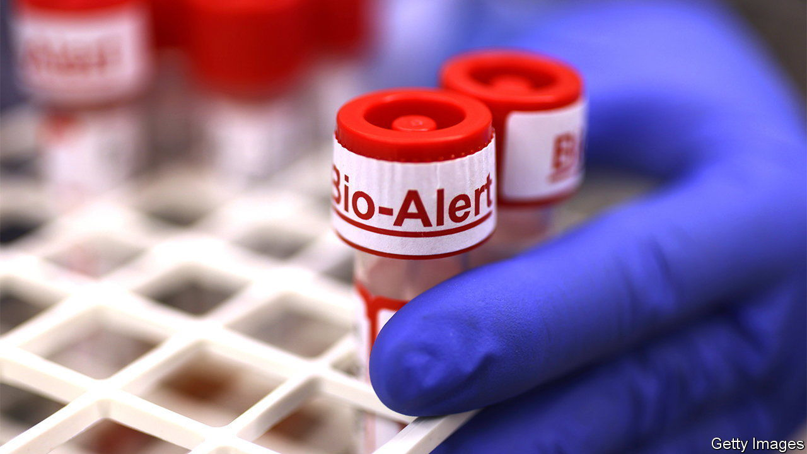

###### No lessons learned

# America’s response to monkeypox has been underwhelming 

##### A new epidemic, same old mistakes 

 

> Jul 27th 2022 

America fumbled its response to covid-19. Inadequate testing and low vaccination rates were among the problems. The latest epidemic has shown that the country has yet to learn its lessons.

Monkeypox, a rare virus similar to smallpox though less fatal, is spreading throughout the world. By July 25th the Centres for Disease Control and Prevention (cdc) had reported nearly 18,100 cases worldwide, about 3,850 of them in America. The World Health Organisation  a public-health emergency of international concern on July 23rd.

The virus was first identified in humans in the Democratic Republic of the Congo in 1970 and until 2022 was mostly reported in central and western Africa. Cases began popping up in Europe and America in May. Researchers have concluded that skin-to-skin contact, often during sex, is the main driver of transmission, for now. About 99% of cases in America have been among gay and bisexual men, a pattern seen in other countries. Many cases are linked to parties involving sex with multiple partners (two children have become ill in America, probably through household contact with an infected person). 

No specific treatment exists for monkeypox, though antiviral drugs and vaccines for smallpox can be used to prevent and treat the disease. Symptoms include fever, headaches, muscle aches and a rash that can present as pus-filled blisters on the body. These symptoms can be severe, but of the thousands of cases , there have been no deaths.

Testing has been sub-par. Unlike the early experience with covid-19, the cdc already had a monkeypox test and began shipping it to 70 laboratories in its network. But many big cities had only one participating lab and doctors were put off by the paperwork involved in requesting a test. In early July New York, which has a third of America’s cases, was testing only ten people a day. Testing, and cases, ramped up in mid-July, when several big commercial lab chains began doing the tests with kits from the cdc.

Vaccination has also been slow. A two-dose  (Bavarian Nordic’s jynneos) is available, but supplies have failed to meet the overwhelming demand. The Food and Drug Administration took nearly two months to approve 1.1m doses from a pharmaceutical facility in Denmark.

The American response to monkeypox should have been swifter after covid-19. Public-health officials could have provided support while the disease was abroad, to help contain it. Once it reached America, testing should have been available quickly. Vaccines should have been distributed more efficiently to high-risk groups.

Belatedly, vaccine access is improving. Only 2,400 vaccine doses were available at the onset of the outbreak in May, and 72,000 more became available three weeks later. Today 374,000 doses are available, but more are needed. New York City has received jabs for a first dose of the vaccine to half of its eligible population; in Washington, dc, another hotspot, doses are enough for 70% of that group. The White House has promised millions of vaccine doses before the end of the year. But Americans have heard such promises before. ■

