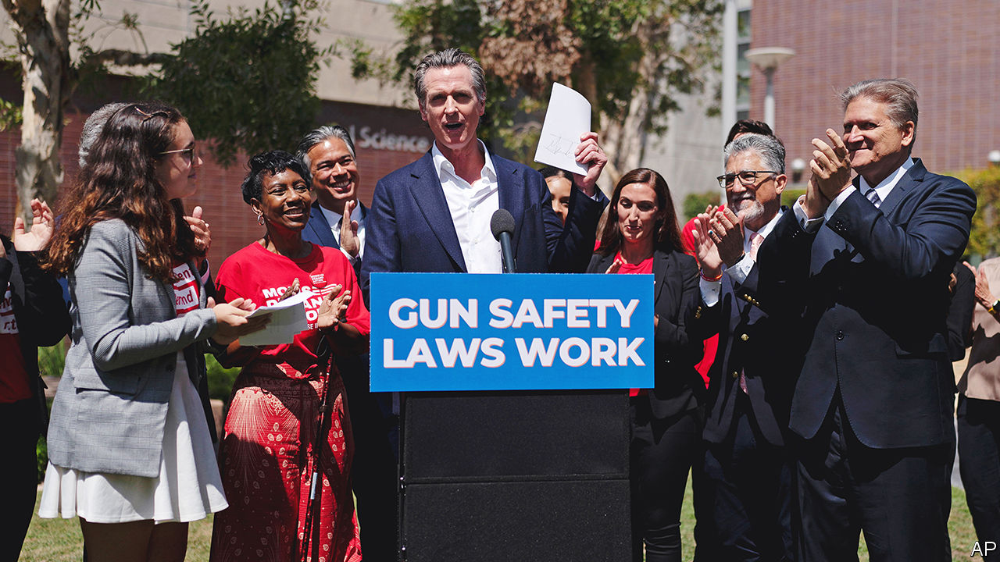

###### Return fire

# California’s governor takes aim at Texas with a new gun law 

##### Doubling down on a dubious legal manoeuvre 

 

> Jul 28th 2022 

Usually imitation is the sincerest form of flattery, but not for Gavin Newsom, California’s governor. On July 22nd he signed a law which copies Texas’s sb 8, a controversial act that lets private citizens sue people involved in administering or abetting abortion. Mr Newsom’s law lets private citizens sue people who are illegally involved with guns. Now Californians will be able to bring lawsuits against those who make, distribute and sell illegal assault weapons and gun parts that lack a serial number, as well as anyone who sells a firearm to someone under 21. Violators will have to pay $10,000 for each infraction, the exact penalty Texas specified. 

“If they’re going to open that door…to put women’s lives at risk, I’ll do it to save people’s lives any day of the week,” Mr Newsom told . He has run an advertisement in Texan newspapers trumpeting California’s efforts to keep people safe from gun violence. It is a direct attack on Greg Abbott, Texas’s governor, who has pushed restrictions on abortion while loosening those on gun sales. Mr Newsom’s office likes to remind people that in recent years California has had a lower per-head death rate in mass shootings than many southern states with more permissive gun laws.

The Golden State’s new “bounty-hunter” law is important for two reasons. First, it shows how Mr Newsom is trying to position himself as a leading progressive voice nationally. Guns are a winning issue among Democratic voters, who favour more controls. Mr Newsom is rumoured to be considering a run for president in 2024, although he denies it. “It’s just not happening,” he says. “She [Vice-President Kamala Harris] is my friend.” 

Second, California is pushing the envelope with gun rules, creating potential “showdowns” with the Supreme Court, says Ken Miller, of Claremont McKenna College. The “bounty hunter” construct empowers individuals, rather than the state, to sue. Mr Newsom reckons if the Supreme Court were to find California’s law invalid, it would have to throw out the one in Texas, which is similarly structured. But after its recent decision to scrap the constitutional right to abortion, the court could rule against California’s bounty-hunter law without restoring abortion access in Texas (where a near-blanket ban goes into effect on August 25th).

The laws also differ in their reach. Whereas Texas’s bounty-hunter law quickly limited access to abortion, California’s is “unlikely to have any significant impact”, predicts Adam Winkler, of the University of California, Los Angeles. It is already in effect illegal to buy assault weapons or sell guns to under 21-year-olds in California, so the law is mostly symbolic. 

Some worry about the consequences of copying a mechanism which even the press release for the Californian gun law describes as “wrongheaded”. The American Civil Liberties Union argues that “replicating the reprehensible Texas model only serves to legitimise and promote it”. It is concerned about a “dangerous legal precedent” for other states to enact bounty-hunting laws. ■

