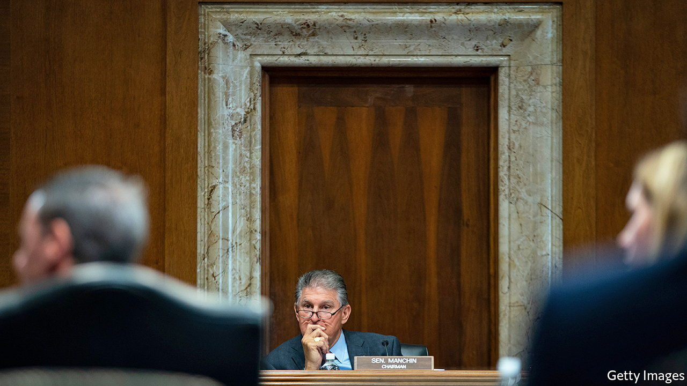

###### Deus ex Manchina

# Democratic hopes for a big spending bill are revived 

##### The surprising Manchin-Schumer deal 

 

> Jul 28th 2022 

Sometimes the senate resembles a zombie film: you can never be sure that what is dead will stay that way. So it was with Democratic ambitions for climate-change legislation. Two weeks ago party members were despondent after negotiations over legislation known as Build Back Better, a long-stalled spending package, between Chuck Schumer, the Democratic leader in the Senate, and Joe Manchin (pictured), the swing vote from West Virginia, seemed decisively broken. Now their hopes have been reanimated. On July 27th the two men announced a new deal that would include hefty spending to mitigate climate change. “Build Back Better is dead,” wrote Mr Manchin in a statement announcing the newest avatar for Democratic dreams: the Inflation Reduction Act of 2022.

Although the outlined deal is a far cry from the $4trn proposal to transform America that President Joe Biden had pitched at the start of his administration, it is also a far cry from zero. The plan aims to raise $740bn over the next ten years by increasing tax enforcement by the Internal Revenue Service and by instituting a 15% minimum tax on corporations—bringing America in line with a global tax floor negotiated by the treasury secretary, Janet Yellen. The federal government would also at last be free to negotiate the prices it pays for prescription drugs, which would help release $288bn over the next decade, according to estimates by the Congressional Budget Office, a non-partisan scorekeeper.

Mr Manchin’s influence is most apparent in the prescribed cocktail of spending: $300bn or so would go to paying off the national debt, one of his perennial areas of concern. Some $64bn is earmarked to extend subsidies for health-insurance premiums to those receiving coverage through Obamacare. And $369bn would be spent on “energy security and climate change”—the exact mix is as yet unknown. 

Mr Manchin is insistent that permitting rules for fossil-fuel projects be loosened in the short term. Mr Schumer is keen to point out that the anticipated spending would “reduce carbon emissions by roughly 40% by 2030”. After the recent setback, environmental modellers had been steeling themselves for a plateau in American emissions reductions that might have lasted for years. Such a compromise would certainly suit the Biden administration, which has struggled to seem both green and averse to high petrol prices. 

But as any fan of the “Evil Dead” franchise could tell you, the second important lesson of zombie films is that what is healthy one minute may be hopelessly necrotised in the next. First, Mr Manchin’s mind changes rather often. Policies that he previously decried as impossible because of inflation, such as increasing taxes, are now proudly touted as disinflationary. Second, the West Virginian is not the only defection that Democrats must agonise over. Kyrsten Sinema, a senator from Arizona, has been adamantly opposed to increasing taxes and is not known to be especially yielding. Third, there is sure to be a flurry of lobbying by pharmaceutical companies that would rather not forgo hundreds of billions of dollars—and by the clean-energy firms that would appreciate the generous subsidies. 

Mr Schumer would now like to charge ahead towards votes on the deal next week. Wise watchers will know to look out for a final twist or two. ■


