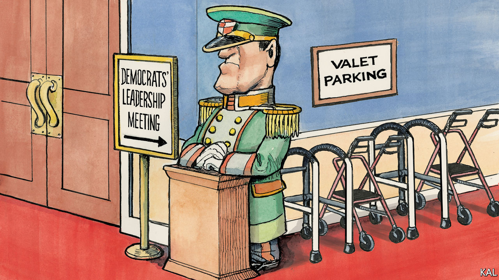

###### Lexington: The gerontocrats

# Democrats are overdue for a new generation of leaders 

##### And in Congress it may be about to arrive 

 

> Jul 27th 2022 

Villa taverna, the American ambassador’s residence in Rome, has seven acres, a Baroque fountain, a third-century Roman sarcophagus and a three-storey wine cellar. It does not, however, have an ambassador. Given its charms as a reward for a political ally, this seems a strange oversight by President .

Or maybe not. Some capital Kremlinologists suspect the vacancy heralds a generational change in the Democratic leadership of Congress after the mid-term elections this autumn. They note that , not only the first woman to be speaker of the House but also the first Italian-American, would make a fine emissary to Rome. A dignified exit for Ms Pelosi would open the way for a leadership transition that some House Democrats have wanted for years, and are particularly anxious for now. 

The Democrats’ leaders are old. A party that yearns for the vigour and optimism of John Kennedy (elected president at 43), and would happily settle for that of Barack Obama (47) or Bill Clinton (46), finds itself yoked to the oldest president (now 79) in history by a margin of eight years, or two full terms. That Mr Biden should bear this distinction some days seems a triumph, other days an irony, and on others—the bad days, as when he tumbled off his bicycle or fumbles for a word—cruelty. He was a boy wonder, among the youngest senators ever, elected at just 29 after he brashly challenged a 63-year-old incumbent because, as Richard Ben Cramer wrote in “What It Takes”, he “knew the old man wasn’t quite up to it any more”. 

Rather than offering a contrast, the Democrats’ congressional leaders are a study in shades of grey. At 71 the Senate majority leader, Chuck Schumer, counts as a spring chicken. His deputy, Dick Durbin, is 77. Ms Pelosi is 82. Steny Hoyer, the House majority leader, is 83. Jim Clyburn, who as House majority whip ranks third, is also 82. They became eligible for Social Security retirement benefits before some of the voters they need to inspire were born. 

They owe their longevity in House leadership partly to advantages accorded to long-serving Democrats, but mostly to their acumen and toughness. This is particularly true of Ms Pelosi, who may not electrify audiences but whose inside game is admired and feared by Democrats and Republicans. As speaker, she confronted George W. Bush over Iraq, delivered Mr Obama’s health-care plan and repeatedly outmanoeuvred Donald Trump, seeing to his impeachment twice. She has also raised more campaign money than any member of Congress in history, according to the biography “Madam Speaker”, by Susan Page. But in 2018, to secure support from restless Democrats, she promised to yield the leadership in 2022. She is said by allies to consider it sexist that no such pledge was demanded of the two male leaders. She has a point. 

The Democrats are expected to lose their narrow majority this autumn. Some House members suspect that if the party limits its losses to fewer than 15 seats, Ms Pelosi may try to stay on. If not, Mr Hoyer, despite his age, might make a run at the top job. 

Their rivalry is epic. They met in 1963, working for the same Maryland senator; Ms Pelosi was a secretary, Mr Hoyer a clerk being groomed for a political career. Four decades on Ms Pelosi won her first leadership job, as whip, by beating Mr Hoyer, who was considered far ahead of her in line (he had served four terms before Ms Pelosi was first elected). If Mr Biden is reserving an ambassadorship for Ms Pelosi, he would be wise to be planning a post for Mr Hoyer, if not Mr Clyburn, too. A new generation of leaders would energise not just the House Democrats but the party.

The odds-on favourite to succeed Ms Pelosi as leader is Hakeem Jeffries of Brooklyn, a pragmatic, tough-minded liberal in Ms Pelosi’s mould. He is 51. He could face a challenge from Adam Schiff, 62, of California, another Pelosi protégé, and Katherine Clark, 59, of Massachusetts. Together, they might make a strong team.

This moment of transition also offers the Democrats a chance to change rules that let their leaders go stale. The Republicans have gerontocrats of their own—Donald Trump is 76 and Mitch McConnell, the Senate minority leader, is 80—but their House leadership is spry. The reason is that when Newt Gingrich led his Republican revolt in 1994, he instituted rules limiting chairs of committees, or ranking members, to three terms. 

Meet the new bosses

The result has been a procession of rising stars. Democrats grouse about having to wait decades, until senior members retire or die, before they can ascend committee ranks. Seth Moulton, a Massachusetts Democrat in his fourth term, and Jim Banks, an Indiana Republican in his third, are both veterans serving on the Armed Services Committee. But Mr Banks, at 43, is already the ranking member of an important subcommittee; he has been positioned to run for the third-ranking post in the next Congress. Mr Moulton, meanwhile, must await his turn.

There are trade-offs. Experience matters. Research suggests that chairmen grow more effective as they serve longer. But the combination of privileged seniority and endless incumbency has great costs. Some members say their senior colleagues are more partisan and carry decades-old grudges; ambitious representatives get frustrated and leave. “Everyone young is like, ‘I’m not waiting 40 years for my gavel’, ” says a next-generation member.

Jerrold Nadler, 75, and Carolyn Maloney, 76, won safe Democratic seats in New York City in 1992. They had to keep an eye on their left, for a primary challenge, but by being staunch liberals and attending to constituents they have served for 15 terms together and risen to be committee chairs. This year, though, they find themselves locked in a tough race—against each other. Redistricting pushed them into the same district, and neither would yield. It is sad watching these two ageing lions claw at each other for another term. Leaders focused on the country’s future, and their party’s, would devote more energy to grooming successors. ■


