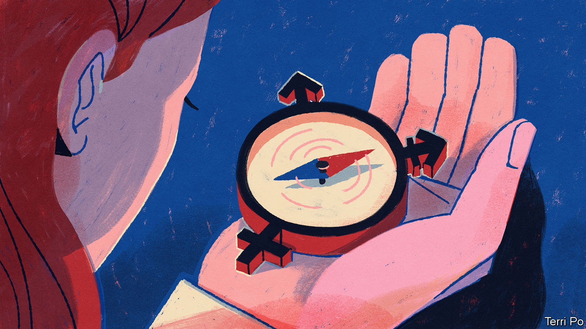

###### In search of evidence

# Questioning America’s approach to transgender health care 

##### Some paediatricians want a re-examination of the professional guidance 

 

> Jul 28th 2022 

When jane clark’s 15-year-old daughter told her that she thought she might be gay, Dr Clark, a paediatrician who calls herself a “typical west-coast liberal”, said, “ok, great.” When the child a few months later said she thought she was non-binary, “I was, like, I don’t know what that means, but ok.” She found a gender therapist for her child, expecting a period of therapy. Within a couple of visits the therapist told her that her daughter wanted “top surgery” (a double mastectomy) and emailed her to recommend a surgeon. “I said, ‘What are you talking about?’” gasps Dr Clark (not her real name).

She booked her daughter into a local gender clinic. Before their first visit, a social worker phoned “to go through the informed consent for the hormones”. “I was completely shocked that this was the approach to a child who was questioning their gender,” says Dr Clark. “I just didn’t know what ‘gender-affirming care’ meant. It sounds so beneficial and positive.”

Looking for support, she turned to the American Academy of Paediatrics (aap), but found the gender clinic was, in fact, following aap guidelines. They state that children should be affirmed in the gender they say they are, and treatment can comprise social and medical transition, including puberty blockers, cross-sex hormones and surgery. “I feel completely betrayed by the aap,” says Dr Clark. 

She is one of a growing number of doctors who are starting to push back against the apparent medical consensus on transgender issues. Some paediatricians are trying to get the aap to change its guidelines at its leadership conference that opens on August 4th. They accuse the academy of trying to suppress debate on the subject. 

The aap’s current guidance, written in 2018, has been influential. But opponents say it is not based on evidence. Julia Mason, a paediatrician in Oregon (and a lifelong Democrat), says research suggesting improved outcomes from “affirmative care” is weak. She points to the review of worldwide research done by Britain’s National Institute for Health and Care Excellence in 2020. It found that studies on the impact of puberty blockers are “either of questionable clinical value, or the studies themselves are not reliable”. On cross-sex hormones, it found some short-term benefits but said these “must be weighed against the largely unknown long-term safety profile of these treatments”. 

Genspect, an international group of clinicians and parents, wrote to the aap calling for a “non-partisan and systematic review of evidence”, saying: “Many of our children have received this care and are anything but thriving.” Without long-term data, says Dr Mason, “We’re flying blind. We’re conducting uncontrolled experiments on the bodies of children.” 

When the aap policy came out, James Cantor, a psychologist, wrote a peer-reviewed article that took apart the statement’s sources. “It is remarkable that a small group of activists is commandeering the most influential organisations affecting children in America,” says Dr Mason. 

Other medical organisations, such as the Endocrine Society and the World Professional Association for Transgender Health (wpath), also have pro-affirmation guidance. wpath in December released a draft of its new Standards of Care. It suggests lowering the age of eligibility for cross-sex hormones to 14, for surgical removal of breasts to 15 and of testicles to 17. 

Europe v America

The dissident paediatricians have had to ignore the culture wars, which suggest conservatives must oppose “affirmative care” and liberals must support it. They say this is about safeguarding not politics, and point to the many “detransitioners” who regret their own actions. 

The aap denies it is blocking debate. In a statement, it said: “Robust evidence demonstrates that access to gender-affirming care decreases risk of suicidal ideations, improves mental health, and improves the overall health and well-being of transgender and gender-diverse youth.” Its website says it is working on a “thorough update” of its 2018 statement. But a change looks unlikely (it will still be titled “Providing affirmative clinical care”). Supporters say waiting until children are 18 is not an option. “There are too many risks in terms of mental-health issues and suicide risk,” says Eli Coleman of wpath. “We can see the benefits of intervening early, rather than having them experience more harm.” Critics say there is no evidence that “affirmation” reduces suicides. They say blockers and hormones can cause sterility, anorgasmia and osteoporosis. 

The American situation contrasts with Europe, where some medical groups are moving in the opposite direction. In 2022 Sweden said it will not give blockers or hormones to anyone under 18, with a few strict exceptions. Finland discourages medicalisation for those under 25. Both now prioritise therapy. Britain has launched a review of child services by Hilary Cass, a former head of the Royal College of Paediatrics. Her interim report this year appeared to distance itself from the “affirmative model” that “originated in the usa”. 

William Malone, an endocrinologist with the Society for Evidence-based Gender Medicine, a non-profit group, sees parallels with previous medical scandals, not least the opioid crisis. There is a mix of “Big Pharma, a vulnerable patient population, and physicians misled by medical organisations or tempted by wealth and prestige”, he says. But now there is gender-identity ideology on top. “We are completely saturated with corporate influences and lobby groups,” says Dr Malone. “The only way they will be halted is if a massive number of people are harmed and they get together to sue the people who harmed them.” ■

