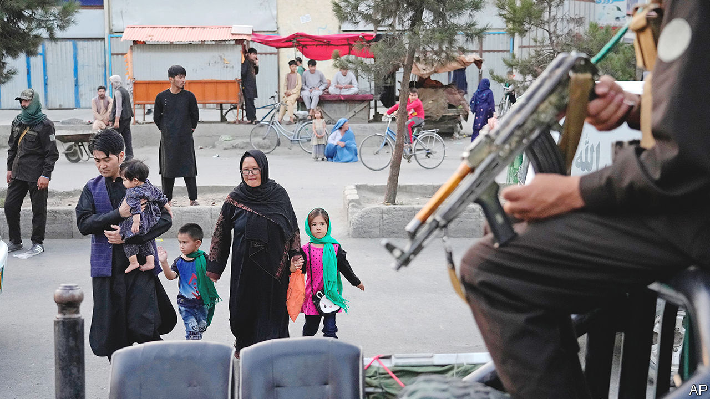
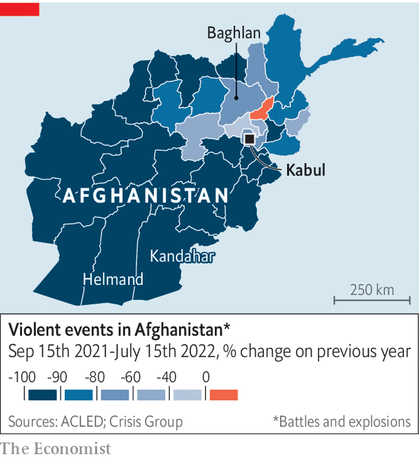

###### Peace, of a sort

# Afghanistan is poorer and hungrier than a year ago 

##### Yet it is also safer, with far less violence in rural areas 

 

> Aug 11th 2022 

One year ago Lema had a good life. Armed with a bachelor’s degree in law and political science, the 27-year-old had a steady job in Kabul, Afghanistan’s capital. She worked out at a local gym in her spare time. But since the Taliban took control of the country last year, women have been barred from many jobs, from travelling without a male escort and from dressing as they please. Lema has lost her job. Her household of 13—parents, siblings, their families—is struggling to get by. Her fiancé has also lost his job. Her brother’s business has gone bust. She cannot walk the streets alone. The gym is out of the question. 

For Mahmood, a watermelon farmer in Baghlan province, north of the capital, things are looking up. Shortly before the Taliban took over, his house was targeted by government forces, who thought it was being used as a militant hideout. They approached the property and opened fire. Mahmood rushed his family to safety at the back of the building. It was not unusual for farmers to get caught up in the fighting. But since the Taliban returned to power, the guns have mostly fallen silent. True, poor rains have ruined Mahmood’s harvest, his relatives have lost their jobs and his family is broke. But at least he no longer has to worry about his children being shot. Moreover, charities are once again coming to his village and handing out cash.

The Taliban’s  on August 15th last year capped a lightning advance through the country. The ease of their victory surprised everyone, including the fighters themselves. The world watched in horror as America botched its withdrawal and desperate Afghans thronged the airport hoping to flee. The Taliban swiftly established total control, and the country fell into crisis. 

The main problems are financial. The economy collapsed as the West cut off Afghanistan from the global banking system and froze its foreign reserves. Between September and December last year, gdp fell by a third compared with the same period a year earlier. Most of the country is . Prices for food and fuel were 50% higher in June than a year before. Only one in 20 families have enough to eat. 

The Taliban are not helping matters. Despite claims that they have changed and promises of “” for Afghans, the new Taliban behave a lot like the old lot, who ruled the country from 1996 to 2001. The Ministry of Virtue and Vice has been reconstituted and its morality police are out in force, harassing men who trim their beards and women who are not covered from head to toe. And the Taliban are still offering haven to their terrorist friends. On July 31st an American drone strike  Ayman al-Zawahiri, al-Qaeda’s leader, in central Kabul. 

Women are undoubtedly the . In two decades under an American-backed government, many had grown accustomed to a degree of freedom. The female literacy rate more than doubled between 2000 and 2018, albeit to only 30%. A generation of women got jobs as doctors, journalists and lawyers. Now they are being forced out of public life once more. In March the Taliban  on their promise to let girls back into secondary schools.

 


Yet some Afghans, like Mahmood, are better off than they were a year ago. Villagers who once lived on the front lines of the conflict, in provinces like Helmand and Kandahar, are safer than they have been in years. According to Crisis Group, a think-tank, violent incidents—armed clashes, drone strikes, suicide bombings—in the ten months to mid-July were down 87% compared with the same period the previous year (see map). 

For many rural Afghans, not much else has changed. Fierce conservatism is not new in villages in the south of the country, which produced the Taliban. Women there are used to covering up and staying home. Such far-flung places never saw much of the aid money that poured into the country. As security has improved, humanitarian assistance has started arriving.

Residents in these remote parts are rebuilding their lives, sowing crops and fixing up their homes. In a recent World Bank survey of heads of households, the share of rural respondents who said they were employed rose to 81% in the last three months of 2021 from 73% two years earlier. (In cities, that share dropped slightly.) They are hardly thriving—being employed does not mean earning a decent wage, and many will be sole breadwinners covering expenses for large families. But they are at least able to work.

Peace may not last, of course. Afghans have been changed by 20 years of American-backed rough democracy. Women, unwilling to live with the Taliban’s bigotry, are taking to the streets in protest. Economic hardship is stirring discontent. Newly poor Afghans blame the Taliban for mismanagement and foreign powers for cutting them off. “There are winners and losers yet again,” says Ashley Jackson, an analyst at the Overseas Development Institute, a think-tank in London, “and that sets the stage for conflict.”■

