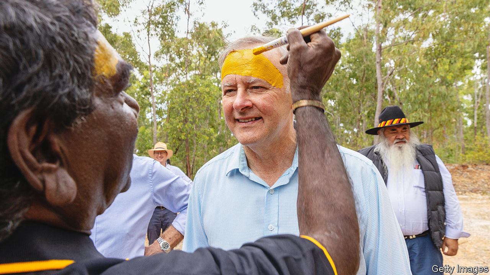

###### Voice recognition

# Australia’s leader wants to include Aboriginals in the constitution 

##### The prime minister has vowed to hold a referendum on the topic within three years 

 

> Aug 11th 2022 

“This rock is an awesome feature,” says James, a ranger of the Anangu people in central Australia. “It’s a story book.” The story may be about to get longer. James is standing at the base of Uluru, a humungous monolith embedded in the red desert near the middle of Australia. The country’s indigenous people have made it a civil-rights symbol: they want Australians to change the constitution to guarantee them a say in laws that affect their lives. The battle over the call for an Aboriginal “voice to Parliament” is looming as a big test for Anthony Albanese, the newish prime minister (pictured), and his centre-left Labor government. 

In late July Mr Albanese flew to an Aboriginal festival in Arnhem Land, some 2,000km north of Uluru, to add his own voice to the campaign. On July 30th he promised the region’s Yolngu people a referendum on the idea within his government’s three-year term, calling it “a momentous change” and a step “in our nation’s journey of healing”.

Aboriginal people make up barely 3% of Australia’s 25m inhabitants. But their forebears had lived on the continent for some 60,000 years before the British landed in 1788. They played no part in drafting Australia’s constitution and were not accorded any rights in it.

Five years ago Aboriginal delegates gathered at Uluru, a sacred site  by the name colonists gave it, Ayers Rock, after a long quest to find a formula to give “First Nations” a say in government policies over their people. The delegates  the “Uluru Statement from the Heart”, a short, elegant cry for constitutional change. Their peoples’ “ancient sovereignty”, it said, had never been ceded, and still co-existed with that of the British Crown. The statement added that the shocking levels of imprisonment and broken families among Aboriginal people were proof of the need for change.

The conservative government of the day greeted the plea coldly. It misrepresented the statement as a call for a third chamber of parliament, and said new laws would be better than a constitutional amendment. But Aboriginal leaders recall how John Howard, a former conservative prime minister, abolished a commission charged with protecting Aboriginal interests. Only the constitution can truly protect them, they argue.

Mr Albanese has embraced this idea. For the referendum campaign, his government will draw on a report by Marcia Langton and Tom Calma, two Aboriginal leaders, explaining how the voice would work. They propose a body of 24, chosen by Aboriginal people, to advise the federal government whenever legislation affecting indigenous Australians’ “social, spiritual and economic well-being” is in the works. This approach, Mr Albanese argues, would mean policies “are always more effective”. He, too, points to shocking statistics, such as that Aboriginals die on average 20 years earlier than other Australians. 

Some critics, including a handful of Aboriginal figures, deride the idea as mere symbolism. Mr Albanese is keen on symbolic gestures: his government’s press conferences now feature the flags used by Australia’s indigenous peoples next to the Australian one. Yet changing the constitution will not be as easy as unfurling extra flags. The document’s 19th-century framers set a high bar for amendments: a “yes” vote both nationally and in at least four of the country’s six states. Just eight of 44 proposed changes have passed in 121 years. 

There are some hints, however, of bipartisan political support. The conservative opposition seems to have warmed slightly to the Uluru Statement since leaving government. Julian Leeser, its Aboriginal affairs spokesman, has publicly supported a constitutional voice. Peter Dutton, the opposition leader, is more vague. 

The election result that swept Labor to power in May suggests Australians are tired of the culture wars that prevailed under nine previous years of conservative government. Penny Wong, the foreign minister, even talks of a “First Nations approach to foreign policy”. Mr Albanese is optimistic that a referendum will pass. As he puts it, “If not now, when?” ■

