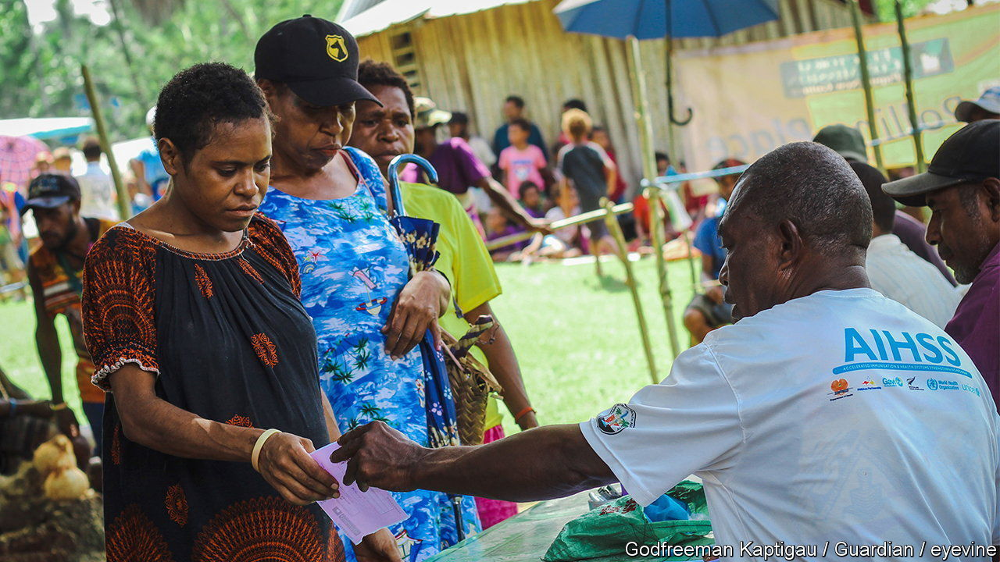

###### Polling badly

# Papua New Guinea conducts its worst election ever 

##### More violence, more corruption, more fraud. But fewer deaths, at least 

 

> Aug 11th 2022 

In parliament on August 9th, 97 members voted for the incumbent, James Marape, to remain prime minister of Papua New Guinea. None voted against him. His rival and predecessor, Peter O’Neill, walked out of the chamber in disgust. 

The parliamentary vote concludes a lengthy and deeply flawed election, even by the standards of a country known for dismal polls. Mr Marape’s Pangu party secured only 36 of 118 seats. But he also has the backing of 17 parties in his coalition and several independents, giving him near-total control of parliament, at least until some lawmakers are inevitably lured away by rivals. Not that their seats were all honourably won. Paul Barker, the director of the Institute of National Affairs, a think-tank in Port Moresby, the capital, believes that each poll is getting worse in terms of the scale and extent of fraud. This one, he says, was the “worst election ever”. 

Papua New Guinea’s 9m people inhabit the most linguistically diverse nation on Earth, with some . Despite abundant natural resources, including gas, gold, timber, tin and coffee, gdp per person remains below $3,000, about the same as Honduras. Over the past decade the country has become a big exporter of natural gas, but few locals have benefited. Mr Marape has promised to “take back” a greater share of the wealth from the mostly foreign resource-extraction companies. But corruption is a big part of the problem. Even honest prime ministers end up doing deals with unscrupulous politicians. Voters see little prospect of any long-term improvement, so they resort to the short-term gains that come from selling their votes.

Electoral fraud is most rampant in the highlands, the central spine of the country, where around 40% of the population lives. One tactic is the hijacking of ballot boxes, either to destroy them or to stuff them. Joe Ketan, an expert on politics and society in Papua New Guinea, who lives in the mountainous interior, observed the election in two provinces near his home. He found that “all the ballots were marked by candidates and their agents”. Much of this fraud is orchestrated at the local level, with rival candidates agreeing to distribute all the available ballot papers among themselves. In one province, women queued for hours in the heat to vote only to be turned away by youths armed with bush knives. 

Authorities halted the count in many constituencies, leaving it to the courts to decide whether to declare these elections “failed”. Fear of official bias in declaring ballot boxes suspicious can itself be a trigger for violence. Schools in the capital had to close for a week after machete-wielding men rampaged outside a counting centre because the returning officer set aside several ballot boxes from their candidate’s area. Mr Barker warns of a corrosive “highlandisation” of the process in the northern part of the mainland. In the south and on the islands off its east coast, elections usually run much more smoothly. 

Deaths, at least, have so far been fewer than in the . Some 55 people were killed during polling this year, compared with 200-odd in 2017. Many of the murders then occurred after results were declared and during the recriminations that followed. This time around, there has been a much heavier security presence. In some cases, though, police and soldiers have themselves been responsible for fatalities. On August 9th police officers shot and killed five people protesting about the result in a highland province.

Mr Marape promises to rectify many of these problems. He needs to do so quickly. Incoming prime ministers have an 18-month grace period during which they cannot legally be removed from office. Most then face a no-confidence vote, which was how Mr Marape himself initially became prime minister—at the —in 2019. If Mr Marape can sustain himself in government without doing too many dodgy deals, he may even manage to do some good for his beleaguered citizens. More likely is that the elections of 2027 will be even worse. ■

