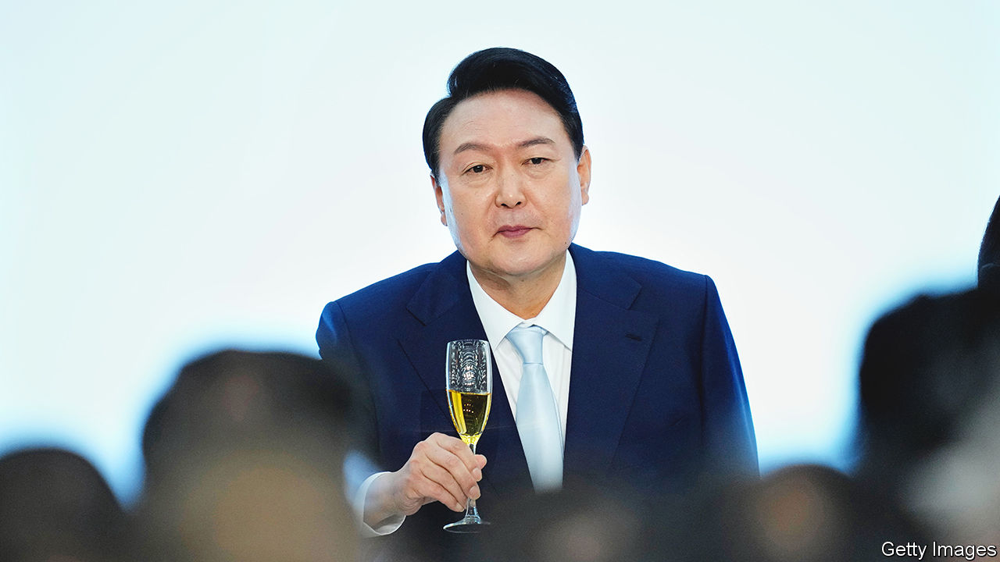

###### The crownless again shall be king

# South Korea’s president is tightening his grip on the police 

##### Yoon Suk-yeol, a former top prosecutor, would like his powers back 

 

> Aug 11th 2022 

The disgruntled in South Korea have long shaved their heads. The tonsure, a symbol of sacrifice, works as a form of passive resistance. Hence the number of dissident officials and put-upon shopkeepers who ask their friends to wield a defiant razor before the cameras. Hence, too, the scene last month outside the headquarters of the National Police Agency (npa) in Seoul, the capital, as the locks of four officers fell on capes bearing the words “Withdraw the mois police bureau. Guarantee police neutrality.”

That “police bureau”, which started work on August 2nd, gives the Ministry of the Interior and Security (mois) oversight of certain decisions within the police force, including appointments. Many cops are furious about the infringement on their autonomy. Opposition politicians and civic groups complain that the bureau was set up without proper parliamentary oversight. They worry it means the police will be forced to kowtow to the administration. That fear is not unreasonable: the npa was made independent in 1991 because of its history as an attack dog of the former military dictatorship.

The bureau’s establishment is a reaction to a pair of reform bills  Moon Jae-in, the previous president, left office in May. Building on similar bills from 2020, they transferred to the police much of the authority over criminal investigations previously held by the prosecution service, which is ultimately answerable to the president. Mr Moon had entered office promising to weaken the service, which enjoyed a  unparalleled in other democracies. Unlike the police force, it did not undergo serious reform after democratisation in the late 1980s. The idea is to increase accountability and impede the use of the prosecutor’s office in political vendettas. 

Yoon Suk-yeol, Mr Moon’s successor and a  (pictured), was livid. His administration is asking the Constitutional Court to void the laws. The bureau is plan b. It is explicitly designed to control the newly empowered npa. 

Yet even with Mr Moon’s reforms the prosecution service retained significant power. It can unilaterally investigate corruption and economic crimes. It also maintains a degree of influence over the police, since the npa still cannot get warrants without its approval. As a bonus, that shields prosecutors from police investigation, since their colleagues are unlikely to approve the warrants required. 

The prosecutor’s office has always been “a valuable political weapon”, says Ethan Shin, a lawyer. Even Mr Moon, for all his reformist zeal, was not above using it. Early in his term he appointed Mr Yoon as his prosecutor-general and set him on both big business and the previous president, Park Geun-hye, who was jailed for corruption. Mr Shin likens the service to the powerful yet corrupting ring in “Lord of the Rings”: “Everyone knows the ring has to be destroyed, but you have it, it’s your ‘precious’.” Little wonder that Mr Yoon wants his powers back. ■

