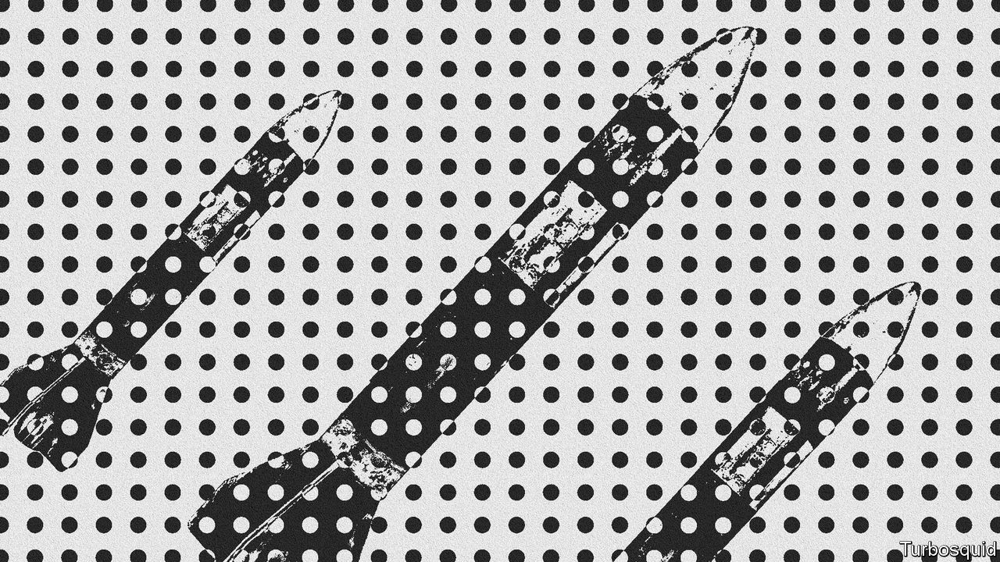
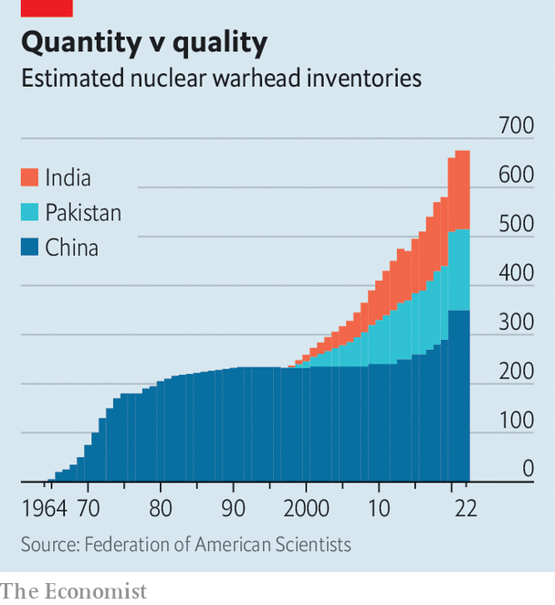

###### The three-body problem

# The nuclear arsenals of China, India and Pakistan are growing 

##### But the countries are not in an arms race—yet 

 

> Aug 11th 2022 

For most of the 75 years since India and Pakistan became independent states, at midnight on 15th August 1947, nuclear weapons have cast a shadow over South Asia. China got the bomb in 1964, two years after thumping India in a border war and forcing its policymakers to confront their country’s vulnerabilities. India showed it too could build one with a demonstrative explosion just a decade later. Pakistan was a screwdriver’s turn away by the 1980s. In 1998, both India and Pakistan conducted nuclear-weapons tests, making official what was already an open secret. 

Yet, in many ways, all three countries were hesitant nuclear powers. China did not deploy a missile capable of hitting the American mainland until the 1980s. When India and Pakistan fought a war over Kargil, in the disputed region of Kashmir, in the summer of 1999, India’s air force, tasked with delivering the bombs if needed, was not told what they looked like, how many there were or the targets over which they might have to be dropped. 

 


All that has changed. China has been adding hundreds of  in recent years. When Pakistan celebrated its 60th birthday in 2007 it had roughly 60 nuclear warheads. Fifteen years on, that number has nearly tripled (see chart). The combined arsenals of China (350 warheads), India (160) and Pakistan (165), though modest by American and Russian standards (several thousand each), now exceed British and French stockpiles in Europe (around 500 in total). All three countries are emulating the American and Russian practice of having a nuclear “triad”: nukes deliverable from land, air and sea. South Asia’s nuclear era is entering a more mature phase.

That need not mean a more dangerous one. A new report by Ashley Tellis of the Carnegie Endowment, a think-tank in Washington, explores the dynamics among Asia’s three nuclear powers. Since 1998, most Western attention has focused on the  between India and Pakistan over Kashmir. That danger persists. Yet the risk of an arms race has been exaggerated, argues Mr Tellis, a former State Department official.

India’s arsenal has grown slowly, he observes—it remains smaller than Pakistan’s—and its nuclear posture remains “remarkably conservative”. The comparison with the nuclear behemoths is instructive. America and Russia both maintain huge arsenals designed to enable so-called counterforce strikes—those which pre-emptively target the other side’s nuclear weapons to limit the damage they might do. That means their arsenals must be large, sophisticated and kept on high alert. 

In contrast, China, India and Pakistan, despite their manifold differences, all view nukes as “political instruments” rather than “usable tools of war”, argues Mr Tellis. Both China and India, for instance, pledge that they would not use nuclear weapons unless an adversary had used weapons of mass destruction first, a commitment known as “no first use”. America disbelieves China’s promise, much as Pakistan doubts India’s. But the Chinese and Indian arsenals are consistent with the pledges, insists Mr Tellis. 

He calculates that if India wanted to use a tactical (or low-yield) nuclear weapon to take out a Pakistani missile on the ground, it would have to do so within a few minutes of the Pakistani launcher leaving its storage site. That is implausible. India does not have missiles that can launch within minutes of an order, nor those accurate to within tens of metres of their target. And, for now, China’s rocketeers also train and operate on the assumption that their forces would be used in retaliation. The result is that things are more stable than the swelling arsenals suggest. 

There are two wrinkles, though, and both concern China. The Pentagon says that China’s arsenal could expand to 1,000 warheads by 2030, as it seeks to overwhelm American missile defences and narrow the numerical gap with its chief rival. If that comes to pass, India might fear that its comparatively meagre arsenal no longer serves as a credible deterrent. If India has fewer warheads, it will want to be sure they can inflict unacceptable damage on Chinese cities. But the thermonuclear device which India tested in 1998 was widely considered to have fizzled.

The real problem, though, is not so much the number of weapons as what China might be able to do with them. India gets by with a small arsenal because it is highly secretive about the location of its nukes—the same approach that China has taken for most of its history. Yet improvements in surveillance technology (such as new spy satellites), artificial intelligence that can find patterns in huge amounts of data and cyber-espionage against nuclear command-and-control networks could one day pierce “the veil of opacity”, warns Mr Tellis. That, in combination with more warheads and more accurate missiles, might enable China to “hold at risk almost every Indian nuclear-storage site”, a prerequisite of counterforce.

It is, in part, to hedge against such a destabilising rupture that India has decided to hide its nukes in the ocean. Its , the , began patrols in 2018. Another, the , is undergoing sea trials. Two more are under construction. But Mr Tellis doubts that India, despite extensive Russian help, has been able to build a sufficiently compact and powerful naval nuclear reactor for extended spells at sea, and a vessel quiet enough to remain undetected. 

The conventional wisdom is that a cascade is under way: America and Russia are abandoning arms control; China races to catch up with America; India pursues China; Pakistan follows. The reality is more complex, insists Mr Tellis. China has an eye on India, too. India increasingly pays more attention to China than to Pakistan. And Pakistan—specifically, its powerful army—is set on its own path, its programme “increasingly driven less by what India is actually doing and more by its fervid imaginings of Indian capabilities”.

In one sense, nuclear weapons are stabilising. They preclude, among their possessors, the big wars that have roiled South Asia through its history. But they do not prevent small or peripheral ones. And the terror they evoke can be exploited. Pakistani generals have used their nuclear shield to harbour jihadists. China might one day seek to emulate Russia’s use of nuclear threats in Ukraine to keep America from intervening in a war over Taiwan.

South Asia’s nuclear future will depend on whether nuclear conservatism withstands the pressures of power politics and the temptations of technology. The direction of China’s arsenal does not offer grounds for optimism. ■

