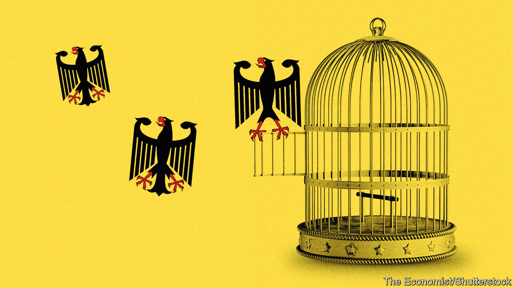
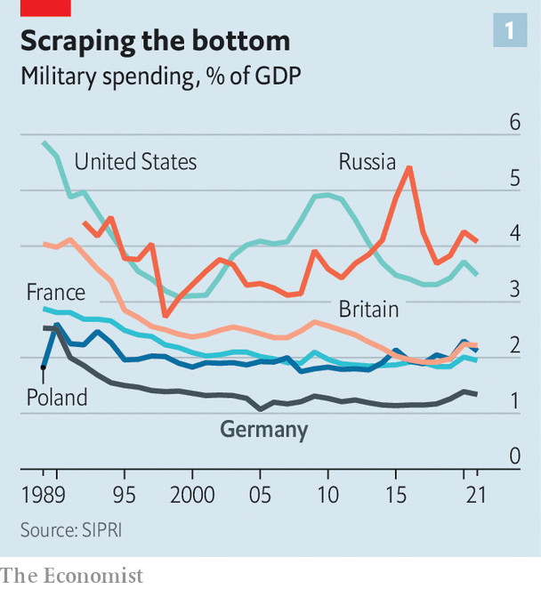
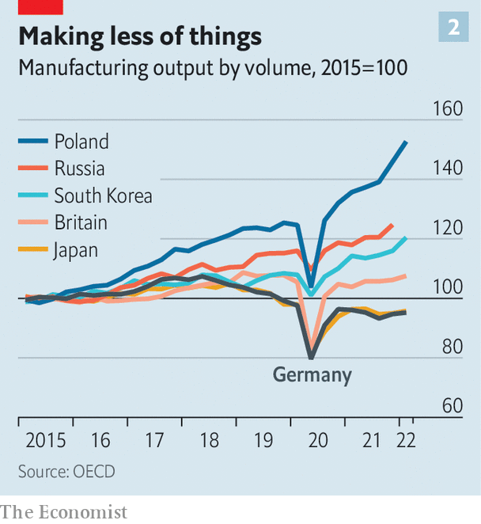
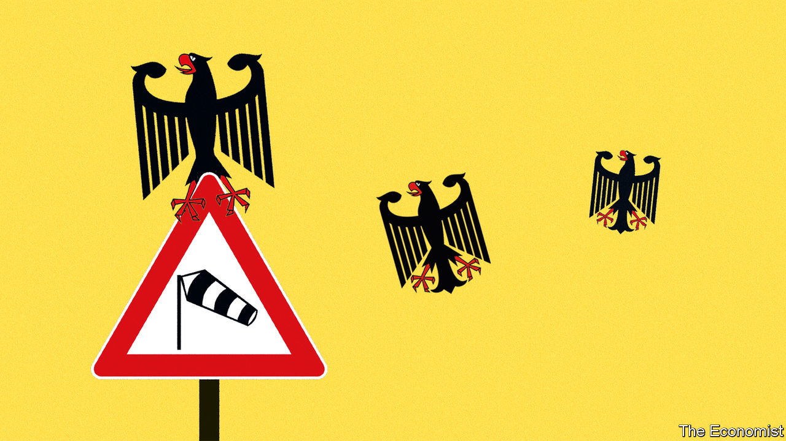
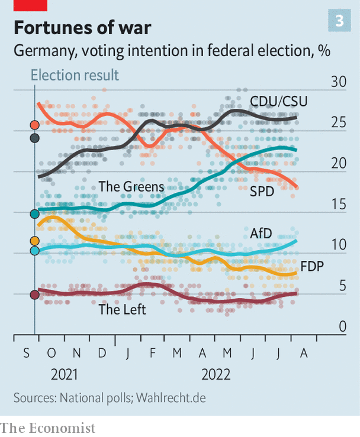

###### Schafft Deutschland das?

# Germany is facing dramatic change in many dimensions all at once 

##### It will not be easy to handle 

 

> Aug 11th 2022 

Much of germany’s success in recent decades can be put down to staying the course. Even its dramas were dramas of continuity—as when, in 2015, Angela Merkel refused to change the country’s asylum policy in the face of a huge influx of Syrian refugees. “Wir schaffen das,” she said as she held open the door—”We can handle this.” The much-quoted remark projected compassion and confidence while offering voters astute reassurance. Germany was strong and stable enough to cope with this extraordinary development. There would be readjustments, but no deep changes, nor serious costs. 

The crisis brought on by Russia’s attack on Ukraine this February is of a different order. Olaf Scholz, who took over from Mrs Merkel last December at the head of a coalition of social democrats, greens and liberals, was quick to grasp the shift. Speaking just three days after Russian tanks rolled over the border he declared the arrival of a —a change in the spirit of the times. Germany would support Ukraine to the hilt, he said. It would punish Russia with sanctions and pump up its own army. It would reverse its willingness—partly a policy of engagement through trade, partly opportunism—to depend on Russia for inordinate amounts of natural gas. 

The tough words opened up a much wider debate on the need to part from well-worn paths, a debate in which almost nothing seems sacred anymore. The Greens in Mr Scholz’s coalition seem willing to bite bullets on nuclear-power stations and coal power. Conservatives talk of releasing the deficit-spending caps that have hogtied public investment; titans of industry admit that yes, German business will sink if it does not learn to swim in new and rougher waters. 

If all the rhetoric is to be believed, a new Germany is emerging: one more pragmatic and less preachy, less self-satisfied and more decisive. It promises to evolve into a more self-reliant and more assertive locomotive for an expanding European project, a global hub for new industries and green technology and a country comfortable with asserting itself using its armed forces. If things go right, Germany’s war-spurred transformation may prove one of Vladimir Putin’s biggest regrets. 

But that is a big if. 

To be fair, not all the credit for Germany’s newfound openness to change should go to Mr Putin. Pressure had been building for years. Prosperous as they were, Germans could see that their infrastructure was aching after decades of underinvestment, that their industry was overdependent on exports to China, that companies struggled to find the right staff. Many felt longer-term challenges such as climate change and keeping the pensions system solvent were being neglected. 

The poor showing of Mrs Merkel’s Christian Democrats in last year’s election reflected the nation’s accumulated impatience. The government that replaced hers is the youngest and most diverse Germany has seen. This  (”traffic-light”) coalition, so called because of the red, yellow and green of its three parties, started with a strong agenda for domestic reform. Its talk was of a greener, highly digitised “social-market economy”. This was quickly overshadowed by the . But elements of it are moving forward in step with the drive to improve the armed forces and reshape the energy landscape.

Six months on from the chancellor’s speech, his government’s record of moving from words to deeds is not too bad. Germany has sent money and arms of its own to Ukraine’s government. It has provided further money through the eu and “backfill” deals in which German arms supplied to nato allies have allowed those allies to send more weapons to Ukraine. It is also hosting close to a million refugees. Some 150,000 Ukrainian children are now registered in German schools. 

Many, though, have found fault with aspects of this response. Though Germany has sent money, others have sent more, especially when measured as a share of gdp. In Ukraine, there have been complaints that Germany was slow to get going and the long list of goodies it has given is dominated by obviously surplus and hand-me-down kit. There are signs that the German army, hollowed out by decades of underspending, has been reluctant to part with what little it has. 

That said, a plodding-but-steady approach may see Germany helping Ukraine more than most over the longer term. Military aid has certainly accelerated. The arrival this month of the first German-made mobile rocket launchers marked the most significant contribution yet from a country that for decades has routinely refused to send weapons into war zones.

More red balloons needed

When it comes to isolating the non-energy sectors of the Russian economy, the record is more consistent. Despite sanctions imposed following Mr Putin’s annexation of Crimea in 2014, at the beginning of this year Germany remained Russia’s top foreign investor, with some 4,000 German firms active there. More than 200 German firms continue to do business in Russia, including Globus (supermarkets) and Fresenius (health care). But the vast majority have now closed operations and pulled out staff, going beyond what was made necessary by new eu sanctions because of concerns about safety, deference to public opinion and a belief it was the right thing to do. This has hit investments, partnerships and sales hard, blows which have been borne with little complaint. 

Politicians, too, have upped their game. The Green party has long had a strong pacifist streak, but it was nowhere to be seen when Annalena Baerbock, the 41-year-old foreign minister, one of the government’s two leading Greens, told students at the New School in New York that Russia’s “brutal war” is an attack on “freedom, democracy and human rights”. Mr Scholz’s own party was long associated with a go-softly approach to Russia. Its previous chancellor, Gerhard Schröder, in office at the turn of the century, became a lobbyist for Russian interests after leaving office. Yet the party’s 44-year-old current co-chair, Lars Klingbeil, bluntly describes military force as a legitimate tool for peace. “It is not talking about war that leads to war,” he said in a recent speech. “Closing your eyes to reality leads to war.”

 


So does an unwillingness to be serious about defence. The part of Mr Scholz’s speech that most heartened his nato allies was his pledge to crank military spending up to 2% of gdp, a goal which the alliance agreed on more than a decade ago but which Germany has egregiously failed to meet. In the mid-2010s it was spending only just over 1% (see chart 1). 

A special fund of €100bn ($103bn) will be used to increase spending on the armed forces from the €51bn in the 2021 budget to an annual €80bn or so. Its first big dollops are destined for the scrawny Luftwaffe, which will be receiving 35 f-35 fighters from America in an $8.4bn deal. 

Increasing investment is not enough on its own. “It is necessary to spend a lot of money on the Bundeswehr,” says Nico Lange, a former chief of staff at the defence ministry, “but what you really need to change is its bureaucratic culture.” He says the army has become desk-bound. “We fuss about training Ukrainians to handle our ‘advanced’ weapons, when it is us who should learn from them how to improvise on the battlefield and take the initiative.”

Challenging though the increase in military ambition is, the change in energy policy carries bigger implications for the domestic economy. Mrs Merkel’s various administrations not only let Russia’s share of gas imports reach 55%. They also approved the sale of refineries, gas-storage facilities and other crucial infrastructure to Russian firms. They built no terminals for liquefied natural gas (lng) tankers coming from more distant providers; they banned fracking, a technology that could have allowed Germany to exploit its own gas reserves. Market-based reforms to renewables funding damped the exponential boom of the early 2010s down into steadier, less dramatic growth. Nuclear power was phased out in an ill-thought-through response to the disaster at Fukushima. 

In terms of its stated aim of using mutually beneficial trade to encourage change in Russia this was a complete bust. And it has left Germany in the embarrassing, indeed tragic, situation of funding Mr Putin’s aggression. Germany’s payments for fossil fuels have put some €18bn into Mr Putin’s pocket since his tanks rolled into fresh parts of Ukraine on February 24th, according to the Helsinki-based Centre for Research on Energy and Clean Air. 

The anticipated difficulty of weaning the country off Russian energy by the summer of 2024, as the government hopes to do, has provoked fears of catastrophic deindustrialisation and popular uprising in the press. So far, though, reductions have been faster than expected and not particularly painful. As Mr Putin has squeezed gas supplies, Germany has found various replacement sources, often by outbidding other countries. The amount of gas coming from Russia is now just 26% of the total, according to the government. Storage facilities, which were at a very low ebb before the war, have been filled to the normal level for August. By early next year the first of five new lng terminals should be on stream.

Reductions in demand are moving ahead. Big firms such as Mercedes-Benz and basf, a chemicals giant, now say they can make do with a lot less gas than they initially thought; the carmaker says it has already cut its gas use by 10% and can get to 50% by the end of the year, though it does not specify how. The government plans to launch an auction mechanism that will let firms offer reductions in gas use at a specific price, allowing the government to find the most efficient options. To encourage frugality among domestic users, who are typically on long-term fixed-price gas contracts, the government will be charging a gas surcharge from October, while at the same time promising further support for the finances of hard-hit consumers.

Both industrial and household gas consumption will also be cut by Germany’s European neighbours (which have pledged 15% reductions). Coupled with more gas coming into Europe from sources such as Qatar, Algeria and America and a temporary switch back to coal for electricity generation that should enable Germany to get through the winter without rationing and with minimal reliance on Russian gas—say 20% of the full capacity of the Nord Stream 1 pipeline. If the winter is particularly cold, though, or if flows from Russia cease completely, further measures will be needed. 

The energy crunch has put a spotlight on Robert Habeck, who as vice-chancellor and minister for economic affairs is the senior Green in government. The war has provided strong tailwinds to the Greens’ ambitious plans to expand renewable capacity in Germany, and Mr Habeck is using the crisis to overcome political resistance to those plans in states governed by the Christian Democrats. In July the upper chamber of parliament (in which the states are represented) approved a package of measures to speed up planning, approval and construction of green-energy projects he had brought forward. 

Mr Habeck has been helped by his willingness to be pragmatic, as in the temporary reopening of mothballed coal-burning power stations. He has not yet buckled on long-standing plans to shut down the last three nuclear plants in December, a move which will reduce electricity supply by 6%. But with his own popularity high, with European allies pleading for such action and with polls showing that some 80% of Germans, including a majority of Greens, favour keeping the plants open for at least a few more months, giving in on this issue looks like a no-brainer. 

Germany thus seems well on its way to expanding its roster of energy suppliers, making it less strategically vulnerable. In the long run more renewables, and a transition away from natural gas to hydrogen made by electrolysis, may make it more self-sufficient. But with high prices for gas and also for carbon emissions (which means coal is not a cheap option) there are large near-term costs and a widespread fear that industries which have relied on cheap Russian gas, could be in real trouble. 

That need not be the case across the board. As Monika Schnitzer of Munich University points out, it is relative costs that matter, more than absolute ones. “If other countries face similarly high gas prices, which in global gas markets will happen over time, production may well remain in Germany, especially of those products that use both gas and technology.” But an economy with a large chemical industry and a dependence on manufacturing cannot look at higher energy prices with equanimity. 

 


German manufacturing is no longer growing in absolute terms (see chart 2). But in 2019, before the pandemic, it still accounted for almost 20% of gdp, compared with 11% in America and 9% in Britain. Though economists expect the economy to shift further towards services, its industrial character will persist. As Jens Südekum of the University of Düsseldorf puts it, “Germany’s services will not be the new Facebook, but rather services closely tied to manufacturing, like the internet of things.”

But transforming an industrial economy requires digital skills, and there Germany has lagged behind. Mrs Merkel was calling the internet “new territory” as late as 2013. While the availability of broadband and high-speed mobile connections has improved, the integration of digital technologies into businesses or public administration remains unimpressive. A key challenge in this, as many other areas, is a lack of qualified staff. Germany’s working-age population is on course to shrink faster in the current decade than that of any other major economy save South Korea. Even with high immigration, which Germany now, in another sign of its turn to pragmatism, plans to encourage, the country is unlikely to make up for the shortfall.

Industry also faces the problem of markets for its manufactures. Russia is lost. The bdi, Germany’s industry association, warned as long ago as 2019 of the need to avoid overexposure to China. And the nature of the things the world wants is changing as a result of the energy transition. 

 


Take the beloved car industry. The agreement which saw Tesla, an electric-vehicle maker, build a factory near Berlin was hailed as a great success. But even if, despite the company’s predilection for vertical integration, the factory boosts the fortunes of some suppliers, it will bring little cheer to the country’s network of highly skilled engineering companies devoted to the intricacies of the internal-combustion engine. And their own car companies are moving in a Tesla-like direction—and thus in need of batteries Asia knows how to make cheaply, not fuel injectors Germany knows how to make exquisitely. 

Hopes for growing tech clusters around the Tesla factory, and in the “Silicon Junction” near Magdeburg (also in the east) where Intel, an American chipmaker, is spending €17bn on a semiconductor fab, may be borne out. Further foreign investment may follow. But the economic benefits will not necessarily flow to Germany’s settled manufacturers. Wrenching change of the sort the country has largely sought to avoid will be the order of the day. That said, European efforts to “friendshore” existing supply chains away from China are bound to benefit some German manufacturers. 

The importance of enemies

 


Germans may well forgive their politicians for privations closely connected to the war. Recent polling shows strong majorities remain in favour of sanctioning Russia and sending arms to Ukraine. But among the coalition partners only the Greens are seeing growing support. Mr Scholz’s ratings and those of his party have steadily dwindled since February (see chart 3). Supporters of its third part, the Free Democrats, are increasingly defecting to the Christian Democrats. A sense of national purpose is already being undermined by squabbling as to the respective roles of the federal government and the states in reducing gas demand and the siting of wind turbines and transmission lines. 

Constanze Stelzenmüller of Brookings, a think-tank, feels confident that Germany will not slump back into old habits. The is real, she believes, and the government is working all-out to make it happen. But she adds a caution. “It is real because of Putin and the fact that he is not going to stop,” she says. “If this had been a one-week war, things might be different.” It may be that, for Germany to make a sustained commitment to change, a sustained challenge is needed. ■

