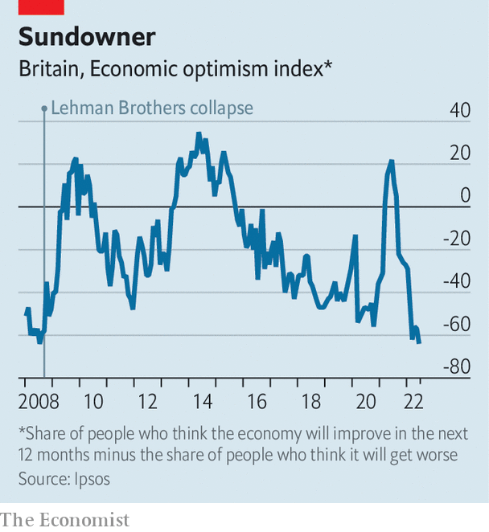

###### Summer of discontent

# Almost nothing seems to be working in Britain. It could get worse 

##### A warning from the hot summer of 1976 

 

> Aug 9th 2022 

In southampton 20-odd people are picketing Red Funnel, a ferry company that carries people to and from the Isle of Wight, off the south coast of England. The strikers complain about their pay and treatment. But they are most exercised by the . One young woman says that she went into debt to attend a friend’s wedding. A man describes watching his electricity meter in horror, knowing that a big bill is coming. “Everyone’s just had enough,” he says. 

The sun pours down on the strikers. Britain as a whole has had a ; southern England extremely so. A weather station west of Southampton recorded no precipitation in July—the first zero monthly reading since it began operating in 1957. On August 5th Southern Water, the local supplier, banned residents from watering their gardens or washing their cars with hoses. Other water companies will follow. 

It has not been a long, hot summer in the American sense—the country has thankfully seen no large-scale disturbances. Instead it is a season of drift and dysfunction. Dry weather has combined with inflation, industrial disputes, transport snafus and . As Michael Gove, until recently a cabinet minister, admitted last month, parts of the state are barely functioning. It is Britain’s summer of discontent. 

For the middle-aged and old, the inescapable comparison is with the summer of 1976. This year’s peak temperature, of 40.3°C, has been considerably higher—the extreme heat probably helps explain why the last two weeks of July saw 3,000 more deaths than expected. But 1976 had a worse drought. As well as hot weather, it too was a period of high inflation, industrial unrest and political turmoil: the prime minister, Harold Wilson, had unexpectedly resigned in the spring. The weather fused in people’s minds with other problems. Bernard (now Lord) Donoughue, a political adviser, lay awake at night, “too hot to sleep”, worrying about the pound. 

Inflation is what keeps people tossing and turning today. Consumer prices rose by 9.4% in the year to June, driven in part by wholesale energy markets. The government has so far opted to help mostly by providing grants to households, with additional benefits for the poorest—a contrast to countries such as Germany, which have slashed fuel duty. Britain’s approach is better targeted and does not incentivise energy use as much. But it makes for scarier headline figures. Energy-price inflation in Britain stands at 57%, compared with 42% in the euro area, according to the oecd, a club of mostly rich countries. 

A wide range of goods have become more expensive. The price of milk (a favourite question for interviewers who want to discover whether a politician has their ear to the ground) rose by 21% in the year to June. As some products rise in price, others shrink in size. , a trade publication that tracks such things, finds that own-brand ready meals at Tesco, Britain’s largest supermarket, have shrunk from 800g to 750g and from 450g to 400g.

Industrial unrest is spreading as workers try to keep ahead of rising prices, or at least ensure that they do not fall too far behind. In 2019, the last year for which official records exist, 234,000 working days were lost to labour disputes. Railway workers alone could drive this year’s figure higher. More than 40,000 walked out on June 21st, the start of a series of ongoing stoppages. Postal workers will soon follow. The Royal College of Nursing is balloting its 465,000 members about a strike, which would be the first in its history. 

Nobody on the Red Funnel picket line in Southampton can remember a previous strike; the company says that the last one was in 1966. Ian Woodley, the regional organiser for the Unite union, is surprised by the speed at which young workers have been radicalised: “They’ve never been in a union before, let alone on strike.” He suspects that workers have been emboldened not just by leaping living costs but also by Britain’s tight labour market. 

Whereas some are angry about pay, many are quietly grumpy about the state of public services. Over the past five years the proportion of Londoners who think that the police can be relied upon has fallen from 79% to 57%. Two years ago, during the worst of the covid-19 pandemic, Britons felt warmly towards their local councils. That did not last. In June only 52% said their council acted on residents’ concerns—the joint lowest figure for a decade, in a survey conducted three times a year. In your correspondent’s street, the weeds that grow on the edge of the pavement are almost two metres high. 

If the National Health Service is the closest thing England has to a religion (as Nigel Lawson, a politician, once put it) the country is falling into unbelief. Only 36% of people are satisfied with the nhs, the lowest figure since 1997. Fully 6.6m are on a waiting list for treatment, up from 4.4m on the eve of the covid-19 pandemic. Ambulances are supposed to respond to “category 2” incidents, such as suspected heart attacks and strokes, within 20 minutes. The average in June was 52 minutes. One in ten waited for at least 1 hour and 54 minutes. 

Feelings about general practitioners, as family doctors are known in Britain, have deteriorated to levels never recorded before. In the spring 47% of patients said they had found it hard to make an appointment with their practice, up from 19% ten years ago. gps have been swamped, not just by patients who stayed away during the worst of the pandemic and are now turning up ill, but also by the millions of people who are waiting for hospital treatment. “Other doors are shut, but the gps’ doors are open,” says Dan Wellings of the King’s Fund, a health-care think-tank. 

Britons might wish to escape such problems by going abroad. But airports have cancelled flights for lack of staff. Dover, the main seaport for continental Europe, has seen long queues for passport checks. Even getting a document can take many weeks, as the Passport Office buckles under high demand. The 28,000 members of “Passport Appointment Help”, a Facebook group, swap sob stories and advice for speeding up the process, such as hassling mps or turning up at passport offices without making an appointment. 

Meanwhile the government idles. Boris Johnson, whose term as prime minister will end in early September, spent part of the summer on holiday in Slovenia. The competitors for his job, Rishi Sunak and Liz Truss, have begun to sketch plans to help with high energy bills. Ms Truss’s in particular are heavy on tax cuts, which says more about the enthusiasm for that measure among Conservative Party members than about its appropriateness. Party obsessions dominate their debates. At one hustings in Exeter the audience was implored to avoid traditional Conservative subjects such as tax cuts and Europe. The very next question was about fox-hunting. 

 


Britain’s travails are of two types. Some, such as the hot weather, the passport delays and even the political paralysis, are likely to ease in the autumn. The crush at Dover, for instance, was partly the result of a sudden resumption of pre-covid holiday habits, aggravated by Brexit and poor planning (see later story). But other problems, such as inflation, industrial unrest and the dire state of some public services, are more likely to persist and even deepen. That is where the historical comparison is particularly worrying. 

Some things that seemed bad in the summer of 1976 soon became worse. A dispute at a photo-processing firm in west London swelled to include workers in unrelated industries, such as coal miners, and turned violent. It was a foretaste of more widespread strikes three years later, and of the miners’ strike that began in 1984. There was violence at the Notting Hill carnival in August 1976, which some observers blamed on aggressive policing. The police carried on behaving much as before. Five years later Brixton exploded in a much more destructive riot. 

Tricks on the mind

Most people expect Britain’s economic ills to linger (see chart). In its monetary-policy report on August 4th, the Bank of England warned of a prolonged recession and said it expected the inflation rate to reach 13% later this year. Cornwall Insight, an energy consultancy, projects the energy price cap (which is not a true cap, but an indication of the annual bills paid by the average household) to more than double from £1,971 ($2,380) at present to £4,427 next April. The nhs will probably come under great pressure in the winter. 

 


So the summer of discontent could be followed by a worse winter and spring. But that is unlikely to be how it is remembered. Last year Phil Andrews collected people’s reminiscences about 1976 for a book. He dredged up a few unpleasant recollections of fires, droughts and terrible violence in Northern Ireland, but many more benign ones. People seem to have remembered the glorious sunshine more than the drought. Punk rock and swarms of ladybirds had lodged in their minds longer than strikes and inflation. 

North of Southampton, the grass at the Hampshire Hogs’ cricket ground has changed from green to the colour of milky tea. This suits some people. The club is saving money on mowing, which is welcome given the high price of diesel fuel. And batsmen love the way the ball runs quickly across the dry outfield, says Peter Came, the club president. He too remembers the summer of 1976. It was the first time, on a similarly parched ground, that he managed to score 100 runs. ■

