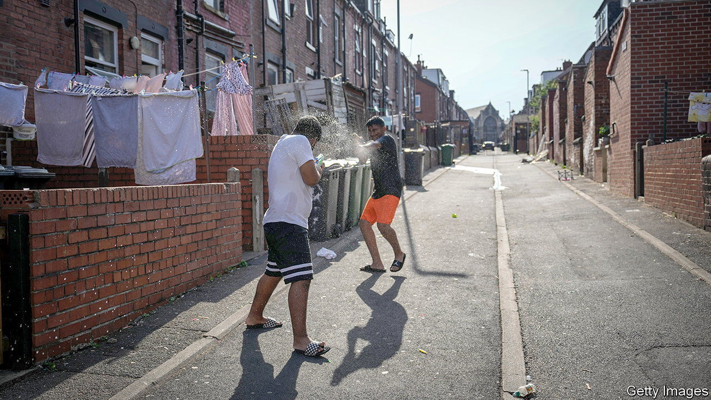
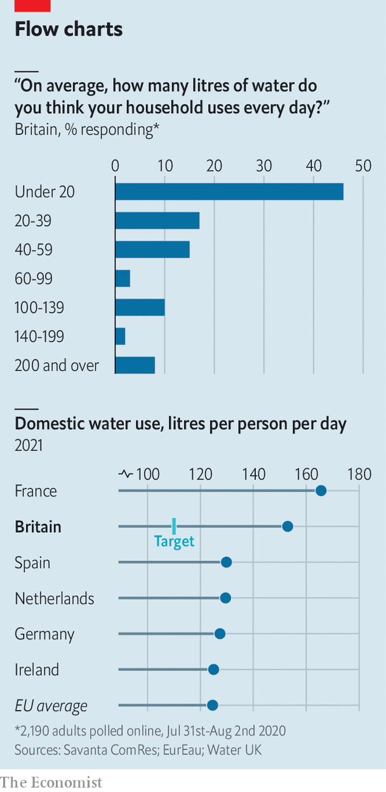

###### Metered litres

# Better measurement would help reduce water consumption 

##### British households have no idea how much water they use 

 

> Aug 11th 2022 

Britain is parched. Hosepipe bans are already in force in some parts of the country; more restrictions are coming. The need to conserve water will intensify in the coming years. Today the country consumes about 15bn litres of water on an average day. By 2050 another 2.2bn litres will be needed to supply a bigger population and to mitigate droughts, but a drier climate means that less water will be available. 

 


Households are responsible for half of Britain’s daily consumption. Most Britons do not have the foggiest how much water they use. When polled in 2020, nearly half of respondents thought their household used under 20 litres a day. The actual figure for an average household last year was about 335 litres each day, or 153 litres per person (see charts). That is well above the European average of 125 litres per person. The government wants to reduce daily usage to 110 litres per person by 2050. 

Reducing demand will be tricky. In 2019 Ofwat, the industry regulator, set a target to reduce household consumption by 6% within five years, but a rise in home-working ended up propelling an increase of 9%. More water meters, which incentivise efficiency, would help. Only 58% of households are charged for the volume of water they use. The rest, who pay on a fixed-price basis, use 30% more water than metered households. Although Ofwat sets prices to encourage adoption, ministers are nervous about requiring universal metering because bills will rise for high-usage households. 

Improving metering technology could help, too. Most meters need to be read by opening a manhole cover. Smart meters, which relay that reading live to a display, make people immediately aware of how much water they are using. Water firms had been planning to install 2m smart meters by 2025 but have been stalled by covid-19 and chip shortages. A back-of-the-envelope calculation suggests that installing smart meters nationwide could reduce average daily consumption to 135 litres per head.

Rolling out smart meters would also help identify leaks. Last year 3bn litres of water was lost to cracked pipes, whose condition worsens in dry weather. The government also has a target to halve leakages by 2050, but that means lots of investment in ageing infrastructure—and higher bills. 

