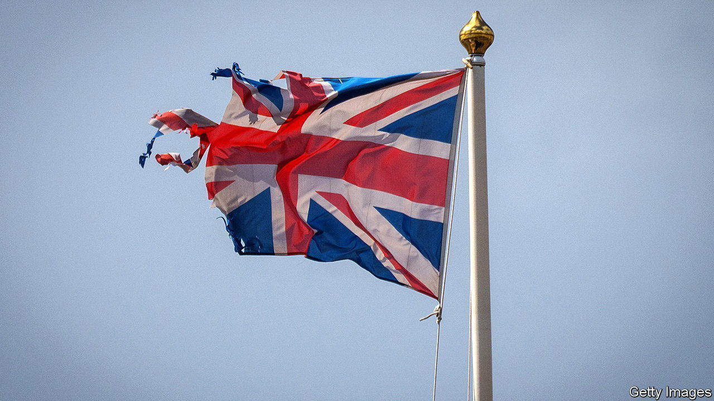

###### The cost-of-living crisis

# Britain’s economy is taking a drubbing 

##### Rising energy bills will be the principal source of pain 

 

> Aug 11th 2022 

Britain’s economy needs to become a lot more productive. But first it has to get through the winter. The big problem is the spiralling cost of living. Last week the Bank of England predicted that annual inflation would rise to just over 13% this October. At least of half of this increase will be driven by steep rises in energy prices, owing mainly to the war in Ukraine. Estimates from Cornwall Insight, a consultancy, suggest that households’ average annual energy bills could grow from £1,971 ($2,380) now, already a hefty increase on the prior year, to an eye-watering £4,427 in April. 


Analysis by the imf suggests that Britain’s poor are particularly exposed to this price shock, because they tend to spend a bigger share of their budget on energy than the rich. The question of how to protect the poorest households from the energy crunch is dominating the race between Rishi Sunak and Liz Truss to become the next leader of the Conservative Party. But the squeeze is affecting more than the most vulnerable. Of the 89% of adults reporting that their cost of living has increased, 62% say they are already spending less on non-essentials and over half are cutting back on their home-energy use.

As Britain’s politicians squabble over how and who to help, the Bank of England is acting to ensure today’s high inflation rate does not become embedded in the system. It raised interest rates by half a percentage point on August 4th, the largest increase for 27 years and the sixth rise in a row. That is pushing up the price of mortgages and, not quite as quickly, the . 


The bank is predicting that households will suffer their biggest drop in living standards in decades: next year post-tax labour income is expected to fall in real terms by an annual rate of over 4%. It also forecasts a protracted recession. The coming downturn will be shallower than those prompted by the global financial crisis and the pandemic, but bodes ill for Britain’s ability to break out of its longer-term economic rut. Recessions are bad for investment, and the cost-of-living crisis will dominate the government’s agenda for months. How political energy is used matters, too. ■

