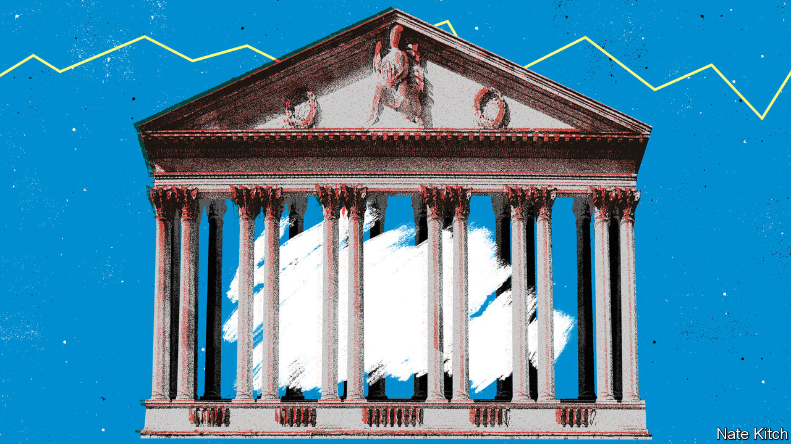

###### Bagehot

# Rising interest rates will split the Conservatives’ electoral coalition 

##### Live by the bank, die by the bank 

 

> Aug 11th 2022 

Bashing the Bank of England is in vogue in Conservative circles. Even during good times, it personifies things the Conservative Party does not like: it is technocratic (boo!), unelected (shame!) and based in London (hiss!). Now that it has presided over a surge in inflation, expected to peak at 13% later this year, Conservative mps are queuing up to kick it. Liz Truss, the foreign secretary and odds-on favourite to become the next prime minister, has suggested tightening its mandate. Kwasi Kwarteng, potentially the next chancellor, said: “Clearly something’s gone wrong.” Suella Braverman, the attorney-general, happily trampled on the bank’s independence and said it should have raised interest rates a “long time ago”. Rather than burying the bank, they should be praising it. Without it the Conservatives would not be in power. 

To misquote Milton Friedman, Conservatism is always and everywhere a monetary phenomenon. Margaret Thatcher won her mandate with a pledge to control inflation, breaking the hold of trade unions on British society as a consequence of that initial aim. John Major lost his authority when he, in effect, lost control of monetary policy on “Black Wednesday” in 1992, as Britain stumbled out of the Exchange Rate Mechanism. And monetary policy—specifically, historically low interest rates—has been at the heart of the Conservatives’ current string of four election victories. 

Since 2010 a combination of tight fiscal policy (for everyone bar pensioners) and loose monetary policy has created an effective electoral coalition. Older voters, who overwhelmingly vote Conservative, avoided the worst of austerity. Pensioners were protected by a “triple-lock” rule that kept the state pension rising inexorably, regardless of the wider economy or the state of government finances. The National Health Service, the public service that older people use most, was ring-fenced. Boomers, the Conservative Party’s base, could still rely on the state. But younger Tory voters—the crucial marginal voters—could rely on the Bank of England. 

Low interest rates, partly pushed down by global forces, changed Britain’s political landscape. To see how, head to the country’s new-build suburbs, filled with boxy, orange Barratt homes, that fringe towns across the “red wall” seats of northern England. It was voters in Barratt Britain, as  dubbed it last year, that gave the Conservatives their majority. In the north, low rates meant cheap mortgages. Fancy cars became affordable. Mondeo Man now drives an Audi: registrations of the sleek Audi a4 overtook the mid-market Ford Mondeo in 2019. It is hard to feel poor when perched on heated leather seats. People voted Tory not because they had become rich but because a Tory life, with a big Barratt home and a big German car, had become cheap. 

That solves a conundrum which has befuddled Labour since 2010. For years Labour pointed to various measures of misery increasing under the Conservatives. Income growth was lousy; wages are still, in real terms, below where they were in 2008. Working-age benefits were sliced to bits. Local services were butchered. Yet the Conservatives increased their vote share at every election between 2010 and 2019. There is a simple explanation: for swing voters, things felt fine, largely owing to the central bank. 

This arrangement has now come to a halt. The Conservative government still goes out of its way to protect pensioners. But higher interest rates threaten the Tory lifestyle of their marginal voters. Mortgages will become less affordable. Someone renewing a £200,000 ($244,000) mortgage today faces paying more than £2,400 extra a year. This is the same amount as the energy-price increases that have prompted Martin Lewis, a consumer-finance deity, to warn of civil strife unless the government steps in. 

The timing of rate hikes is awkward, too. Barratt Britain will not feel the pain instantly. Many mortgage-holders (four out of five by value) have a fixed-rate deal. But over half of them have to renew those deals before 2025, according to the central bank. With an election due by January of that year at the latest, many voters will be crossing ballot papers fresh from changing to new mortgage deals that make them thousands of pounds worse off. As for leasing a new car, higher costs mean the marginal Tory voter may well be squeezing into a second-hand Skoda, the Audi a memory. 

In the campaign to be Conservative leader, Ms Truss has, in effect, called on the bank to be the bad cop. Patrick Minford, an economist of whom Ms Truss is a fan, has suggested that interest rates would have to rise to nearly 7% to control inflation if Ms Truss’s proposed tax cuts go ahead. Rishi Sunak, her opponent, argues that higher interest rates mean harder times for the Conservatives’ most vital voters: Mr Sunak’s campaign launched a calculator, pointing out how much extra voters would have to pay on a mortgage. Sound money is not always sound politics. 

Bank you very much 

Optimistic Conservative strategists know that their core voters are unaffected by higher interest rates. The number of outright homeowners in Britain overtook that of mortgage-holders in 2014, and their number has continued to rise. The past decade has been one of cheap debt but lousy returns for savers, which was bad for retirees, who back the Conservatives by two-to-one. For the party’s base, higher interest rates are an irrelevance or a boon.

But beyond this cohort, things are less pretty. In Barratt Britain higher interest rates will bring a financial reckoning. Losing marginal voters is the quickest way to lose an election. In a first-past-the-post voting system, the difference between clownish failure and once-in-a-generation success are slim. Theresa May, who is regarded as a cack-handed election-fumbler, won only 300,000 fewer voters than Boris Johnson, who enjoys an undeserved reputation as a uniquely popular leader. Maintaining the coalition that handed Mr Johnson power is a delicate task. Rising interest rates make it a near-impossible one. The Conservatives owe their rule to the Bank of England. They will owe their demise to it, too. ■


