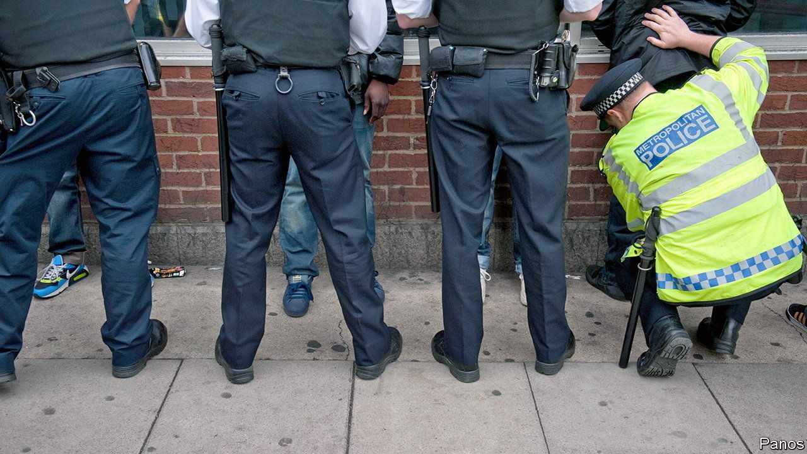

###### Stop and think

# Stop-and-search is on the rise again in Britain 

##### So are complaints that ethnic minorities are disproportionately targeted 

 

> Aug 11th 2022 

The conservatives have been in power for 12 years. That is long enough for some policies to be tried, ditched and revived. Stop-and-search, a policing technique in which people are stopped on the street and frisked for weapons or drugs, falls into this category. 

Police conducted 1.2m stop-and-searches in England and Wales in the year to March 2011. They fell sharply in subsequent years because Theresa May, during her time as home secretary, told police to cut back. She said searches did little to fight crime and soured relations with ethnic minorities. In the year to March 2018 fewer than 280,000 searches took place.

Since then, the numbers have been climbing again. An uptick in knife crime prompted Sadiq Khan, the mayor of London, to increase use of stop-and-search. In May Priti Patel, the home secretary, made it easier for police forces to authorise “suspicionless search”, which is allowed in specific areas for a limited amount of time—in response to violence or during events such as festivals. Parliament passed a law this year that gave police the power to stop people who had been convicted of weapons offences; a proposed bill would allow them to frisk people suspected of carrying glue or padlocks for use in disruptive protests. The number of stop-and-searches rose to 704,000 in the year to March 2021.

The return of a familiar policy has meant the return of familiar criticisms. In England and Wales people who are black or black British are seven times more likely to get stopped for a suspicion-based stop-and-search than white people. (That disparity rate doubles in suspicionless stops.) 

Some police forces do better than others. In London, where the plurality of stop-and-searches in England and Wales takes place, black people are 3.4 times more likely to be searched than white people for suspicion-based stops. Yet even forces with lower disparity rates can struggle to explain why they have one at all. 

The Home Office and regional police forces are taking steps to tackle this issue. The Home Office tracks the ethnicity of the people stopped. Officers wear body cameras; in some forces, community panels review that body-camera footage and give feedback. The disparity rate between black and white Britons has been falling, from 8.8 in the year ending March 2020 (to that figure of seven in the following year).

Proponents of stop-and-search say it removes weapons from the streets—16,000 of them last year. But more than two-thirds of stops in the year to March 2021 were because of drugs. And as numbers of searches have risen, arrest rates have decreased; arrest rates for suspicion-based stops peaked at nearly 18% in the years following Mrs May’s change in policy, when the number of stops was low, and dropped to 11% in the year ending March 2021.

The trade-offs involved in stop-and-search have not changed. It results in some arrests and the seizure of some weapons but risks eroding public confidence. A study published in 2020 in the “European Law Enforcement Research Bulletin” found that a belief that police were acting fairly and honestly mattered more for trust than low crime rates or neighbourhood policing. Mrs May understood how to use stop-and-search: sparingly. ■

