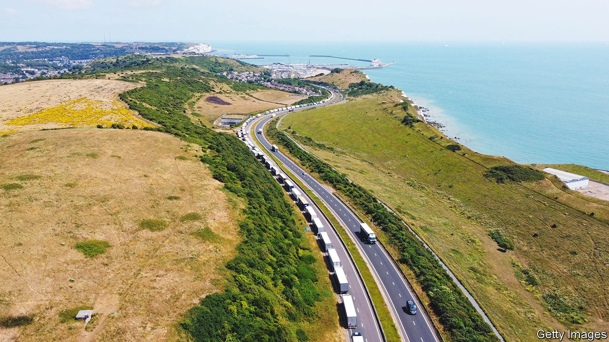
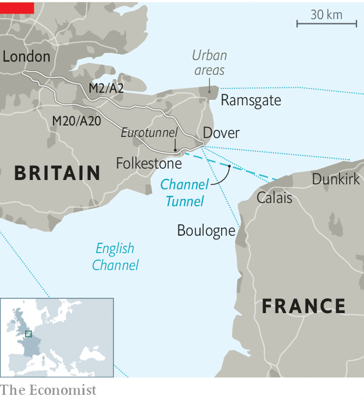

###### Borders and bottlenecks

# The port of Dover is vulnerable to delay and disruption 

##### And it’s about to get worse 

 

> Aug 11th 2022 

When the port of Dover works, it works very well indeed. A mere 23 miles separate Dover from Calais (see map). Trucks get across in 90 minutes on ferries; the journey from Portsmouth to Caen takes six hours. If drivers miss their ferry at another port, they must often wait hours for the next boat. Dover is more like the tube: you hop on the next available departure, which leaves every half-hour. 

 


But when Dover goes awry, as happened at the start of the school holidays on July 23rd, it turns into a nightmare. Some holiday-makers ended up queuing for 30 hours on roads approaching Dover; trapped trucks missed deliveries. The British government blamed the French for not sending enough staff to check passports. The French blamed Brexit and said there weren’t enough booths for border officials. 

Both sides were right. French border officers must now stamp the passports of people leaving Dover, which takes around 90 seconds for each vehicle; before Britain left the eu, cars were often waved straight through. But delays were a fixture of Dover even before Brexit: it is remarkably vulnerable to disruption. And the problem is likely to get worse before it gets better.

The obvious solution would be to reduce Britain’s dependence on the Dover bottleneck. It is among the world’s busiest passenger ports. Estimates vary, but it handles around one-third of the country’s traded goods with the eu by value, worth £144bn ($176bn) annually. Another 26% barrels under the English Channel on Eurotunnel, a train service that leaves from nearby Folkestone. Both take advantage of the “short straits” crossing; both are vulnerable to delays for similar reasons. 

There is enough capacity at other British ports to carry all the freight currently passing through the short straits, according to the uk Major Ports Group (ukmpg), a trade body for nine ports (not including Dover). But entire supply chains have been built on Dover’s flexibility and speed. 

Most other ports predominantly handle unaccompanied freight—containers that are dropped off by one driver, shipped across the sea and then picked up by another. Accompanied freight is flexible, cheap and requires less organisation. And for now, nowhere else facilitates as much of it as Dover. “The customer is expecting a 24-hour delivery. We can’t go to a port shipping twice a day,” says David Zaccheo of Alcaline, a haulage company based in Kent. And other ports have problems of their own. Felixstowe, Britain’s biggest container port, also has backlogs; workers there are due to go on strike later this month. 

For all these reasons Dover will remain vital to many firms. The question is whether it can be made more efficient. Capacity for those extra passport checks would help, at the port and at Eurotunnel. The port has temporarily upped its number of passport booths from five to nine. It eventually plans to add ten permanent desks, as well as developing unused land to accommodate more queuing inside the port. But that will take time and investment—in 2020 Dover asked the government for £33m to fund the project and was given £33,000. 

Doing such work in a functioning port is “like conducting open-heart surgery on a patient who’s awake and walking around the operating theatre”, according to Doug Bannister, the port’s chief executive. And Mr Bannister can do nothing about the small roundabout connecting all roads into the port—that pinch point is managed by Highways England, a separate agency. 

Another way to ease the bottleneck would be to improve roads into Dover and Folkestone. Two of Britain’s busiest trade routes are served by one motorway, the m20 (which becomes the a20), and one dual carriageway, the a2, which becomes a single carriageway on the approach to Dover. When they become jammed, traffic has nowhere to go. Widening the a2 would take years and could cause more delays.

Traffic management is the immediate solution. Operation Brock—which at busy times turns the left side of the m20 into a queue for lorries—helps prevent total gridlock around Dover. But drivers are often stuck there for hours, their produce wilting as tourists and locals, who do not have to queue, zoom past. Some truckers, paid by the trip not the hour, ignore the scheme, clogging roads further. Building more lorry parks would take them off the roads: drivers could use proper toilets while waiting for queues to disperse. But slabs of concrete face fierce opposition from nimbys. 

Duncan Buchanan of the Road Haulage Association, which represents lorry drivers, reckons the government should be funding new border facilities. “Dover was designed for a single market. We can’t pretend Brexit hasn’t changed anything—like an alcoholic, we’ve got to admit there’s a problem in order to fix it.” The government has big plans to use technology in order to ease Dover’s delays. Smart tags are being trialled on lorries, for instance: these would allow customs officers to know in advance if a truck’s actual weight matched the numbers on its customs forms. The digitisation of post-Brexit customs declarations is already helping. Forms can be filled out far from the port; a digital “envelope system” matches drivers’ documents to their trucks’ number plates. 

But technology could slow the border down before it speeds it up. The eu’s Entry/Exit system, which requires people from non-member states to undergo biometric checks, is due to begin next May. People may need to leave their cars to scan their fingerprints or faces. Queues could balloon. The port of Dover says it does not have space to conduct biometric checks. Further strain will come if and when inspections start on fresh food and animal products arriving from Europe. Jams tomorrow, then, as well as today. ■


