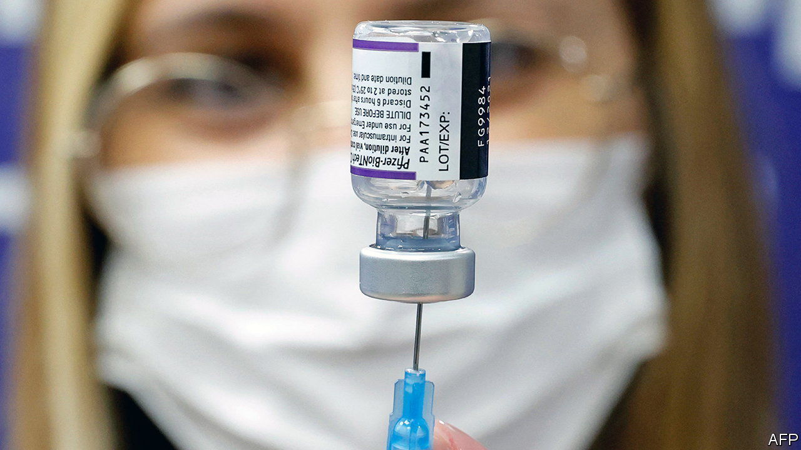
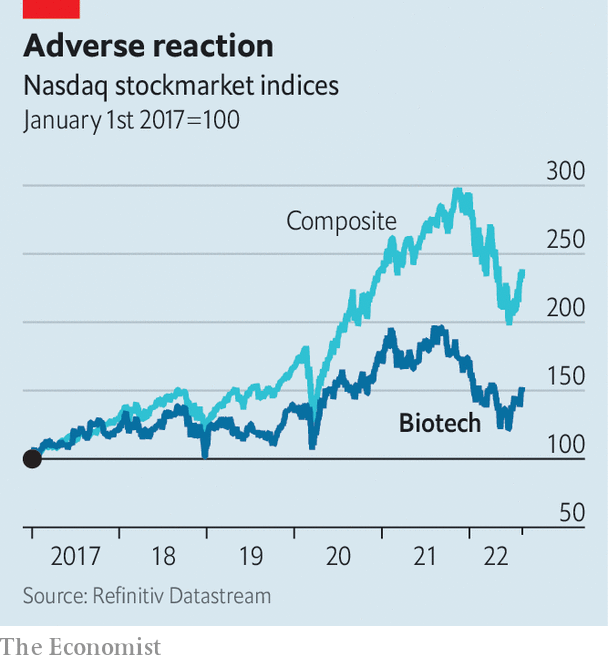

###### More cash, stat!

# After a covid-fuelled adrenaline rush, biotech is crashing 

##### Many firms will not survive 

 

> Aug 10th 2022 

Three years ago no one had heard of . Today the German biotechnology firm , as well as annual revenues of $19bn. The company owes both the lustre and the lucre chiefly to the successful mrna  which it developed in partnership with , an American drug giant. Yet even the effective jab has not immunised it from a downturn afflicting the biotech industry. On August 8th BioNTech reported that sales fell by 40% in the second quarter, year on year, as fewer people are left unjabbed and unboosted. Its share price tumbled by nearly 9%.

The biotech industry is particularly vulnerable to the syndrome of slowing economic growth, higher inflation and rising interest rates. As with other tech startups, rate rises make promised profits, most of which lie far in the future, look less hale today. Unlike software firms, biotech companies need constant injections of capital to develop their drugs, which takes lots of time and money. 

Until recently that money was easy to tap. Biotech startups raised $34bn globally last year, twice the figure in 2020. In the first six months of 2021, 61 such firms launched initial public offerings (ipos) in America alone. Since then cash has grown scarcer. The first half of 2022 saw just 14 American ipos. None of the 24 startups that Silicon Valley Bank, a lender to techie companies, expected to go public this year has made the jump. Funding for private biotech businesses is down, too. Banks are reluctant to lend to early-stage firms, whose fate is tied to treatments that might never materialise. 

 


Many companies are shedding staff. This week Atara and MacroGenics, two medium-sized public firms, announced big layoffs. An index of biotech companies listed on New York’s Nasdaq exchange has fallen by a quarter since its peak a year ago, further than the sliding nasdaq index overall (see chart). Valuations of unlisted companies are dropping faster than ever, says Lain Anderson of L.E.K. Consulting. Not all will pull through.

As non-specialist investors swept up in the pandemic biotech boom retreat, more discerning ones are sharpening their pencils. Some companies suddenly look cheap, especially those with proven treatments or drugs in late-stage trials. Venture-capital firms have raised over $100bn to invest in life-sciences businesses in the past three years, notes Tim Haines of Abingworth, a biotech-focused asset manager. They still have plenty of unspent “dry powder” to deploy. 

Big pharma in particular may be eyeing up biotech startups with promising drug pipelines. The giants will see some $300bn-worth of patents expire by 2030, says Mr Haines. Pfizer has been particularly acquisitive—and, thanks to the $37bn it earned last year from sales of its covid vaccines and treatments, particularly flush. On August 8th it agreed to pay $5.4bn for Global Blood Therapeutics, a maker of a treatment against sickle-cell disease, bringing its total takeovers to more than $25bn in the past 12 months.

As for Pfizer’s covid-vaccine partner, BioNTech, it is still worth five times what it was before the pandemic, despite a 50% crash in its market capitalisation since the peak a year ago. Don’t bring out the defibrillator just yet. ■


