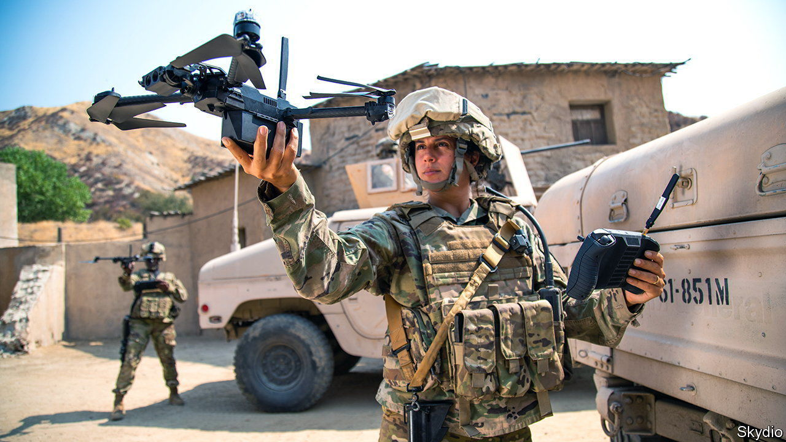
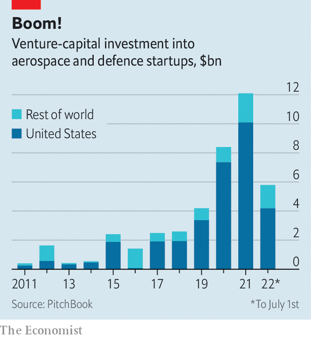

###### Defence is the best offence

# Can tech reshape the Pentagon? 

##### After a long break-up, Silicon Valley and the military-industrial complex are getting back together 

 

> Aug 8th 2022 

Soon after Nancy Pelosi, speaker of America’s House of Representatives, left Taiwan on August 3rd, China launched a series of war games around the island, which it claims as its own. This was a furious response to Ms Pelosi’s intentionally provocative act. It was also a dry run for a bid to reunify Taiwan with the mainland by force, which China does not rule out. Troubling, then, for Taiwan and its Western backers, that in American simulations of the conflict the Chinese side often prevails. One congressional report in 2018 warned that America could plausibly face a “decisive military defeat” against China in a battle over Taiwan. 

China has since kept chipping away at American military superiority, including its technological edge. Pushing that edge is therefore a priority for the Department of Defence (dod). And that would be easier if America’s world-beating software developers worked more closely with its equally formidable armsmakers, thinks Michael Brown, who heads the department’s Defence Innovation Unit. Katherine Boyle of Andreessen Horowitz, a venture-capital (vc) firm, observes that America’s largest weapons manufacturers lack top-flight programmers. Silicon Valley has them in spades—but has also long displayed an aversion to battlefield technology. 

Now geopolitical strife, from Chinese bellicosity to Russia’s invasion of Ukraine, is suddenly making the defence sector  in techies’ eyes. At the same time, technology is changing how wars are fought. And big tech and scrappy startups alike see the dod’s $140bn annual procurement budget, plus American allies’ smaller but cumulatively significant kitties, as ripe for eating into. 

 


Giants from Amazon to Microsoft are pitching for dod contracts. vc funding for American aerospace and defence startups tripled between 2019 and 2021, to $10bn (see chart). In the first half of 2022 such firms raised $4bn, down a bit from the last six months of 2021 but not as sharply as for startups overall. On August 8th Palantir, a listed data-analytics firm which works with soldiers and spooks, reported better-than-expected second-quarter revenues of $473m, up by 26% year on year. The estrangement between the crucible of America’s tech and the Pentagon may, in other words, be coming to an end. The rekindled bonhomie may reshape America’s mighty military-industrial complex.

The dod played a large role in seeding Silicon Valley’s early technologies, from radar to semiconductors. Lockheed once built missiles in Sunnyvale, wedged between Mountain View (now home to Google’s parent company, Alphabet) and Cupertino (home to Apple). The Vietnam war changed all that. Anti-war sentiment permeated Stanford University’s lecture halls and faculty lounges, and the garages of startup founders of the day. Protests against the conflict led Stanford to ban classified research and military recruitment on its campus in Palo Alto. In 2018 a protest by thousands of Google employees successfully stopped their employer from bidding for a Pentagon cloud-computing contract. The search giant’s guidelines for its artificial-intelligence (ai) projects explicitly rule out weapons-related work. 

Now two forces are pulling the Valley closer to the Pentagon. The first is the mounting geopolitical risk. Even before Russia’s invasion of Ukraine reminded the West that big wars can still occur, a growing sense of insecurity was causing countries to beef up their defence budgets. Globally these exceeded $2trn for the first time in 2021. Citigroup, a bank, reckons that 2% of gdp will go from being a largely ignored target for defence spending among nato members to the alliance’s floor. That would expand the worldwide market for tech firms dabbling in defence. Christian Brose, strategy chief of Anduril, which makes anti-drone and other defence systems, says his firm will look to America’s allies to fuel growth. Since the start of the Ukraine war several European defence ministries have expressed interest in Palantir’s data analytics.

The second force is technology. Advanced computing, and in particular ai, is finding its way into weapons and the command-and-control systems that connect them to one another. The Pentagon is therefore looking beyond its usual contractors to places like Silicon Valley, whose machine-learning chops put to shame the “primes”, as defence giants such as Raytheon or Lockheed Martin are known. That is a big reason why Ash Carter, defence secretary under Barack Obama, created the Defence Innovation Unit in 2015. “Less of the tech the Pentagon needs is developed inside and more of it is becoming commercial and dual-use,” explains Mr Brown.

Rather than buy isolated “platforms”—aircraft, tanks and other advanced systems—the dod would like to build more networks of cheaper battle units. Last year Israel demonstrated how this might work by deploying swarms of connected drones in Gaza. The Pentagon hopes to do something similar through its Joint All-Domain Command and Control (jadc2) system, which enables data-sharing among sensors and battle units in real time. This has led to a shift in how the Pentagon views technology, says Raj Shah of Shield Capital, a military-focused vc firm. The future of warfighting is “software first”, reckons Seth Robinson of Palantir.

This is good news for software pedlars. Big tech already equips the armed forces and law enforcement with cloud storage, databases, app support, admin tools and logistics. Now it is moving closer to the battlefield. Alphabet, Amazon, Microsoft and Oracle are expected to divvy up the $9bn five-year contract to operate the Pentagon’s Joint Warfighting Cloud Capability (jwcc). Last year Microsoft was awarded a $22bn contract to supply its HoloLens augmented-reality headset to simulate battles for army training for up to ten years. It is also helping develop the air force’s battle-management system, which aims to integrate data sources from across the battlefield. In June Alphabet launched a new unit, Google Public Sector, which will compete for the dod’s battle-networks contracts. In a departure from Google’s earlier wariness of the Pentagon, its cloud chief, Thomas Kurian, has insisted: “We wouldn’t be working on a programme like jwcc purely to do back-office work.” 

Smaller firms, too, spy an opportunity. In January Anduril secured a contract to build anti-drone defences worth $1bn over ten years. The following month another startup, Skydio, won one to sell the us Army $100m-worth of drones. Palantir is one of several tech firms with contracts to flesh out the jadc2 vision. In July c3.ai, a software firm that went public in 2020, was picked by Raytheon to develop ai for a long-range precision-targeting system. Steve Walker, chief technology officer of Lockheed Martin, says that his company is also looking to work with such firms. 

Tech’s conquest of warfare is far from assured. The tech giants’ earlier sorties into defence have a mixed record. Little appears to have come out of a big dod programme from 2015, joined by Apple, to develop battle-ready wearables. The jwcc project was revived after an earlier version, called jedi, was cancelled amid lawsuits from Amazon, which had lost the contract to Microsoft. The HoloLens deal has been plagued by delays and criticised as wasteful. Despite robust revenue growth, Palantir reported another loss last quarter, disappointing investors who were expecting the 18-year-old firm to make money at last. Its share price tumbled by more than 10%.

Among the upstarts, Anduril and Skydio remain exceptions in having won big contracts. Most smaller startups, says Ms Boyle, are “waiting to see if they are going to get a major contract”. A fraction of the $1trn that America has spent on defence procurement since 2016 has gone to non-conventional defence contractors. As that share rises, the primes, which retain a lot of power (and armies of lobbyists) in Washington, may become less welcoming of the newcomers. 

Such obstacles may yet be overcome. That appears to be in the interests not just of the tech disrupters but of the Pentagon, too. In late 2020 America at last defeated China in one of the dod’s war games. The winning move was not more and better hardware. It was the roll-out of clever software-enabled systems like jadc2. ■


