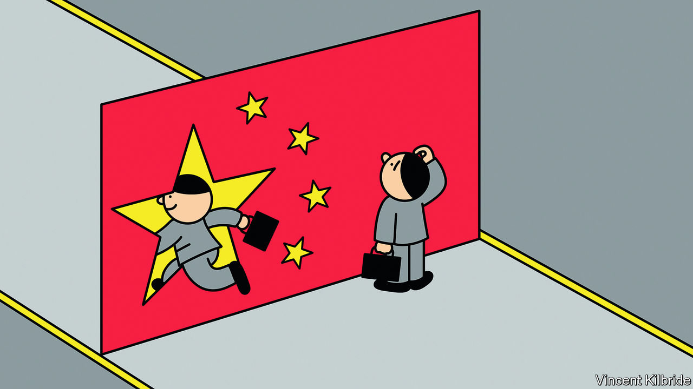
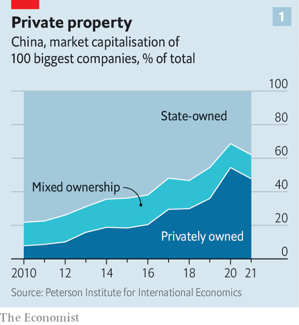
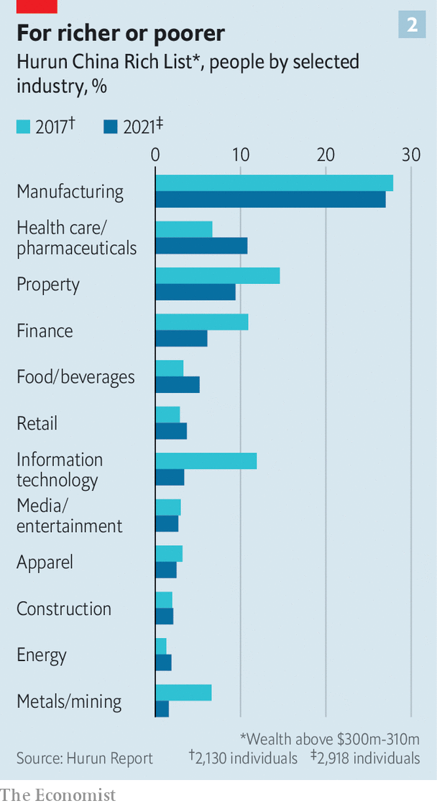
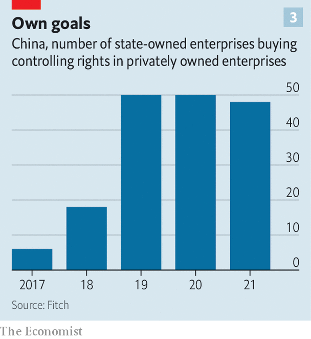

###### Chinese private enterprise

# Meet China’s new tycoons 

##### Who is winning in Xi Jinping’s economy? 

 

> Aug 5th 2022 

Xi jinping has a master plan for China. Its ultimate goal is for the country to be the 21st century’s dominant superpower, both feared and admired. China’s increasing sabre-rattling encapsulates the . As for admiration, that is to come from growing economic and technological heft. Here, Mr Xi’s plan involves a reshaping of Chinese private enterprise. 

At first blush, this exercise has been painful for business. A crackdown against successful internet companies has wiped as much as $2trn from their collective market capitalisation. On August 4th Alibaba, an e-commerce giant, reported its first ever quarterly decline in revenues. A day earlier its financial affiliate, Ant Group, revealed a slide in profits. Jack Ma, who co-founded both firms, may soon cede control of Ant. His net worth has fallen by more than $20bn in the past couple of years. That of Hui Ka Yan, the founder of , a troubled property giant, has crashed from $40bn in 2020 to $6bn. Last month Carlos Tavares, the boss of Stellantis, a carmaker (whose largest shareholder, Exor, part-owns ’s parent company), said that it would exit a Chinese joint-venture after complaining of “growing political interference”.

Yet if you look closer the picture is more complex. Even as some businesses suffer, others are thriving in Mr Xi’s China. Companies have raised a record $58bn in initial public offerings in mainland China so far this year, according to Bloomberg, a financial-information firm, compared with just $19bn in America and $5bn in Hong Kong. Another 1,000 firms are reportedly lining up to go public. A fresh cohort of tycoons is emerging, too. China’s ten richest magnates have accumulated a net $167bn in wealth since the start of 2020, according to data from Bloomberg. In the past few weeks has spoken to several of the new champions, and the mood is surprisingly upbeat.

This century China’s private sector has grown from a backwater into one of the most dynamic in the world. According to the Peterson Institute for International Economics (piie), an American think-tank, by 2020 privately controlled companies accounted for more than half of the market capitalisation of China’s 100 biggest listed firms, compared with less than a tenth a decade earlier. The private sector employs four in five urban workers, or around 150m all told. Thirty-two private Chinese companies feature in the 500 ranking of the world’s biggest firms by revenue, up from none in 2005. 

The march from Maoism to markets has been long and arduous. Until 1992 “entrepreneurs were looked down upon”, recalls Zheng Chunying, back then a government functionary in Liaoning province. But China was buzzing with talk of change and its ailing leader, Deng Xiaoping, had just reaffirmed the government’s commitment to economic reforms. Liaoning’s local government began encouraging officials and Communist Party members to start their own firms. Mr Zheng became the proud co-owner, with his wife and sister, of a small shop that sold imported clothing from Hong Kong and shoes from Europe. When in 1996 officials were suddenly banned from running businesses, he quit his government job rather than closing his shop. 

He was one of a cohort who chose business over bureaucracy. His decision was vindicated in 2002, when the party constitution was amended to let businesspeople become members. After that China Inc went from strength to strength. Entrepreneurs cite the first five years of Mr Xi’s leadership between 2012 and 2017 as the heyday of private enterprise. Technology groups such as Alibaba and  and conglomerates like hna and Dalian Wanda rose to global prominence. Their founders became household names—and amassed Croesus-like riches. 

 


Five years ago the mood began to shift. First came a swift crackdown on the conglomerates, some of which subsequently went bust (for example, hna) or were nationalised (Anbang, a big insurer). Then thousands of privately run shadow banks were shut down. In the past two years came the turn of the tech giants, slapped with regulatory probes, fines and tough new rules on everything from user data to the treatment of workers, and of property firms, whose ability to take on new debt began to be restricted by the government. Last year the private sector’s share of the market value of China’s 100 largest companies fell for the first time (see chart 1).

Look beyond tech and property, though, and things are rather different. Many big private companies “have not only avoided regulatory assault but have also grown bigger”, says Huang Tianlei of piie. Anta has built a global sportswear empire. Batteries made by catl can be found in many of the world’s evs. Zhifei Biological, a maker of covid-19 and other tests from the central city of Chongqing, has come out of nowhere to land on the 500 list. Mr Zheng’s firm, Jala, now employs 8,000 people and is one of the largest domestic makers of skincare products. His firm has become an important part of a cosmetics development park called “Oriental Beauty Valley”, where local brands have been encouraged to set up labs and hire scientists.

 


The bosses of these new corporate champions are dislodging tech moguls as owners of China’s biggest fortunes, notes Rupert Hoogewerf of Hurun, a compiler of rich lists (see chart 2). China’s wealthiest man is now , who built Nongfu, which sells bottled water. 

Many tycoons have greatly added to their personal wealth with direct help from local authorities. Take Muyuan, which has grown into one of the world’s biggest hog producers. The Communist Party of Nanyang city, where the company is based, has an explicit goal of putting it on the 500 list. In late 2021 the local party told officials to make land available for Muyuan, and to streamline its various applications and inspections. The company is to receive subsidies for farm equipment, and local engineers and other workers are to be connected with the company, the plan ordains. The fortune of Muyuan’s founder, Qin Yinglin, has swollen to $23bn.

As for the next generation of entrepreneurs, Mr Xi recently urged them to “dare to start a business”. His message has been one of unwavering —as long as they focus on the areas the government has prioritised. These include cloud computing, green energy and high-end manufacturing. The central government wants to create 1m innovative small and medium-sized firms between 2021 and 2025. Of those, 100,000 will be dubbed “specialised new enterprises” and 10,000 will earn the distinction of “little giant”. The state still takes direct stakes in private companies. But it is finding new ways to influence and guide the private sector, often through industrial parks and a system of state-designated status. 

Firms are free not to participate, but many will find great benefits to becoming part of these ecosystems of talent, capital and market access. Designations such as “little giants” act as endorsements and signal where capital ought to flow. Such labels also make for “good public relations”, says Gu Jie, founder of Fourier, a robotics startup. Obtaining them eases access to places like Zhangjiang Robotics Valley in Shanghai, part of a larger high-tech development zone housing 150 research and development (r&amp;d) centres, more than 24,000 companies and 400,000 workers. The local government owns and runs the zone. 

Startups benefit in other ways. Mr Gu, whose firm is based in Zhangjiang, notes that securing the metal components for Fourier’s prototypes takes weeks rather than months, because many of the suppliers themselves reside in the technology park. He has also been able to tap the local talent pool, hiring more than 600 engineers and scientists in the past few years. Doing that in Silicon Valley or other global tech hubs would be time-consuming and prohibitively expensive, Mr Gu observes. 

 


Fourier has attracted money from SoftBank, a Japanese tech-investment group, and Aramco Ventures, the venture-capital arm of Saudi Arabia’s oil colossus. It has also been backed by Chinese government funds. These state investments were smaller than SoftBank’s. But they send an message to the market about Fourier’s prospects. Such guidance funds, as they are called, are proliferating. Many are run by local governments. Other state entities have taken over the controlling rights to an average of 50 privately run listed firms each year over the past three years, up from six in 2017 and 18 in 2018, reckons Fitch, a rating agency (see chart 3). 

Forward, guidance funds

The recipients of such largesse do not see this as the first step to nationalisation. Zhou Hanyi, co-founder of Xinzailing, a company specialising in lift safety, likens it instead to a bank loan without a fixed maturity, which does not typically engender state meddling. 

The state’s goal in promoting guidance funds and schemes like “little giants” is to boost r&amp;d and help train talent. If a particular company fails, its technology and workforce can be absorbed by others without too much waste, says Christopher Fong of Welkin Capital, a private-equity firm in Hong Kong (and investor in Xinzailing). Older businesses, too, are opting to join state-backed innovation parks. Mr Zheng, who built Jala with neither state help nor a party membership, has begun working with a district government in Shanghai. 

All this hints that Mr Xi’s ideal private sector might look something like Germany’s , according to Enodo Economics, a research firm: “a large stable of small private firms that are innovative, generate high-paying jobs and produce technologically advanced manufactured goods”. Some entrepreneurs say bureaucracy is being cut back in professionally managed industrial zones and that the state is meddling less in their operations. Yet there are reasons for scepticism. 

In practical terms, Mr Xi’s pursuit of higher-quality growth is easier in some parts of the country than in others. The startup zones in Shanghai are well-tuned machines with professional staff. Some employ former Wall Street bankers. By contrast, an analyst who recently visited an industrial park in the southern province of Hunan recounts that it resembled a film set made to look like Hangzhou, a big tech hub and home to Alibaba, without any real innovation taking place. 

When startups soak up local-government largesse, moreover, they tie themselves to the fate and interests of local officials. This has always been a risk for companies but is becoming a more pressing concern as local authorities’ involvement in business becomes closer. Last year the local government in Hangzhou conducted a sweeping review of the holdings of 25,000 officials and their family members. The city’s party chief, believed to have links to Alibaba, was put under investigation and expelled from the party. 

Mr Xi’s vision faces another, more fundamental challenge. As a recent report from the Institute on Global Conflict and Co-operation, a think-tank at the University of California, San Diego, puts it, the idea is ultimately for private firms to “cluster and fill in the rest of the supply chain” around the state sector. In other words, rather than compete in a marketplace for customers who are themselves subject to competitive pressures, private companies are increasingly expected to cater, directly or indirectly, to the state itself. Some may still try to dream up new products and services that appeal to a wide audience. But if more entrepreneurs find cosying up to government a surer road to commercial success, the private sector may lose some of its dynamism. 

Deng and his successors understood the flaws of too much state control. Mr Xi seems intent on proving them wrong. As for the new tycoons, they will, like pragmatic bosses everywhere, adapt in order to prosper for as long as they can. ■


